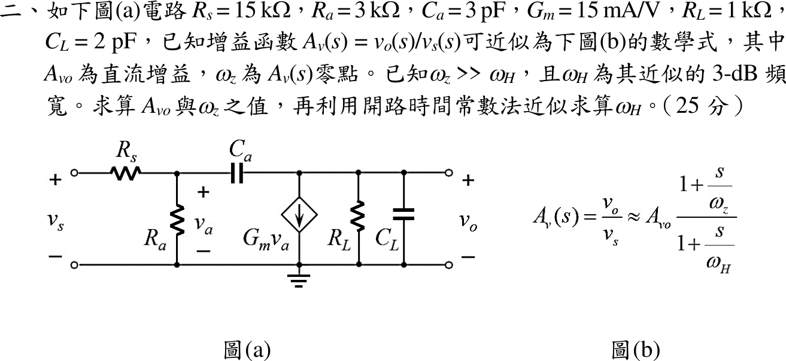
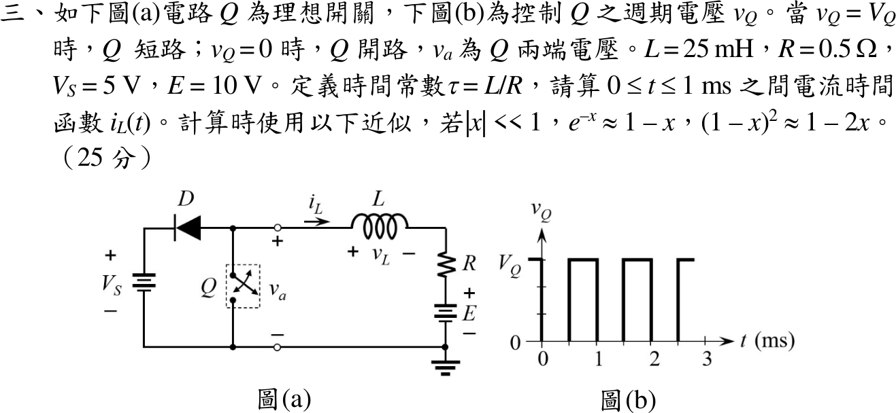
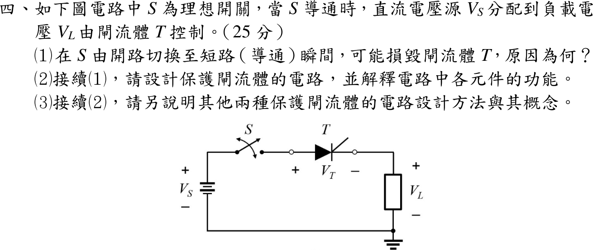

# 📝 114 年電機工程技師｜電子學（包括電力電子學）逐題詳解

> 本頁由題級 canonical 筆記組合；每題保留 QID、官方裁切、校驗狀態與完整得分型解答。

## 題目導覽
- [[#一、114 年電子學第 1 題｜BJT 差動放大器|第 1 題：BJT 差動放大器]]
- [[#二、114 年電子學第 2 題｜零點與開路時間常數|第 2 題：零點與開路時間常數]]
- [[#三、114 年電子學第 3 題｜切換 R-L 電路的電感電流|第 3 題：切換 R-L 電路的電感電流]]
- [[#四、114 年電子學第 4 題｜閘流體 dv/dt 與 di/dt 保護|第 4 題：閘流體 dv/dt 與 di/dt 保護]]

---

## 一、114 年電子學第 1 題｜BJT 差動放大器

> 題級識別：`EE-114-02-1`
> canonical 來源：`canonical/EE-114-02-1.md`
> 題級校驗狀態：`verified`

![[依考科分類/02_電子學_含電力電子/images/questions/PE_114年_電子學（包括電力電子學）_Q01.png]]

> 官方裁切來源：`依考科分類/02_電子學_含電力電子/images/questions/PE_114年_電子學（包括電力電子學）_Q01.png`

### 已知與所求

$Q_1=Q_2$ 工作於主動區，$\beta=40$、$r_o=\infty$、$V_T=25\,\mathrm{mV}$；尾端為 $I_S=2\,\mathrm{mA}$ 電流源並聯 $R_S=2\,\mathrm{k}\Omega$，$R_C=2\,\mathrm{k}\Omega$。$Q_1$ 基極接 $v_1$、$Q_2$ 基極接 $v_2$，$v_o$ 正端在 $Q_2$ 集極、負端在 $Q_1$ 集極。求 $v_2=-v_1,\ v_1,\ -3v_1$ 三種情況的 $R_i=v_1/i_1$ 與 $A_v=v_o/v_1$。

**數值答案的偏壓前提：**題圖沒有負電源、基極直流電位或 $V_{BE}$，若 $R_S$ 在直流還有分流，就無法唯一求出 $I_C$。本解取 $I_S$ 為總尾射極電流、$R_S$ 只代表尾源的小訊號並聯電阻，每支 $I_E=1\,\mathrm{mA}$；若 $R_S$ 確有未知直流分流，下列數字都不是唯一精確答案。

### 考場標準作答

#### 小訊號參數

\[
\alpha=\frac{40}{41},\quad I_C=\alpha I_E=0.975610\,\mathrm{mA},\quad g_m=\frac{I_C}{V_T}=0.0390244\,\mathrm S,\quad r_e=\frac{V_T}{I_E}=25\,\Omega,\quad r_\pi=(\beta+1)r_e=1025\,\Omega
\]

#### 射極節點與通式

令 $v_2=kv_1$。射極節點 KCL（T 模型）：
\[
\frac{v_1-v_e}{r_e}+\frac{v_2-v_e}{r_e}=\frac{v_e}{R_S}
\Rightarrow v_e=\frac{(1+k)v_1}{2+r_e/R_S}=\frac{1+k}{2.0125}v_1
\]
\[
R_i=\frac{v_1}{i_1}=\frac{r_\pi v_1}{v_1-v_e},\qquad
v_o=v_{c2}-v_{c1}=\alpha R_C\frac{(v_1-v_e)-(v_2-v_e)}{r_e}=g_mR_C(1-k)v_1
\]
其中 $g_mR_C=78.0488$，射極電壓在差動輸出中相消。

#### （1）$v_2=-v_1$

$v_e=0$（交流虛地）：
\[
\boxed{R_i=r_\pi=1025\,\Omega},\qquad \boxed{A_v=2g_mR_C=156.098\ \mathrm{V/V}}
\]

#### （2）$v_2=v_1$

$v_1-v_e=v_1\,(0.0125/2.0125)$：
\[
\boxed{R_i=(\beta+1)(r_e+2R_S)=165.025\,\mathrm{k}\Omega},\qquad \boxed{A_v=0}
\]

#### （3）$v_2=-3v_1$

$v_e=-0.993789v_1$，$v_1-v_e=1.993789v_1$：
\[
\boxed{R_i=\frac{1025}{1.993789}=514.097\,\Omega},\qquad \boxed{A_v=4g_mR_C=312.195\ \mathrm{V/V}}
\]

### 驗算

- 共模（2）用半電路：每側射極電阻為 $2R_S$，$R_i=(\beta+1)(r_e+2R_S)=41(4025)=165025\,\Omega$，與通式一致；理想差動輸出完全抑制共模，$A_v=0$。
- （3）分解為差模 $v_d=v_1-v_2=4v_1$ 與共模 $v_{cm}=-v_1$：差動輸出只看 $v_d$，$A_v=g_mR_C\cdot4=312.195$；射極 KCL 代回 $\frac{(1.993789)+(-2.006211)}{25}=-4.969\times10^{-4}=v_e/R_S$ 成立。

### 失分點

- 把尾電流 $2\,\mathrm{mA}$ 整個當成單管 $I_C$，會得 $g_m=0.08\,\mathrm S$、增益加倍。
- 共模時把 $v_e=v_1$ 視為精確而得 $R_i=\infty$；$R_S$ 有限，$R_i=165.025\,\mathrm{k}\Omega$。
- $v_o$ 正端在 $Q_2$ 集極；若取 $v_{c1}-v_{c2}$，三個增益全部變號。

### 條件與疑義

- 若改採 $I_C\approx I_E=1\,\mathrm{mA}$ 的考場近似（$g_m=0.04\,\mathrm S$、$r_\pi=1\,\mathrm{k}\Omega$），三組 $(R_i,A_v)$ 為 $(1.000\,\mathrm{k}\Omega,160)$、$(165.0\,\mathrm{k}\Omega,0)$、$(501.52\,\Omega,320)$，與上列差約 2.5%。

---

## 二、114 年電子學第 2 題｜零點與開路時間常數

> 題級識別：`EE-114-02-2`
> canonical 來源：`canonical/EE-114-02-2.md`
> 題級校驗狀態：`verified`

![[依考科分類/02_電子學_含電力電子/images/questions/PE_114年_電子學（包括電力電子學）_Q02.png]]

> 官方裁切來源：`依考科分類/02_電子學_含電力電子/images/questions/PE_114年_電子學（包括電力電子學）_Q02.png`

### 已知與所求

$R_s=15\,\mathrm{k}\Omega$、$R_a=3\,\mathrm{k}\Omega$、$C_a=3\,\mathrm{pF}$（跨接 $v_a$ 與 $v_o$ 節點）、$G_m=15\,\mathrm{mA/V}$（電流 $G_mv_a$ 由 $v_o$ 節點向下流到地）、$R_L=1\,\mathrm{k}\Omega$、$C_L=2\,\mathrm{pF}$。$A_v(s)\approx A_{vo}\dfrac{1+s/\omega_z}{1+s/\omega_H}$，求 $A_{vo}$、$\omega_z$，並以開路時間常數法求 $\omega_H$。

### 考場標準作答

#### $A_{vo}$

直流時 $C_a,C_L$ 開路：
\[
\boxed{A_{vo}=-G_mR_L\frac{R_a}{R_s+R_a}=-(15\,\mathrm{mS})(1\,\mathrm{k}\Omega)\frac{3}{18}=-2.50\ \mathrm{V/V}}
\]

#### $\omega_z$

輸出節點 KCL：$(G_m-sC_a)v_a+[G_L+s(C_a+C_L)]v_o=0$。$v_o=0$ 時需 $sC_a=G_m$，零點在右半平面 $s=+G_m/C_a=+5\times10^9\,\mathrm{rad/s}$。代入圖 (b) 的 $1+s/\omega_z$ 形式：
\[
\boxed{\omega_z=-\frac{G_m}{C_a}=-5.00\times10^{9}\ \mathrm{rad/s}}
\]
即 $A_v(s)\approx-2.5\,(1-s/5\times10^9)/(1+s/\omega_H)$。

#### $\omega_H$（開路時間常數）

$C_a$ 所見電阻（$C_L$ 開路、$v_s=0$），令 $R'=R_s\parallel R_a=2.5\,\mathrm{k}\Omega$：
\[
R_{a}^{o}=R'+R_L+G_mR'R_L=2.5+1+37.5=41\,\mathrm{k}\Omega,\qquad \tau_a=C_aR_a^o=123\,\mathrm{ns}
\]
$C_L$ 所見電阻（$C_a$ 開路）為 $R_L$：$\tau_L=R_LC_L=2\,\mathrm{ns}$。
\[
\boxed{\omega_H\simeq\frac{1}{\tau_a+\tau_L}=\frac{1}{125\,\mathrm{ns}}=8.00\times10^{6}\ \mathrm{rad/s}}
\]

### 驗算

完整轉移函數分母 $D(s)=1+1.25\times10^{-7}s+1.5\times10^{-17}s^2$（$s^1$ 係數即 $\tau_a+\tau_L$），兩根為 $8.0077\times10^6$ 與 $8.3253\times10^9\,\mathrm{rad/s}$；主極點與 OCTC 結果差 0.1%，且 $|\omega_z|/\omega_H=625\gg1$，符合題設。

### 失分點

- $\tau_a$ 只取 $C_a(R'+R_L)=10.5\,\mathrm{ns}$，漏掉 $G_mR'R_L=37.5\,\mathrm{k}\Omega$ 的米勒效應項，$\omega_H$ 會高估約 10 倍。
- 直流時把 $C_a$ 當短路，分壓與 $A_{vo}$ 都錯。
- 零點寫成 $1/(R_LC_a)$；零點只由 $C_a$ 前饋電流與 $G_mv_a$ 相消決定。

---

## 三、114 年電子學第 3 題｜切換 R-L 電路的電感電流

> 題級識別：`EE-114-02-3`
> canonical 來源：`canonical/EE-114-02-3.md`
> 題級校驗狀態：`verified`

![[依考科分類/02_電子學_含電力電子/images/questions/PE_114年_電子學（包括電力電子學）_Q03.png]]

> 官方裁切來源：`依考科分類/02_電子學_含電力電子/images/questions/PE_114年_電子學（包括電力電子學）_Q03.png`

### 已知與所求

$L=25\,\mathrm{mH}$、$R=0.5\,\Omega$、$V_S=5\,\mathrm V$、$E=10\,\mathrm V$，$\tau=L/R$。二極體陽極接開關節點 $a$、陰極接 $V_S$ 正端；$i_L$ 由 $a$ 經 $L,R$ 流入 $E$ 正端。圖 (b)：$0\le t<0.5\,\mathrm{ms}$ 為 $v_Q=0$（$Q$ 開路），$0.5\le t<1\,\mathrm{ms}$ 為 $v_Q=V_Q$（$Q$ 短路），週期 1 ms，故**先開路、後短路**。求 $0\le t\le1\,\mathrm{ms}$ 的 $i_L(t)$。

### 考場標準作答

$\tau=25\,\mathrm{mH}/0.5\,\Omega=50\,\mathrm{ms}$，每段 $0.5\,\mathrm{ms}$ 對應 $x=0.01$，依題給近似 $a=e^{-0.01}\approx0.99$、$a^2\approx0.98$。

**第一段（$Q$ 開路）：**$i_L<0$ 時電流由 $E$ 經 $R,L$ 流回節點 $a$，只能經二極體流入 $V_S$，節點箝位 $v_a=V_S$：
\[
L\dot i_L+Ri_L=V_S-E=-5\ \Rightarrow\ i_L=-10+(i_0+10)e^{-t/\tau}
\]
**第二段（$Q$ 短路）：**$v_a=0$、二極體反偏：
\[
L\dot i_L+Ri_L=-E=-10\ \Rightarrow\ i_L=-20+(i_m+20)e^{-(t-0.5\,\mathrm{ms})/\tau},\quad i_m=-10+(i_0+10)a
\]
題面沒有給初始電流，取週期穩態 $i_L(1\,\mathrm{ms})=i_L(0)$：
\[
i_0=-20+(i_m+20)a\ \Rightarrow\ (1-a^2)\,i_0=-20+10a+10a^2\ \Rightarrow\ 0.02\,i_0=-0.3,\quad i_0=-15\,\mathrm A
\]
\[
i_m=-10+(-5)(0.99)=-14.95\,\mathrm A
\]
再以 $e^{-t/\tau}\approx1-t/\tau$ 展開（$t$ 以 s 計，$1/\tau=20\,\mathrm{s^{-1}}$）：
\[
\boxed{i_L(t)=\begin{cases}-15+100t\ \ \mathrm A, & 0\le t\le0.5\,\mathrm{ms}\\[4pt]-14.95-101\,(t-0.5\times10^{-3})\ \ \mathrm A, & 0.5\le t\le1\,\mathrm{ms}\end{cases}}
\]
電流全程為負，第一段二極體持續導通的假設成立；$t=1\,\mathrm{ms}$ 時回到 $-15.0005\approx-15\,\mathrm A$。

### 驗算

- 斜率法：$\dot i_L=(v_a-Ri_L-E)/L$。以 $i_L\approx-15\,\mathrm A$ 代入，第一段 $(5+7.5-10)/0.025=+100\,\mathrm{A/s}$、第二段 $(0+7.5-10)/0.025=-100\,\mathrm{A/s}$，與上式斜率一致（第二段 $101$ 來自起點 $-14.95\,\mathrm A$）。
- 平均值：$\bar v_a=0.5\times5=2.5\,\mathrm V$，$\bar i_L=(\bar v_a-E)/R=-15\,\mathrm A$。
- 不作近似的精確週期解 $i_0=-10(2+a)/(1+a)=-15.025000\,\mathrm A$、$i_m=-14.975000\,\mathrm A$，與近似答案差 $0.025\,\mathrm A$（0.17%），漣波同為 $0.05\,\mathrm A$。

### 失分點

- 把 $0\sim0.5\,\mathrm{ms}$ 讀成短路，兩段方程順序顛倒。
- $Q$ 開路時仍令 $v_a=0$，漏掉二極體把節點箝在 $V_S=5\,\mathrm V$。
- 自設 $i_L(0)=0$；題面沒有此條件，且第二段初值須用電感電流連續 $i_L(0.5\,\mathrm{ms}^-)=i_L(0.5\,\mathrm{ms}^+)$。

### 條件與疑義

若不取週期穩態，須另給 $i_0$；上列含 $i_0$ 的通解只在第一段 $i_L<0$（二極體導通）時成立。

---

## 四、114 年電子學第 4 題｜閘流體 dv/dt 與 di/dt 保護

> 題級識別：`EE-114-02-4`
> canonical 來源：`canonical/EE-114-02-4.md`
> 題級校驗狀態：`verified`

![[依考科分類/02_電子學_含電力電子/images/questions/PE_114年_電子學（包括電力電子學）_Q04.png]]

> 官方裁切來源：`依考科分類/02_電子學_含電力電子/images/questions/PE_114年_電子學（包括電力電子學）_Q04.png`

### 已知與所求

直流源 $V_S$、理想開關 $S$、閘流體 $T$（$+V_T-$）與負載（$+V_L-$）串聯，無數值。求（1）$S$ 閉合瞬間可能損毀 $T$ 的原因；（2）保護電路設計與各元件功能；（3）另兩種保護方法與概念。

### 考場標準作答

#### （1）損毀原因

迴路 KVL 恆有 $V_S=V_T+V_L$。$S$ 閉合時 $T$ 尚未觸發、處於阻斷，負載無電流，故 $V_L\approx0$、$V_T\approx V_S$：$T$ 兩端電壓在極短時間內由 0 跳到 $V_S$，$dv_T/dt$ 極大。$J_2$ 接面電容 $C_j$ 的位移電流
\[
\boxed{i_j=C_j\frac{dv_T}{dt}}
\]
相當於注入閘極的觸發電流，超過 $(dv/dt)_{cr}$ 即在無閘極訊號下誤導通。誤導通時導通區只在閘極附近一小塊，電流若以很大 $di/dt$ 上升，電流密度集中造成局部熱點而燒毀（$di/dt$ 損壞）。

#### （2）RC 緩衝器（snubber）

在 $T$ 兩端並聯串聯的 $R_s$–$C_s$：

- $C_s$：$S$ 閉合時先由 $C_s$ 承接電壓步階，使 $v_T$ 依時間常數上升，限制 $dv_T/dt$。
- $R_s$：$T$ 觸發導通時限制 $C_s$ 經 $T$ 放電的尖峰電流 $V_S/R_s$（避免放電 $di/dt$ 過大），並阻尼配線電感與 $C_s$ 的振盪。

以電阻性負載 $R_L$ 估算（$S$ 閉合、$T$ 阻斷）：
\[
v_T(0^+)=\frac{R_s}{R_L+R_s}V_S,\qquad \boxed{\left.\frac{dv_T}{dt}\right|_{0^+}=\frac{R_LV_S}{(R_L+R_s)^2C_s}<\left(\frac{dv}{dt}\right)_{cr}}
\]
$C_s$ 加大則斜率變小；$R_s$ 也不可過大，否則 $v_T(0^+)$ 的初始步階變大。

#### （3）另兩種方法

1. **串聯限流電感 $L_s$（di/dt 保護）：**導通瞬間 $L_s\,di/dt=V_S-Ri$，故
\[
\boxed{\left.\frac{di_T}{dt}\right|_{0^+}=\frac{V_S}{L_s}<\left(\frac{di}{dt}\right)_{cr}}
\]
讓導通區有時間擴散到整個晶片；常與 RC 緩衝器搭配（$L_s$ 限 $di/dt$、$R_sC_s$ 限 $dv/dt$）。
2. **過電壓箝位（MOV／TVS 或 RCD 吸收）：**MOV／TVS 並接 $T$，正常電壓時近似開路，超過箝位電壓即導通吸收突波能量，使 $V_T$ 不超過 $V_{DRM}$；RCD 則以二極體把尖峰能量導入電容、由電阻耗散。另可串快速熔絲作過電流保護，其 $I^2t$ 須小於 $T$ 的 $I^2t$ 額定。

### 驗算

- 終值：$t\to\infty$ 時 $C_s$ 充至 $V_S$、電流為 0，$v_T\to V_S$、$V_L\to0$，與阻斷態 KVL 一致。
- 單位：$\dfrac{R_LV_S}{(R_L+R_s)^2C_s}$ 為 $\mathrm{V}/(\Omega\cdot\mathrm F)=\mathrm{V/s}$；$V_S/L_s$ 為 $\mathrm{V/H}=\mathrm{A/s}$。
- 極限：$R_s\to0$ 時斜率為 $V_S/(R_LC_s)$；無緩衝器（$C_s\to0$）時斜率趨於無限大，即（1）的步階。

### 失分點

- 只寫「突波」，未指出接面電容位移電流 $C_j\,dv/dt$ 造成誤觸發的機制。
- 緩衝器只並一顆電容而無 $R_s$：$T$ 導通瞬間 $C_s$ 直接經 $T$ 短路放電，反而造成極大 $di/dt$；主回路 $di/dt$ 也不是 RC 能限制，須靠串聯 $L_s$。
- 寫成 $S$ 閉合時 $T$ 與負載都承受 $V_S$；由 $V_S=V_T+V_L$，兩者不能同時各取 $V_S$，阻斷時是 $V_T\approx V_S$。
