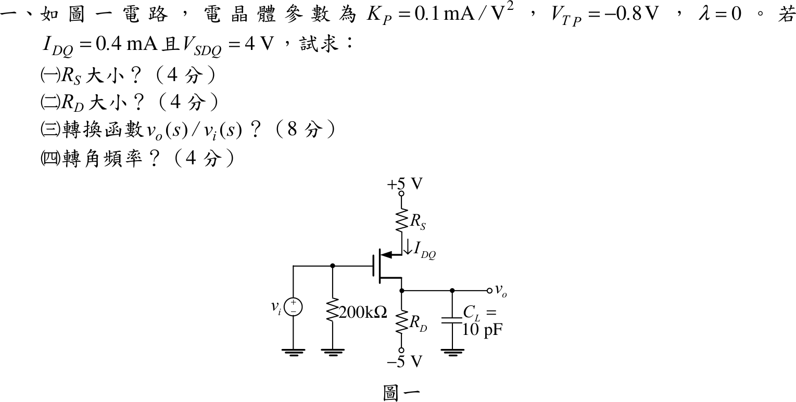

# 104 年電子學（含電力電子）第 1 題｜PMOS 偏壓與源極退化頻率響應

## 已知與所求

PMOS：$K_P=0.1\text{ mA/V}^2$、$V_{TP}=-0.8\text{ V}$、$\lambda=0$；$I_{DQ}=0.4\text{ mA}$、$V_{SDQ}=4\text{ V}$。依圖：$+5\text{ V}$ 經 $R_S$ 接源極，閘極接 $v_i$（經 $200\text{ k}\Omega$ 到地，無直流電流，$V_G=0$），汲極接 $R_D$ 到 $-5\text{ V}$，輸出 $v_o$ 取自汲極並接 $C_L=10\text{ pF}$ 到地；$R_S$ 沒有旁路電容。

求（一）$R_S$（4 分）；（二）$R_D$（4 分）；（三）$v_o(s)/v_i(s)$（8 分）；（四）轉角頻率（4 分）。

題目的符號（$K_P$、$V_{TP}$、$I_{DQ}$、$V_{SDQ}$）沿用導通參數定義 $I_D=K_P(V_{SG}+V_{TP})^2$；另一種慣例的結果見文末「條件與疑義」。

## 考場標準作答

### （一）、（二）偏壓

$$
0.4=0.1\,(V_{SG}-0.8)^2\ \Rightarrow\ V_{SG}=0.8+2=2.8\text{ V}\ \Rightarrow\ V_S=2.8\text{ V}
$$
$$
\boxed{R_S=\frac{5-2.8}{0.4\text{ mA}}=5.5\text{ k}\Omega}
$$
$$
V_D=V_S-V_{SD}=2.8-4=-1.2\text{ V},\qquad
\boxed{R_D=\frac{-1.2-(-5)}{0.4\text{ mA}}=9.5\text{ k}\Omega}
$$

### （三）轉移函數

$$
g_m=2K_P(V_{SG}-|V_{TP}|)=2(0.1)(2)=0.4\text{ mA/V}
$$
$R_S$ 無旁路，源極節點 KCL：$-v_s/R_S=i_d=g_m(v_s-v_i)$，故
$$
i_d=-\frac{g_mv_i}{1+g_mR_S},\qquad
v_o=i_d\,\bigl(R_D\parallel\tfrac1{sC_L}\bigr)
$$
$$
\boxed{\frac{v_o(s)}{v_i(s)}=-\frac{g_mR_D}{(1+g_mR_S)(1+sR_DC_L)}
=-\frac{1.1875}{1+9.5\times10^{-8}s}}
$$
其中 $1+g_mR_S=1+0.4\times5.5=3.2$，$g_mR_D=3.8$。

### （四）轉角頻率

$$
\boxed{f_c=\frac{1}{2\pi R_DC_L}=\frac{1}{2\pi(9.5\text{ k}\Omega)(10\text{ pF})}=1.675\text{ MHz}}
\quad(\omega_c=1.053\times10^7\text{ rad/s})
$$

## 驗算

- 偏壓 KVL：$5-0.4(5.5)-4-0.4(9.5)+5=0$。
- 轉導另算：$g_m=2\sqrt{K_PI_{DQ}}=2\sqrt{0.1\times0.4}=0.4\text{ mA/V}$。
- 小訊號回代：$i_d/v_i=-0.4/3.2=-0.125\text{ mA/V}$，源極電壓 $v_s=-i_dR_S=0.6875\,v_i$，$v_{sg}=v_s-v_i=-0.3125\,v_i$，$g_mv_{sg}=-0.125\,v_i$ 與 $i_d$ 相同；$|A_{v0}|=0.125\times9.5=1.1875$。

## 失分點

- 圖中 $R_S$ 沒有旁路電容，中頻增益要除以 $1+g_mR_S=3.2$；用 $-g_mR_D=-3.8$ 會大三倍多。
- $R_S$ 用 $5-V_S$、$R_D$ 用 $V_D-(-5)$：源極 $V_S=V_G+V_{SG}=2.8\text{ V}$，不是 0；$200\text{ k}\Omega$ 無直流電流。
- 轉角頻率只由 $R_DC_L$ 決定，與 $R_S$ 退化無關。

## 條件與疑義

題幹只給「$K_P=0.1\text{ mA/V}^2$」而未寫平方律公式。上列採導通參數寫法（記號 $K_P,V_{TP},I_{DQ},V_{SDQ}$ 的教科書慣例，且 $R_S,R_D$ 得整齊數值 $5.5/9.5\text{ k}\Omega$）。若採 ½$K_P$ 慣例 $I_D=\tfrac12K_P(V_{SG}-|V_{TP}|)^2$：

$$
V_{SG}=0.8+\sqrt8=3.628\text{ V},\quad R_S=3.43\text{ k}\Omega,\quad R_D=11.57\text{ k}\Omega,\quad g_m=0.2828\text{ mA/V}
$$
$$
\frac{v_o(s)}{v_i(s)}=-\frac{g_mR_D}{(1+g_mR_S)(1+sR_DC_L)}=-\frac{1.66144}{1+1.15711\times10^{-7}s},\ \ A_{v0}=-1.66144,\ \ f_c=1.375\text{ MHz}
$$
兩種慣例只改數值，結構 $-\dfrac{g_mR_D}{1+g_mR_S}\cdot\dfrac1{1+sR_DC_L}$ 相同；以官方公布解答的 $R_S$ 為準選擇其一。
