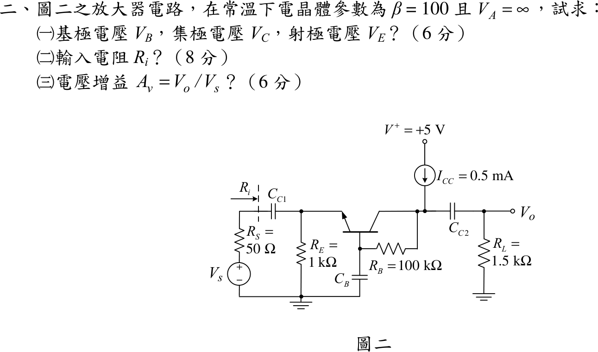

# 104 年電子學（含電力電子）第 2 題｜BJT 共基極偏壓與中頻增益

## 已知與所求

NPN，$\beta=100$、$V_A=\infty$；$+5\text{ V}$ 經電流源 $I_{CC}=0.5\text{ mA}$ 注入集極節點，$R_B=100\text{ k}\Omega$ 接在集極節點與基極之間，基極經 $C_B$ 交流接地；$R_E=1\text{ k}\Omega$ 接地，信號 $V_s$ 經 $R_s=50\ \Omega$、$C_{C1}$ 進射極，集極經 $C_{C2}$ 接 $R_L=1.5\text{ k}\Omega$。題目未給 $V_{BE}$ 與 $V_T$，取 $V_{BE}=0.7\text{ V}$、$V_T=25\text{ mV}$（假設）。

求（一）$V_B,V_C,V_E$（6 分）；（二）輸入電阻 $R_i$（8 分）；（三）$A_v=V_o/V_s$（6 分）。

## 考場標準作答

### （一）直流電位

集極節點 KCL：電流源 $I_{CC}$ 同時供給集極電流與流經 $R_B$ 的基極電流，$I_{CC}=I_C+I_B$。又 $I_C=\beta I_B$，$I_E=I_C+I_B$，所以
$$
I_E=I_{CC}=0.5\text{ mA},\qquad I_B=\frac{0.5}{101}=4.95\ \mu\text{A},\qquad I_C=0.495\text{ mA}
$$
$$
\boxed{V_E=I_ER_E=0.5\text{ V}},\quad
\boxed{V_B=V_E+0.7=1.2\text{ V}},\quad
\boxed{V_C=V_B+I_BR_B=1.2+0.495=1.695\text{ V}}
$$

### （二）輸入電阻

基極交流接地，由射極看入為 $r_e$ 與 $R_E$ 並聯：
$$
r_e=\frac{V_T}{I_E}=\frac{25\text{ mV}}{0.5\text{ mA}}=50\ \Omega,\qquad
\boxed{R_i=R_E\parallel r_e=1000\parallel50=47.62\ \Omega}
$$

### （三）電壓增益

$g_m=I_C/V_T=0.49505/25=19.802\text{ mA/V}$。集極交流負載含 $R_B$（其另一端為交流地）：
$$
R_{L,ac}=R_L\parallel R_B=1.5\text{ k}\Omega\parallel100\text{ k}\Omega=1.4778\text{ k}\Omega
$$
$$
\boxed{A_v=\frac{R_i}{R_s+R_i}\,g_mR_{L,ac}=0.48780\times19.802\times1.47783=14.275\text{ V/V}}
$$

## 驗算

以 hybrid-$\pi$ 模型對射極與集極兩節點直接列節點方程式（$r_\pi=\beta/g_m=5.05\text{ k}\Omega$），解得 $v_e/v_s=0.4878$、$v_o=g_mR_{L,ac}v_e$，$A_v=14.275$；而 $R_i=1/(1/R_E+1/r_\pi+g_m)=47.62\ \Omega$。直流側：$V_C-V_B=I_BR_B=0.495\text{ V}$ 且 $I_{CC}=0.495+0.00495=0.5\text{ mA}$ 守恆。

## 失分點

- 電流源接在集極節點而 $R_B$ 把基極也接到該節點，$I_{CC}$ 必須分給集極與基極：$I_E=I_{CC}=0.5\text{ mA}$，不是 $I_C=I_{CC}$、$I_E=0.505\text{ mA}$。
- 增益不能只看 $R_L$：基極交流接地使 $R_B$ 跨在集極與地之間，$R_{L,ac}=R_L\parallel R_B$。
- $R_i$ 是看入 $C_{C1}$ 右側，不含 $R_s$；$A_v$ 才要乘 $R_i/(R_s+R_i)$ 的分壓。
