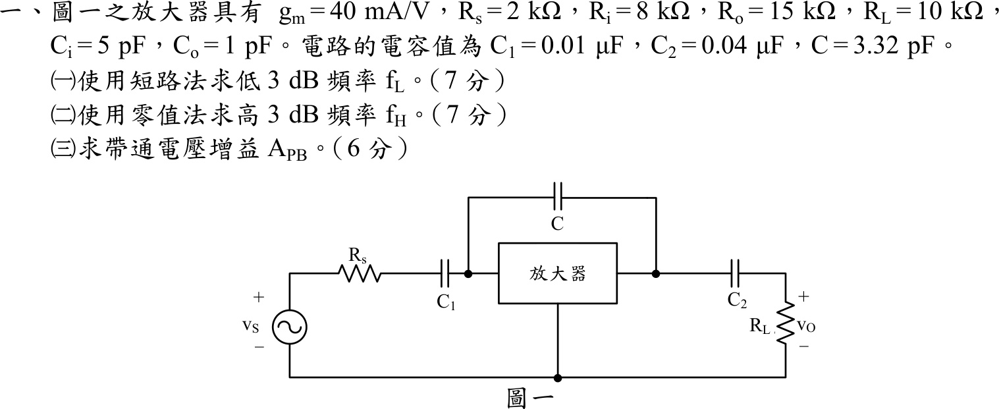

# 105 年電子學（含電力電子）第 1 題｜放大器頻率響應與時間常數

## 已知與所求

$g_m=40\text{ mA/V}$、$R_s=2\text{ k}\Omega$、$R_i=8\text{ k}\Omega$、$R_o=15\text{ k}\Omega$、$R_L=10\text{ k}\Omega$、$C_i=5\text{ pF}$、$C_o=1\text{ pF}$、$C_1=0.01\ \mu\text{F}$、$C_2=0.04\ \mu\text{F}$、$C=3.32\text{ pF}$。依圖：$v_S\to R_s\to C_1\to$ 放大器輸入端（$R_i$、$C_i$ 對地），輸出端為受控電流源 $g_mv_i$ 並聯 $R_o$、$C_o$，再經 $C_2$ 接 $R_L$；$C$ 跨接放大器輸入與輸出節點。

求（一）短路法 $f_L$（7 分）；（二）零值法 $f_H$（7 分）；（三）帶通增益 $A_{PB}$（6 分）。

## 考場標準作答

### （一）低 3 dB 頻率（短路時間常數法）

內部電容 $C_i,C_o,C$ 開路，耦合電容逐一求所見電阻（另一顆短路）：
$$
R_{C1}=R_s+R_i=10\text{ k}\Omega,\qquad R_{C2}=R_o+R_L=25\text{ k}\Omega
$$
$$
f_{L1}=\frac{1}{2\pi R_{C1}C_1}=1591.5\text{ Hz},\qquad
f_{L2}=\frac{1}{2\pi R_{C2}C_2}=159.2\text{ Hz}
$$
$$
\boxed{f_L\approx f_{L1}+f_{L2}=1750.7\text{ Hz}\approx 1.751\text{ kHz}}
$$

### （二）高 3 dB 頻率（零值時間常數法）

$C_1,C_2$ 短路，$v_S=0$。$C_i$ 與 $C_o$ 所見電阻：
$$
R_{in}'=R_s\parallel R_i=1.6\text{ k}\Omega,\qquad R_{out}'=R_o\parallel R_L=6\text{ k}\Omega
$$
跨接電容 $C$ 所見電阻（輸入／輸出兩側電阻再加受控源的米勒放大）：
$$
R_C=R_{in}'+R_{out}'+g_mR_{in}'R_{out}'=1.6+6+384=391.6\text{ k}\Omega
$$
$$
\tau=R_{in}'C_i+R_{out}'C_o+R_CC=8+6+1300.1=1314.1\text{ ns}
$$
$$
\boxed{f_H=\frac{1}{2\pi\tau}\approx 121.1\text{ kHz}}
$$

### （三）帶通電壓增益

$$
A_{PB}=\frac{R_i}{R_s+R_i}\bigl[-g_m(R_o\parallel R_L)\bigr]=0.8\times(-40\times 6)=\boxed{-192\text{ V/V}}
$$

## 驗算

- 高頻側改解 $C_1,C_2$ 短路時的完整節點方程式，得二階轉移函數 $H(s)=\dfrac{-192\,(1-s/s_z)}{1+b_1s+b_2s^2}$；其 $b_1=1.3141\ \mu\text{s}$ 正好等於零值時間常數總和，主極點為 $7.61\times10^5\text{ rad/s}$（$121.1\text{ kHz}$），第二極點約 $5.5\times10^{9}\text{ rad/s}$，遠離主極點，故以單極點估算 $f_H$ 合理。
- 低頻側改解兩個高通極點的完整幅頻式 $\dfrac{\omega^4}{(\omega^2+\omega_1^2)(\omega^2+\omega_2^2)}=\dfrac12$，得 $f_{-3\,\mathrm{dB}}\approx1.607\text{ kHz}$；短路法的 $1.751\text{ kHz}$ 是題目指定方法下的估計值，略偏高。

## 失分點

- $C$ 跨接輸入與輸出，必須用 $R_C=R_{in}'+R_{out}'+g_mR_{in}'R_{out}'$；若只加 $C_i$、$C_o$ 的時間常數，$f_H$ 會高估約百倍。
- 低頻短路法求 $C_1$ 的電阻要含 $R_s$（$10\text{ k}\Omega$），而高頻零值法的輸入電阻是 $R_s\parallel R_i=1.6\text{ k}\Omega$，兩者不同。
- $A_{PB}$ 為負號（反相），且須含 $R_i/(R_s+R_i)=0.8$ 的輸入分壓。
