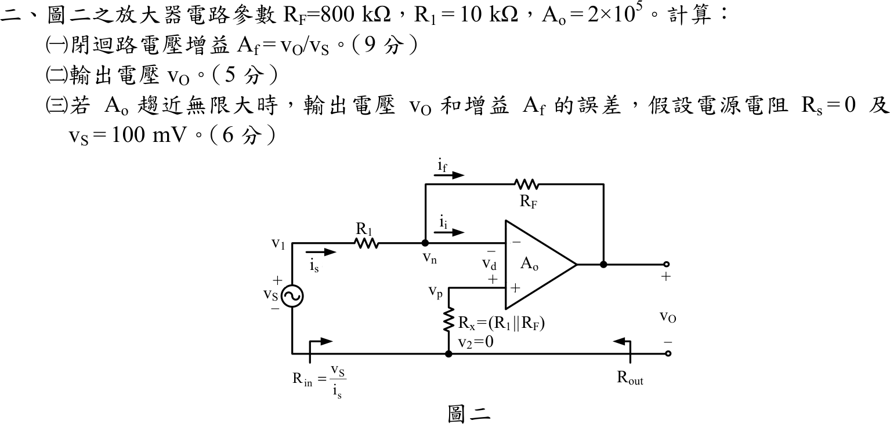

# 105 年電子學（含電力電子）第 2 題｜有限開路增益反相運算放大器

## 已知與所求

$R_F=800\text{ k}\Omega$、$R_1=10\text{ k}\Omega$、$A_o=2\times10^5$；$v_p$ 經 $R_x=R_1\parallel R_F$ 接地（無電流，$v_p=0$），運算放大器 $v_O=A_o(v_p-v_n)=-A_ov_n$。求（一）$A_f=v_O/v_S$（9 分）；（二）$v_S=100\text{ mV}$ 時的 $v_O$（5 分）；（三）$A_o\to\infty$ 時 $v_O$ 與 $A_f$ 的誤差（$R_S=0$，6 分）。

## 考場標準作答

### （一）閉迴路增益

反相端 KCL：$\dfrac{v_S-v_n}{R_1}=\dfrac{v_n-v_O}{R_F}$，代 $v_n=-v_O/A_o$：
$$
A_f=\frac{v_O}{v_S}=-\frac{R_F/R_1}{1+\dfrac{1+R_F/R_1}{A_o}}
=-\frac{80}{1+\dfrac{81}{2\times10^{5}}}=-\frac{80}{1.000405}
$$
$$
\boxed{A_f\approx-79.9676\text{ V/V}}
$$

### （二）輸出電壓

$$
v_O=A_fv_S=-79.9676\times0.1=\boxed{-7.9967613\text{ V}}
$$

### （三）與 $A_o\to\infty$ 比較的誤差

$A_o\to\infty$ 時 $A_f=-R_F/R_1=-80\text{ V/V}$、$v_O=-8\text{ V}$：
$$
\Delta v_O=-7.9967613-(-8)=\boxed{+3.2387\text{ mV}}
$$
$$
\varepsilon=\frac{A_f-(-80)}{-80}=\boxed{-0.0405\%}
\quad(\text{輸出電壓與增益的相對誤差相同})
$$

## 驗算

反相端電壓 $v_n=-v_O/A_o=+40\ \mu\text{V}$，幾乎為虛接地。以兩側電流回代：$\dfrac{v_S-v_n}{R_1}=\dfrac{0.1-0.00004}{10\text{ k}}=9.9960\ \mu\text{A}$，$\dfrac{v_n-v_O}{R_F}=\dfrac{0.00004+7.99676}{800\text{ k}}=9.9960\ \mu\text{A}$，兩者相等，KCL 成立。

## 失分點

- 誤差須相對 $A_o\to\infty$ 的理想值 $-80$（$-8\text{ V}$）計算；用 $1/A_o$ 近似 $-81/A_o$ 時別漏掉 $1+R_F/R_1=81$。
- $v_O$ 為負，誤差 $\Delta v_O=+3.2387\text{ mV}$ 是「比理想值 $-8\text{ V}$ 更正」，符號不可寫反。
