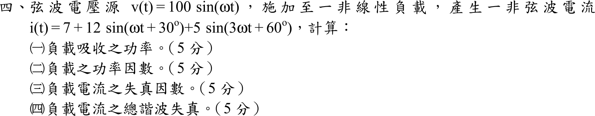

# 105 年電子學（含電力電子）第 4 題｜非線性負載諧波功率與功率因數

## 已知與所求

$v(t)=100\sin\omega t$；$i(t)=7+12\sin(\omega t+30^\circ)+5\sin(3\omega t+60^\circ)$。求（一）吸收功率；（二）功率因數；（三）電流失真因數；（四）電流總諧波失真（各 5 分）。

## 考場標準作答

電壓只有基波，$V_{rms}=100/\sqrt2=70.71\text{ V}$；電流各分量 rms：$I_{dc}=7\text{ A}$、$I_1=12/\sqrt2=8.485\text{ A}$、$I_3=5/\sqrt2=3.536\text{ A}$。
$$
I_{rms}=\sqrt{7^2+\tfrac{12^2}{2}+\tfrac{5^2}{2}}=\sqrt{133.5}=11.554\text{ A}
$$

### （一）吸收功率

不同頻率分量乘積平均為零，只有基波貢獻：
$$
P=V_{rms}I_1\cos(30^\circ)=\frac{100}{\sqrt2}\cdot\frac{12}{\sqrt2}\cdot\frac{\sqrt3}{2}=\boxed{300\sqrt{3}\approx519.62\text{ W}}
$$

### （二）功率因數

$$
S=V_{rms}I_{rms}=70.711\times11.554=817.0\text{ VA},\qquad
\boxed{PF=\frac PS=0.6360\ (\text{超前})}
$$

電流基波相位 $+30^\circ$ 超前電壓，故為超前。

### （三）失真因數

$$
\boxed{DF=\frac{I_1}{I_{rms}}=\sqrt{\frac{72}{133.5}}=0.7344\ (73.44\%)}
$$

### （四）總諧波失真

以基波為基準，含直流與三次諧波：
$$
\boxed{THD=\frac{\sqrt{I_{rms}^2-I_1^2}}{I_1}=\sqrt{\frac{133.5-72}{72}}=0.9242\ (92.42\%)}
$$
依 IEEE-519 不計直流時 $THD=I_3/I_1=5/12=41.67\%$。

## 驗算

$PF=DF\cdot\cos\phi_1=0.7344\times0.8660=0.6360$，與 $P/S$ 一致；$THD=\sqrt{1/DF^2-1}=\sqrt{1/0.5393-1}=0.9242$。再以一個週期取樣積分 $\overline{vi}$ 與 FFT 分離基波，得 $P=519.62\text{ W}$、$DF=0.7344$，同上。

## 失分點

- 直流 $7\text{ A}$ 與三次諧波都計入 $I_{rms}$，但因電壓無直流與三次成分，不貢獻實功；若把 $5\sin(3\omega t+60^\circ)$ 也乘進 $P$ 會多算。
- 峰值需除 $\sqrt2$ 才是 rms；漏除會使 $S$ 與 PF 錯。
- THD 的分母是基波 $I_1$，不是 $I_{rms}$。
