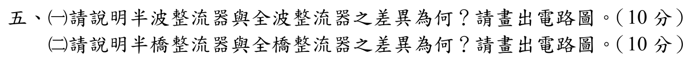

# 105 年電子學第 5 題｜整流器拓撲與波形比較



## 題目與假設

官方題目要求比較：(一) 半波與全波整流器；(二) 半橋與全橋整流器，並繪出電路圖。本題沒有指定元件壓降或負載型式，以下採理想二極體、純電阻負載與正弦輸入；若改用 SCR，文末列出受控整流的對應式。這樣可避免把「半橋整流器」誤當成逆變器的兩開關 H 橋。

## 一、半波整流器與全波整流器

### 1. 導通機制與電路

半波只讓一個半週期通過：

```text
                 D
  AC 熱端 o─────|>|─────+──── vo
                         |
                         R_L
                         |
  AC 回端 o──────────────+──── 0
```

全波可用中心抽頭（兩只二極體）：

```text
  次級 a o────|>|────+──── vo
             D1      |
                     R_L
  次級 b o────|>|────+──── 0 (中心抽頭 CT)
             D2
  次級 CT o───────────+
```

或用四只二極體的橋式接法（不需要中心抽頭）：

```text
                 D1          D2
  AC~ o─────────|>|───+───|<|────────o AC~
                         |+
                         R_L
                         |−
  AC~ o─────────|<|───+───|>|────────o AC~
                 D3          D4
```

上圖的二極體方向表示：任一半週期都使負載電流由 `vo` 流向回路負端。

### 2. 理想電阻負載的可驗證結果

令輸入 $v_s(t)=V_m\sin\omega t$。半波輸出為

$$
v_o(t)=
\begin{cases}
V_m\sin\omega t,&0<\omega t<\pi,\\
0,&\pi<\omega t<2\pi.
\end{cases}
$$

全波輸出為 $v_o(t)=|V_m\sin\omega t|$。因此

| 指標 | 半波 | 全波 |
|---|---:|---:|
| 平均值 $V_{DC}$ | $V_m/\pi$ | $2V_m/\pi$ |
| 負載 RMS 電壓 | $V_m/2$ | $V_m/\sqrt{2}$ |
| 漣波基頻 | $f$ | $2f$ |
| 理想二極體導通數 | 1 | 中心抽頭 1（橋式 2） |
| 變壓器直流偏磁 | 有 | 無（正負半週對稱） |

所以全波的平均輸出是半波的兩倍，濾波器所見的漣波頻率也加倍；全波並非「只把半波的二極體數量加倍」，而是正、負半週都被整流成同一極性。

## 二、半橋整流器與全橋整流器

在整流器語境中，「半橋」通常指**中心抽頭全波整流器**：次級有中心抽頭、只需兩個整流元件；「全橋」指四臂橋式整流器：不需中心抽頭、每半週兩個元件導通。兩者都屬全波整流，不能寫成半橋輸出只有半週。

| 比較項目 | 半橋（中心抽頭） | 全橋 |
|---|---|---|
| 整流元件 | 2 顆二極體（受控時為 2 顆 SCR） | 4 顆二極體（受控時為 4 顆 SCR） |
| 變壓器 | 需要中心抽頭，兩半繞組交替使用 | 不需要中心抽頭，整個次級均使用 |
| 導通時串聯壓降 | 理想為 0；實際約 1 顆二極體壓降 | 理想為 0；實際約 2 顆二極體壓降 |
| 每顆元件反向峰值 | 約 $2V_m$（以半繞組峰值 $V_m$ 定義） | 約 $V_m$ |
| 理想平均輸出 | $2V_m/\pi$ | $2V_m/\pi$（以橋式次級線電壓峰值定義） |

半橋的優點是元件少、導通壓降較小；缺點是變壓器必須中心抽頭且銅利用率較差。全橋的優點是次級利用率高、元件耐壓較低且接線簡單；缺點是每次導通有兩顆二極體串聯。

### 受控整流的延伸

若題目把二極體改成 SCR，需在導通角 $\alpha$ 後觸發。連續電流、理想元件下，單相全波半橋（中心抽頭）與全橋的平均值都可寫成

$$
V_{DC}=\frac{2V_m}{\pi}\cos\alpha,
$$

但半橋的 $V_m$ 是每半繞組對中心抽頭的峰值；全橋的 $V_m$ 是整個次級線電壓峰值。不可在兩種不同的電壓定義下直接比較額定值。

## 結論與校驗紀錄

- 半波：單一半週導通，$V_{DC}=V_m/\pi$、漣波頻率 $f$，存在直流偏磁。
- 全波：兩半週皆導通，$V_{DC}=2V_m/\pi$、漣波頻率 $2f$，無直流偏磁。
- 半橋：中心抽頭、兩個整流元件；全橋：四個整流元件、免中心抽頭；兩者在理想定義下皆為全波整流。
- 已依官方 Q5 裁切文字逐項核對，並以導通路徑、PIV、平均值與漣波頻率交叉檢查；原先將半橋／全橋誤寫成兩／四開關逆變器的內容已移除，狀態升級為 `verified`。
