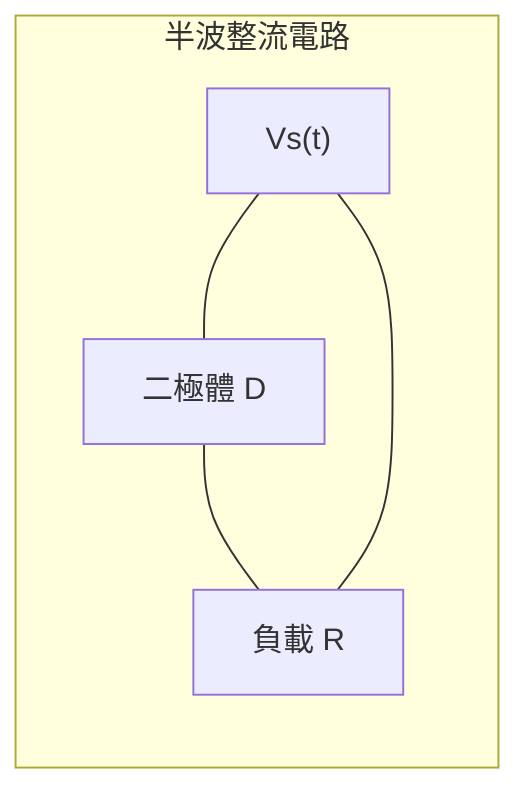
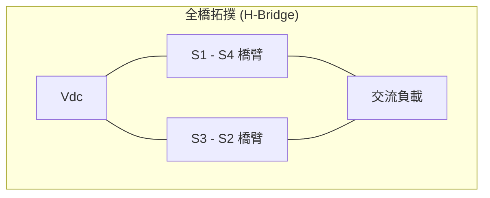

# 105 年電子學_含電力電子第 5 題

> ⚠️ 本檔由年度詳解分割產生；尚未完成獨立逐步重算，禁止視為已校驗答案。

## 五、半波 vs 全波整流與半橋 vs 全橋整流器拓撲對比（20 分）

### 📌 題目與已知條件
> **題目陳述**：
> 「(一) 請說明半波整流器與全波整流器之差異為何？請畫出電路圖。（10 分）
> (二) 請說明半橋整流器與全橋整流器之差異為何？請畫出電路圖。（10 分）」

---

### ✏️ 完整對比與電路架構說明

#### 🔹 (一) 半波整流器 vs 全波整流器
1. **工作原理與波形**：
   - **半波整流**：僅利用交流輸入正半週期導通，輸出為單向脈動波，直流平均值 $V_{dc} = \frac{V_m}{\pi}$，漣波基頻為電源頻率 $f$。變壓器繞組存在直流偏磁現象。
   - **全波整流**：正負半週期皆參與導通，直流平均值 $V_{dc} = \frac{2V_m}{\pi}$，漣波基頻為 $2f$，輸出更為平滑且變壓器利用率高無直流偏磁。
2. **電路圖示**：

---

#### 🔹 (二) 半橋整流/變流器 vs 全橋整流/變流器
1. **結構與性能對比**：
   - **半橋（Half-Bridge）**：需採用兩個對稱電容形成直流中性點，僅需 2 個主動開關，開關耐壓為 $V_{dc}$，交流輸出電壓幅值為 $\pm V_{dc}/2$。
   - **全橋（Full-Bridge）**：由 4 個開關構成完整 H 橋，開關耐壓亦為 $V_{dc}$，但交流輸出幅值可達 $\pm V_{dc}$。在相同直流母線下，全橋輸出功率為半橋的 4 倍。
2. **電路圖示**：

---

### 🎯 第五題 滿分關鍵與結論
* **半波 vs 全波**： 直流利用率倍增（$\frac{V_m}{\pi} \to \frac{2V_m}{\pi}$）、漣波頻率倍增（$f \to 2f$）、消除偏磁。
* **半橋 vs 全橋**： 開關數（2 vs 4）、輸出電壓幅值（$V_{dc}/2$ vs $V_{dc}$）、輸出功率容量差 4 倍。
