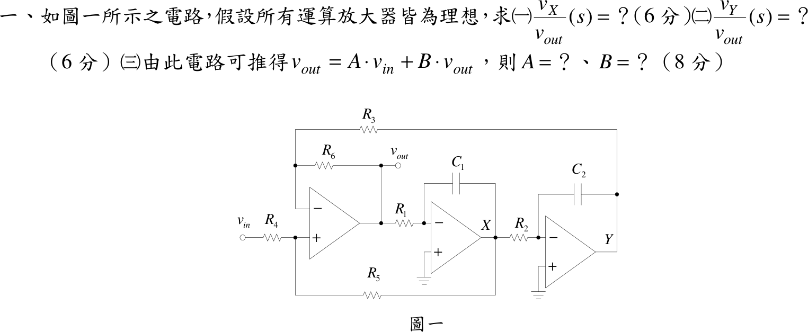

# 106 年電子學第 1 題｜雙積分器狀態變數濾波器

## 已知與所求

三顆運放皆理想。左運放 $A_1$：$+$ 輸入點 $M$ 由 $v_{in}$ 經 $R_4$、由 $X$ 經 $R_5$ 供電；$-$ 輸入點 $N$ 由輸出 $v_{out}$ 經 $R_6$、由 $Y$ 經 $R_3$ 供電；輸出為 $v_{out}$。中運放 $A_2$：$v_{out}$ 經 $R_1$ 入 $-$，$C_1$ 跨接輸出 $X$ 與 $-$，$+$ 接地。右運放 $A_3$：$X$ 經 $R_2$ 入 $-$，$C_2$ 跨接輸出 $Y$ 與 $-$，$+$ 接地。求（一）$v_X/v_{out}$、（二）$v_Y/v_{out}$、（三）$v_{out}=A\,v_{in}+B\,v_{out}$ 中的 $A$、$B$。

## 考場標準作答

### （一）

$A_2$ 為反相積分器：
\[
\boxed{\frac{v_X}{v_{out}}(s) = -\frac{1}{sR_1C_1}}
\]

### （二）

$A_3$ 為反相積分器，$v_Y/v_X=-1/(sR_2C_2)$，級聯兩次反相：
\[
\boxed{\frac{v_Y}{v_{out}}(s)=\frac{1}{s^2R_1R_2C_1C_2}}
\]

### （三）

$M$、$N$ 為電阻分壓（運放輸入不取電流）：
\[
v_M=\frac{R_5v_{in}+R_4v_X}{R_4+R_5},\qquad
v_N=\frac{R_3v_{out}+R_6v_Y}{R_3+R_6}
\]
虛短 $v_M=v_N$，解 $v_{out}$：
\[
v_{out}=\frac{R_3+R_6}{R_3}\cdot\frac{R_5v_{in}+R_4v_X}{R_4+R_5}-\frac{R_6}{R_3}v_Y
\]
代入（一）、（二）的 $v_X,v_Y$（均正比於 $v_{out}$）：
\[
\boxed{A=\frac{R_5 (R_3 + R_6)}{R_3 (R_4 + R_5)}}
\]
\[
\boxed{B=-\frac{R_4(R_3+R_6)}{R_3(R_4+R_5)}\cdot\frac{1}{sR_1C_1}-\frac{R_6}{R_3}\cdot\frac{1}{s^2R_1R_2C_1C_2}}
\]
$B$ 是 $s$ 的函數（回授項）；整理得 $\dfrac{v_{out}}{v_{in}}=\dfrac{A}{1-B}$。

## 驗算

令 $R_1\sim R_6=1\,\mathrm{k\Omega}$、$C_1=C_2=1\,\mu\mathrm F$、$\omega=1000\ \mathrm{rad/s}$（$sRC=j$）：$A=1$、$B=-\dfrac1j-\dfrac{1}{j^2}=1+j$，故 $v_{out}/v_{in}=1/(1-B)=j$。直接檢查：$v_X=-v_{out}/j=jv_{out}$、$v_Y=-v_{out}$，故 $v_N=(v_{out}+v_Y)/2=0$；虛短得 $v_M=(v_{in}+v_X)/2=0$，即 $v_X=-v_{in}$、$v_{out}=jv_{in}$，一致。另外令 $v_X=v_Y=0$ 時 $A_1$ 為非反相放大器，增益 $(1+R_6/R_3)\cdot R_5/(R_4+R_5)=A$。

## 失分點

- $v_Y/v_{out}$ 經兩級反相積分器，符號為正（$+1/(s^2R_1R_2C_1C_2)$），不是負。
- $N$ 點是 $v_{out}$ 經 $R_6$、$v_Y$ 經 $R_3$ 的分壓：$v_{out}$ 的權重是 $R_3/(R_3+R_6)$，$v_Y$ 的權重是 $R_6/(R_3+R_6)$；對調權重會使 $A$ 變成 $R_5(R_3+R_6)/(R_6(R_4+R_5))$。
- $M$ 點 $v_{in}$ 的權重是 $R_5/(R_4+R_5)$（遠端電阻在分子），不是 $R_4/(R_4+R_5)$。

## 條件與疑義

題面（三）寫成 $v_{out}=A\,v_{in}+B\,v_{out}$，字面上 $B$ 是乘在 $v_{out}$ 上的回授係數，因此含 $v_X,v_Y$ 的積分項，是 $s$ 的函數而非常數。若改以 $v_X,v_Y$ 為獨立量，對應形式為 $v_{out}=\frac{R_3+R_6}{R_3}\frac{R_5v_{in}+R_4v_X}{R_4+R_5}-\frac{R_6}{R_3}v_Y$。
