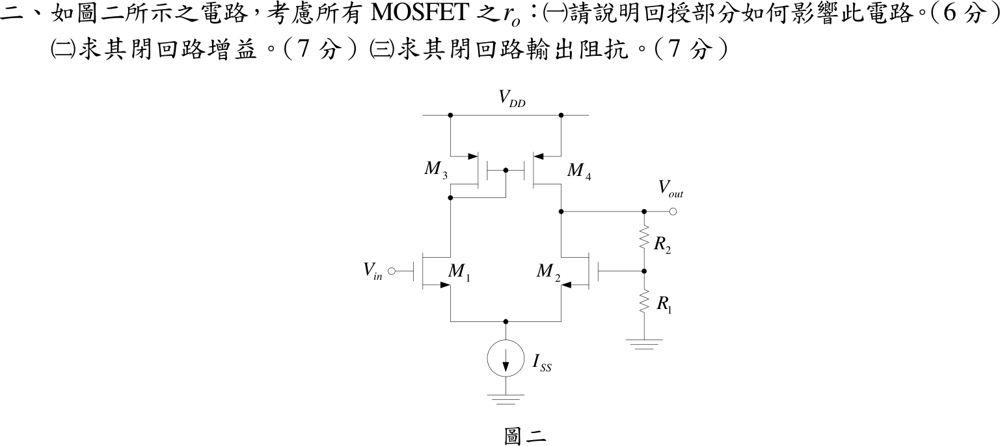

# 106 年電子學第 2 題｜MOSFET 差動放大器負回授

## 已知與所求

$M_1$、$M_2$ 為 NMOS 差動對（尾端理想電流源 $I_{SS}$），$M_3$（閘汲短接）、$M_4$ 為 PMOS 電流鏡負載；$V_{in}$ 加在 $M_1$ 閘極，輸出 $V_{out}$ 取自 $M_2$、$M_4$ 汲極，經 $R_2$、$R_1$ 分壓接到 $M_2$ 閘極。考慮所有 MOSFET 的 $r_o$。題圖無元件數值，答案為符號式；參考書（reference_book evidence，非官方答案）採對稱模型 $r_{ON}=r_{OP}=r_o$，$g_{mN}=g_{m1}=g_{m2}$，$\beta=R_1/(R_1+R_2)$。求（一）回授的影響；（二）閉迴路增益；（三）閉迴路輸出阻抗。

## 考場標準作答

### （一）回授的影響

$R_1,R_2$ 取樣輸出電壓（分壓器並接於輸出）、在 $M_2$ 閘極與 $V_{in}$ 串聯相減，為
\[
\boxed{\text{串聯-並聯（電壓串聯）負回授}}
\]
極性：$V_{out}$ 上升使 $M_2$ 汲極電流增加、把輸出拉低，確為負回授。效果：閉迴路增益由 $A_f=A/(1+A\beta)$ 趨近 $1/\beta=1+R_2/R_1$，對 $g_m,r_o$ 變動不敏感；輸出阻抗降為開迴路的 $1/(1+A\beta)$；頻寬增加、非線性失真降低；閘極輸入阻抗仍近無限大。

### （二）閉迴路增益

差模誤差 $v_d=V_{in}-\beta V_{out}$。差動對加電流鏡使輸出的短路電流為 $g_{mN}v_d$；分壓器從輸出端到地是一條串聯支路，輸出端負載為 $R_1+R_2$，與 $M_2$、$M_4$ 的 $r_o$ 並聯（鏡像理想時為 $r_o/2$）：
\[
R_o=\frac{r_o}{2}\parallel(R_1+R_2),\qquad
A=g_{mN}R_o=g_{mN}\left[\frac{r_o}{2}\parallel(R_1+R_2)\right]
\]
\[
\boxed{A_f=\frac{V_{out}}{V_{in}}=\frac{A}{1+A\beta}},\qquad \beta=\frac{R_1}{R_1+R_2}
\]
$R_1+R_2\gg r_o/2$ 時 $A\to\tfrac12g_{mN}r_o$，即參考書採用的 $A$；$A\beta\gg1$ 時 $A_f\to1+R_2/R_1$。

### （三）閉迴路輸出阻抗

電壓取樣（並聯）使輸出阻抗減為 $1/(1+A\beta)$：
\[
\boxed{R_{out,f}=\frac{R_o}{1+A\beta}=\frac{\dfrac{r_o}{2}\parallel(R_1+R_2)}{1+A\beta}}
\]
此式與參考書形式 $\dfrac{(R_1+R_2)\parallel(r_o/2)}{1+A\beta}$ 相同。

## 驗算

對四顆電晶體做完整小訊號節點解（含 $g_{m3},g_{m4}$、各 $r_o$，尾端理想電流源），代入 $g_{mN}=g_{mP}=1\,\mathrm{mS}$、$r_o=100\,\mathrm{k\Omega}$、$R_1=10\,\mathrm{k\Omega}$、$R_2=90\,\mathrm{k\Omega}$：$A_f=7.681$，上式（含負載的 $A$）給 $7.692$，相差 0.14%；$R_{out,f}$ 精確 $7757\,\Omega$，上式 $7692\,\Omega$（0.8%）。令 $g_{mP}\to\infty$ 兩式嚴格相等。

## 失分點

- 把分壓器負載寫成 $R_1\parallel R_2$；從輸出端看，$R_1$、$R_2$ 是串聯到地，負載是 $R_1+R_2$。
- 以為 $A_f$ 恆等於 $1+R_2/R_1$；只有 $A\beta\gg1$ 才成立，有限 $A$ 時是 $A/(1+A\beta)$。
- 只說「降低輸出阻抗」而不寫 $1/(1+A\beta)$，且忘記要乘上 $r_o/2$ 與 $R_1+R_2$ 的並聯開迴路值。

## 條件與疑義

參考書的開迴路增益 $A=\tfrac12g_{mN}r_o$ 未計入分壓器負載 $R_1+R_2$，但其 $R_{out,f}$ 分子卻含 $(R_1+R_2)\parallel(r_o/2)$，兩處對負載的處理不一致。以上述數值（完整節點解 $A_f=7.681$、$R_{out,f}=7757\,\Omega$）比較：

| 項目 | 完整節點解 | 含負載的 $A$ | 參考書未含負載的 $A=\tfrac12g_{mN}r_o$ |
|---|---|---|---|
| $A_f$ | 7.681 | 7.692 | 8.333（高 8.5%） |
| $R_{out,f}$ | 7757 $\Omega$ | 7692 $\Omega$ | 5556 $\Omega$（低 28%） |

兩者僅在 $R_1+R_2\gg r_o/2$ 時一致。官方題面未給數值，也無標準答案；本解以含負載的 $A$ 為主解，參考書形式視為該極限。
