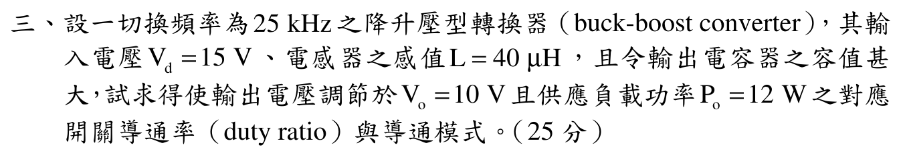

# 107 年電子學（含電力電子）第 3 題｜降升壓型轉換器

> ✅ 已依官方輸入／輸出功率、電感及切換頻率先檢查 CCM 臨界電感，再以 DCM 能量平衡求責任週期。

## 考場標準作答

先以 CCM 假設檢查導通模式。負載 \(R=V_o^2/P_o=10^2/12=8.333\,\Omega\)，若為 CCM 則 \(D_{\rm CCM}=10/(15+10)=0.4\)。邊界電感
\[
L_B=\frac{(1-D_{\rm CCM})^2R}{2f_s}
=\frac{(0.6)^2(8.333)}{2(25\,000)}
=60\,\mu\mathrm H.
\]
實際 \(L=40\,\mu\mathrm H<L_B\)，故為 \(\boxed{\mathrm{DCM}}\)，不得直接使用 CCM 的 \(D=0.4\) 當答案。DCM 每周期傳能 \(LI_{\rm pk}^2/2\)，且 \(I_{\rm pk}=V_dD/(Lf_s)\)，因此
\[
P_o=\frac{V_d^2D^2}{2Lf_s}
\quad\Longrightarrow\quad
\boxed{D=\sqrt{\frac{2Lf_sP_o}{V_d^2}}
=\sqrt{\frac{24}{225}}=0.3266}.
\]
關斷放能比例 \(D_2=V_dD/V_o=0.4899\)，有 \(D+D_2=0.8165<1\)，與 DCM 結論一致。

## 得分點拆解

- 先由 \(V_o^2/P_o\) 求負載，再用 CCM 候選占空比計算邊界電感。
- 比較 \(40<60\,\mu\mathrm H\) 判為 DCM；不得將 0.4 當最終占空比。
- 在 DCM 用每周期電感儲能求輸出功率，解得 \(D=0.3266\)。
- 由 \(D+D_2<1\) 回查導通模式，寫明 32.66% 為最終答案。

## 完整教學推導

### 三、降升壓型轉換器導通模式判別與責任週期求解（25 分）

### 📌 題目與已知條件
> **題目陳述**：
> 「設一切換頻率為 $25\text{ kHz}$ 之降升壓型轉換器（buck-boost converter），其輸入電壓 $V_d = 15\text{ V}$、電感器之感值 $L = 40\ \mu\text{H}$，且令輸出電容器之容值甚大，試求得使輸出電壓調節於 $V_o = 10\text{ V}$ 且供應用載功率 $P_o = 12\text{ W}$ 之對應開關導通率（duty ratio）與導通模式。（25 分）」

---

### 💡 核心考點與破題關鍵
1. 臨界電感判別： $L_B = \frac{(1 - D)^2 R}{2 f_s} = 60\ \mu\text{H} > 40\ \mu\text{H} \implies$ **不連續導通模式（DCM）**。
2. DCM 功率傳輸方程： $P_o = \frac{V_d^2 D^2}{2 L f_s}$。

---

### ✏️ 步驟式詳細數學推導

#### 步驟 1：導通模式判別
等效負載電阻 $R = \frac{V_o^2}{P_o} = \frac{10^2}{12} = \frac{25}{3}\ \Omega \approx 8.333\ \Omega$。
若在 CCM 下，責任週期 $D = \frac{V_o}{V_d + V_o} = \frac{10}{25} = 0.4$。
邊界臨界電感：
$$
L_B = \frac{(1 - 0.4)^2 \times (25/3)\ \Omega}{2 \times 25 \times 10^3\text{ Hz}} = \frac{0.36 \times 8.333}{50000} = 60\ \mu\text{H}
$$
因實際電感 $L = 40\ \mu\text{H} < L_B = 60\ \mu\text{H}$，電路工作於 **不連續導通模式（DCM）**。

---

#### 步驟 2：求解 DCM 下之導通率 $D$
由 DCM 輸出功率公式：
$$
P_o = \frac{V_d^2 D^2}{2 L f_s} \implies 12\text{ W} = \frac{(15\text{ V})^2 \times D^2}{2 \times (40 \times 10^{-6}\text{ H}) \times (25 \times 10^3\text{ Hz})} = \frac{225 D^2}{2}
$$
$$
D^2 = \frac{12 \times 2}{225} = \frac{24}{225} = 0.10667
$$
$$
\mathbf{D = \sqrt{\frac{24}{225}} = \frac{2\sqrt{6}}{15} \approx \mathbf{0.3266 \approx 32.66\%}}
$$

---

### 🎯 第三題 滿分關鍵與結論
* **導通模式**： **不連續導通模式（DCM）**
* **開關導通率**： $\mathbf{D \approx 32.66\%}$

---

## 獨立驗算

\[
I_{\rm pk}=\frac{15(0.3266)}{(40\,\mu\mathrm H)(25\,\mathrm{kHz})}
\approx4.899\,\mathrm A,\qquad
f_s\frac{LI_{\rm pk}^2}{2}\approx12.0\,\mathrm W.
\]
放能時間比例 \(D_2=15(0.3266)/10=0.4899\)，餘下約 18.35% 周期電感電流為零，因此 DCM 的三段時序自洽。若誤採 CCM 的 \(D=0.4\)，由同一 DCM 功率式將得到 18 W，與題目要求 12 W 不符。

## 常見失分

- 只解 CCM 增益式就答 \(D=0.4\)，未先比較 \(L\) 與邊界值。
- 把 \(V_o=10\) V 當電感充電電壓；開關導通時電感電壓為 \(V_d=15\) V。
- 忘記 DCM 還有零電流區間，未回查 \(D+D_2<1\)。
- 將 \(25\,\mathrm{kHz}\) 與 \(40\,\mu\mathrm H\) 的前綴漏換。
