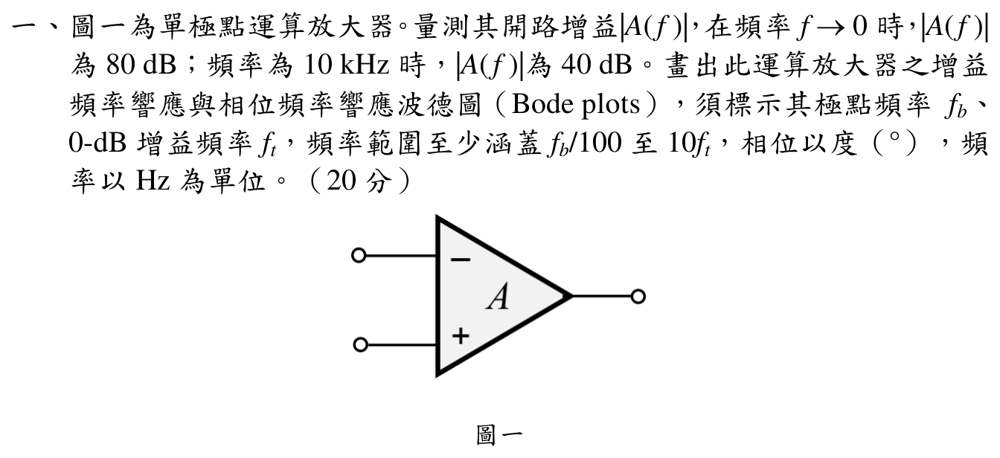

# 108 年電子學第 1 題：單極點運算放大器波德圖

## 題目條件

官方裁切圖給定單極點開路運算放大器：

- $\lvert A(0)\rvert=80\,\mathrm{dB}$。
- $\lvert A(10\,\mathrm{kHz})\rvert=40\,\mathrm{dB}$。
- 要求標示極點頻率 $f_b$、0-dB 單位增益頻率 $f_t$，並涵蓋 $f_b/100$ 至 $10f_t$。

## 1. 單極點模型與精確求解

取單極點模型

\[
A(f)=\frac{A_0}{1+jf/f_b},
\qquad
\lvert A(f)\rvert=\frac{A_0}{\sqrt{1+(f/f_b)^2}}.
\]

由低頻增益

\[
A_0=10^{80/20}=10^4=10000\ \mathrm{V/V}.
\]

在 $f=10\,\mathrm{kHz}=10000\,\mathrm{Hz}$ 時，40 dB 對應線性增益 $100\ \mathrm{V/V}$，所以

\[
100=\frac{10000}{\sqrt{1+(10000/f_b)^2}}.
\]

\[
1+(10000/f_b)^2=10000,
\qquad
f_b=\frac{10000}{\sqrt{9999}}=100.005000\ \mathrm{Hz}.
\]

0-dB 頻率由 $\lvert A(f_t)\rvert=1$ 定義：

\[
f_t=f_b\sqrt{A_0^2-1}=1{,}000{,}049.999\ \mathrm{Hz}\approx1.00005\ \mathrm{MHz}.
\]

若依考試波德漸近線慣例忽略轉折點的 3 dB 修正，則可寫成 $f_b\approx100\,\mathrm{Hz}$、$f_t\approx1.00\,\mathrm{MHz}$；此為四捨五入近似，不是精確單極點解。

## 2. 波德圖應標示的曲線

精確幅度與相位為

\[
G_{\mathrm{dB}}(f)=20\log_{10}A_0-10\log_{10}\left(1+(f/f_b)^2\right),
\qquad
\phi(f)=-\tan^{-1}(f/f_b).
\]

因此在題目要求範圍

\[
\frac{f_b}{100}=1.00005\,\mathrm{Hz}
\le f\le
10f_t=10.0005\,\mathrm{MHz}
\]

圖上至少應標示下列特徵點：

| 頻率 | 精確幅度 | 精確相位 |
|---:|---:|---:|
| $f_b$ | $76.9897\,\mathrm{dB}$ | $-44.9986^\circ$ |
| $10\,\mathrm{kHz}$ | $40.0000\,\mathrm{dB}$ | $-89.4271^\circ$ |
| $f_t$ | $0\,\mathrm{dB}$ | $-89.9943^\circ$ |

波德漸近線則從 $80\,\mathrm{dB}$ 起，在 $f_b$ 後以 $-20\,\mathrm{dB/decade}$ 下降；相位由 $0^\circ$ 經 $f_b$ 附近的 $-45^\circ$ 趨近 $-90^\circ$。

## 校驗結論

- `qid`、題號與官方 `source_crop` 已核對，圖面確為單極點運算放大器及題目指定資料。
- 原草稿以高頻漸近線直接把 $f_b$ 寫成 100 Hz；已補上精確單極點方程，精確值為 $100.005000\,\mathrm{Hz}$，並說明考試近似值 $100\,\mathrm{Hz}$。
- $f_t$ 亦以精確 0-dB 條件求得 $1{,}000{,}049.999\,\mathrm{Hz}$；所有公式均已改為標準 LaTeX，故本題標記為 `verified`。
