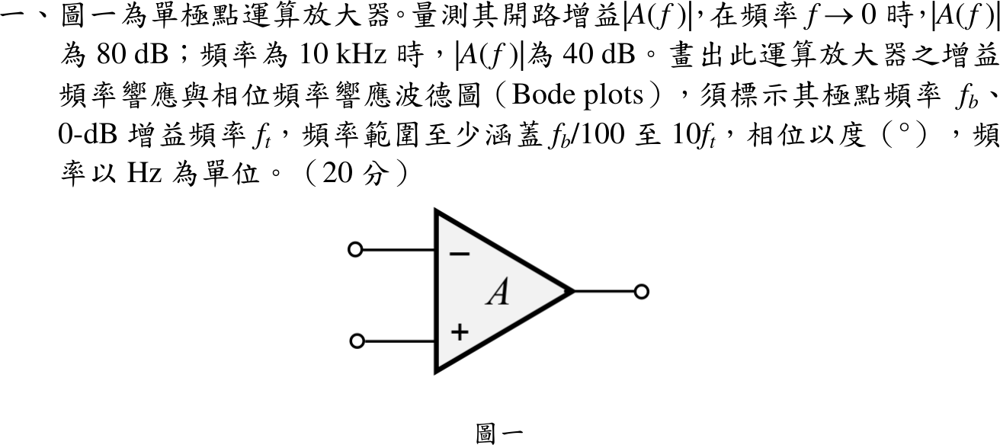

# 108 年電子學第 1 題｜單極點運算放大器波德圖



## 已知與所求

單極點開路增益：$f\to0$ 時 $|A|=80\,\mathrm{dB}$；$f=10\,\mathrm{kHz}$ 時 $|A|=40\,\mathrm{dB}$。畫幅頻與相頻波德圖，標出極點頻率 $f_b$、0 dB 頻率 $f_t$，範圍至少 $f_b/100\sim10f_t$，相位以度、頻率以 Hz。

## 考場標準作答

### 極點頻率 $f_b$

$A(f)=\dfrac{A_0}{1+jf/f_b}$，$A_0=10^{80/20}=10^4$，$|A(10\,\mathrm{kHz})|=10^{40/20}=100$：
\[
100=\frac{10^4}{\sqrt{1+(10^4/f_b)^2}}\ \Rightarrow\ (10^4/f_b)^2=9999
\]
\[
\boxed{f_b=\frac{10^4}{\sqrt{9999}}=100.005\ \mathrm{Hz}\approx100\ \mathrm{Hz}}
\]

### 0 dB 頻率 $f_t$

$|A(f_t)|=1$：
\[
\boxed{f_t=f_b\sqrt{A_0^2-1}\approx1.00005\ \mathrm{MHz}\approx1\ \mathrm{MHz}}
\]

### 波德圖

\[
G_{\mathrm{dB}}(f)=80-10\log_{10}\!\left[1+(f/f_b)^2\right],\qquad \phi(f)=-\tan^{-1}(f/f_b)
\]

```
|A|
  80 dB │────────────●  f_b
  60 dB │                  ╲
  40 dB │                        ●  10 kHz
  20 dB │                              ╲
   0 dB │                                    ●  f_t
 -20 dB │                                          ╲
        └──────────────────────────────────────────────
         1     10    100   1k    10k   100k  1M    10M  f (Hz)

φ
   0 °  │───────╲
 -45 °  │            ●
 -90 °  │                  ╲───────────────────────────
        └──────────────────────────────────────────────
         1     10    100   1k    10k   100k  1M    10M  f (Hz)
```

圖中 80 dB 平線延伸到 $f_b=100\ \mathrm{Hz}$，之後以 $-20\ \mathrm{dB/decade}$ 直線下降，經 $10\ \mathrm{kHz}$ 的 40 dB 到 $f_t\approx1\ \mathrm{MHz}$ 的 0 dB，延伸至 $10\ \mathrm{MHz}$（$-20\ \mathrm{dB}$）；相位在 $f_b$ 為 $-45^\circ$，兩側各約一個十倍頻後趨近 $0^\circ$、$-90^\circ$。

| $f$ | 1 Hz | $f_b$ | 10 kHz | $f_t$ | 10 MHz |
|---|---|---|---|---|---|
| $\lvert A\rvert$ (dB) | 80 | 76.99 | 40 | 0 | −20 |
| $\phi$ (°) | −0.57 | −45 | −89.43 | −89.994 | −89.9994 |

## 驗算

以幾何方式檢查增益頻寬積：$A_0f_b=10^4\times100.005=1.00005\ \mathrm{MHz}=f_t$；漸近線在 10 kHz 為 $80-20\log_{10}(10^4/100)=40\ \mathrm{dB}$，與題給量測一致。

## 失分點

- 40 dB 是 $100$ V/V（$20\log_{10}$），不是 40 V/V；若誤用 $10\log_{10}$ 會得 $10^4$ 而得到錯誤的 $f_b$。
- $f_b$ 是 $-3\,\mathrm{dB}$ 轉折點（相位 $-45^\circ$），$f_t\approx10^4f_b$ 才是 0 dB 交越；兩者不可混標。
- 單極點相位是 $0^\circ\to-90^\circ$（負值），並要涵蓋 $f_b/100=1\ \mathrm{Hz}$ 到 $10f_t=10\ \mathrm{MHz}$。
