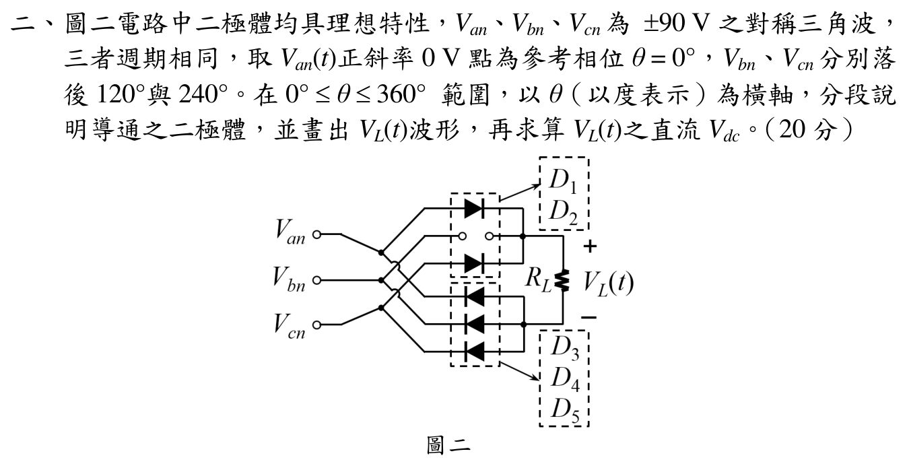

# 108 年電子學第 2 題：三相對稱三角波全波整流

## 考場標準作答

理想三相橋式整流器的上臂接瞬時最高相、下臂接瞬時最低相，因此

\[
V_L(\theta)=\max(V_{an},V_{bn},V_{cn})-\min(V_{an},V_{bn},V_{cn}).
\]

依官方圖的編號，正端二極體 $D_1,D_3,D_5$ 分別接 $a,b,c$ 相，負端二極體 $D_2,D_4,D_6$ 分別接 $a,b,c$ 相。三角波斜率大小為 $1\,\mathrm{V/deg}$，故換相角為 $30^\circ+60^\circ k$，導通順序為

| 角度 | 最高相／最低相 | 導通二極體 | $V_L$ |
|---|---|---|---:|
| $0^\circ\!\sim30^\circ$ | $c/b$ | $D_5,D_4$ | $120\,\mathrm V$ |
| $30^\circ\!\sim90^\circ$ | $a/b$ | $D_1,D_4$ | $120\,\mathrm V$ |
| $90^\circ\!\sim150^\circ$ | $a/c$ | $D_1,D_6$ | $120\,\mathrm V$ |
| $150^\circ\!\sim210^\circ$ | $b/c$ | $D_3,D_6$ | $120\,\mathrm V$ |
| $210^\circ\!\sim270^\circ$ | $b/a$ | $D_3,D_2$ | $120\,\mathrm V$ |
| $270^\circ\!\sim330^\circ$ | $c/a$ | $D_5,D_2$ | $120\,\mathrm V$ |
| $330^\circ\!\sim360^\circ$ | $c/b$ | $D_5,D_4$ | $120\,\mathrm V$ |

所以輸出波形為整個週期的 $120\,\mathrm V$ 水平線，

\[
\boxed{V_{dc}=\frac1{360^\circ}\int_0^{360^\circ}120\,d\theta=120\,\mathrm V}.
\]

## 得分點拆解

- 先判斷上臂取最高相、下臂取最低相，不能直接套用正弦三相整流的平均值公式。
- 由三角波的相位位移找出 $30^\circ+60^\circ k$ 的換相點。
- 每一段寫出導通二極體與最高／最低相，並畫出 $V_L=120\,\mathrm V$ 的水平波形。
- 用一週期積分求 $V_{dc}$，並在端點說明雙二極體同時導通只代表換相，不改變平均值。

## 完整教學推導

### 1. 建立三相三角波

令 $V_{an}$ 在 $\theta=0^\circ$ 由 0 V 以正斜率開始，峰值為 $90\,\mathrm V$。每個線性段的斜率大小為

\[
\left|\frac{dV}{d\theta}\right|=\frac{90\,\mathrm V}{90^\circ}=1\,\mathrm{V/deg}.
\]

並令 $V_{bn}(\theta)=V_{an}(\theta-120^\circ)$、$V_{cn}(\theta)=V_{an}(\theta-240^\circ)$。

### 2. 判定各段最高相與最低相

以 $0^\circ\le\theta\le30^\circ$ 為例，三相為 $V_{an}=\theta$、$V_{bn}=-60-\theta$、$V_{cn}=60-\theta$，故最高相為 $c$、最低相為 $b$，輸出為 $120\,\mathrm V$。每隔 $60^\circ$ 有一個新的候選相交會；在 $30^\circ$、$90^\circ$、$150^\circ$、$210^\circ$、$270^\circ$、$330^\circ$ 發生換相。

以 $30^\circ\le\theta\le90^\circ$ 為例，最高相為 $a$、最低相為 $b$，且

\[
V_L=V_{an}-V_{bn}=\theta-(\theta-120^\circ)=120\,\mathrm V.
\]

其餘區段同理；因三角波兩條同斜率線段的垂直距離均為 $120\,\mathrm V$，每段輸出都相同。

### 3. 平均值與波形

\[
V_L(\theta)=120\,\mathrm V\quad(0^\circ\le\theta\le360^\circ),
\]

\[
V_{dc}=\frac{1}{360^\circ}\int_0^{360^\circ}V_L(\theta)\,d\theta
=\frac{120\times360}{360}=120\,\mathrm V.
\]

這個結果來自官方題目指定的對稱三角波，不是正弦輸入下 $1.35V_{LL}$ 的公式。

## 獨立驗算

- 在 $0^\circ$：$(V_{an},V_{bn},V_{cn})=(0,-60,60)\,\mathrm V$，線電壓為 $60-(-60)=120\,\mathrm V$。
- 在 $60^\circ$：$(60,-60,0)\,\mathrm V$，線電壓仍為 $120\,\mathrm V$。
- 在 $120^\circ$：$(60,0,-60)\,\mathrm V$，線電壓仍為 $120\,\mathrm V$。
- 在 $240^\circ$：$(-60,0,60)\,\mathrm V$，線電壓仍為 $120\,\mathrm V$；以上涵蓋各種換相型態。
- `qid`、題號、三相 ±90 V、相位落後 120°／240° 與官方裁切圖一致。

## 常見失分

- 把三角波誤當正弦波，套用 $1.35V_{LL}$ 或以峰值直接平均。
- 把 $0^\circ$–$60^\circ$ 當成單一導通組合，漏掉 $30^\circ$ 的換相。
- 只列二極體編號，不檢查該相是否為瞬時最高／最低相。
- 將線電壓差誤算成 $90\,\mathrm V$ 或 $180\,\mathrm V$，忽略相位移後的三角波值。
