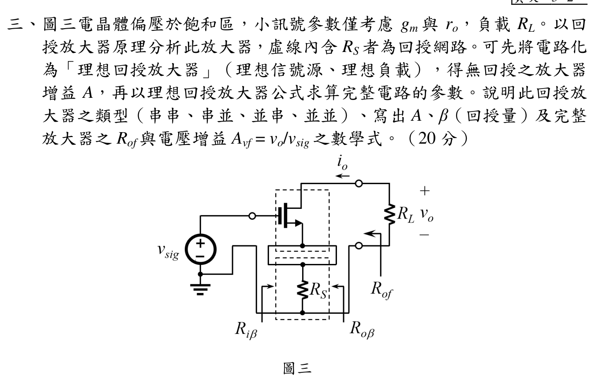

# 108 年電子學第 3 題：MOSFET 串聯–串聯負回授

## 考場標準作答

輸入端以 $v_{gs}$ 串聯相減，輸出端以汲極電流串聯取樣，故為**串聯–串聯負回授**，基本放大器為互導放大器：

\[
A=\frac{i_o}{v_i}=g_m,\qquad \beta=\frac{v_{fb}}{i_o}=R_S.
\]

理想 $r_o\to\infty$ 時

\[
i_o=g_m(v_{sig}-R_Si_o),
\qquad
\boxed{A_{vf}=\frac{v_o}{v_{sig}}=-\frac{g_mR_L}{1+g_mR_S}}.
\]

含有限 $r_o$ 時，直接對汲極、源極寫 KCL，得到

\[
\boxed{A_{vf}=-\frac{g_mr_oR_L}{r_o+R_L+R_S+g_mr_oR_S}},
\qquad
\boxed{R_{of}=r_o+R_S+g_mr_oR_S}.
\]

## 得分點拆解

- 指出輸入串聯混合、輸出串聯取樣，所以型態是串串而非串並。
- 寫出無回授互導增益 $A=g_m$ 與回授量 $\beta=R_S$。
- 先用 $1+ A\beta$ 求理想回授結果，再以 $r_o$ 的小訊號 KCL 求完整式。
- 求 $R_{of}$ 時移除外部 $R_L$；若要負載端總電阻，才再與 $R_L$ 並聯。

## 完整教學推導

### 1. 回授型態與理想公式

$R_S$ 的電流是輸出電流取樣，形成 $v_{fb}=R_Si_o$；此電壓回到輸入端與 $v_{sig}$ 串聯相減，故是串聯–串聯回授。令有效閘源電壓為 $v_i$，則

\[
i_o=g_mv_i,
\qquad v_i=v_{sig}-R_Si_o.
\]

解得 $i_o/v_{sig}=g_m/(1+g_mR_S)$。由圖中 $v_o=-i_oR_L$，即得理想增益。

### 2. 有限 $r_o$ 的節點方程

令閘極、汲極、源極電壓分別為 $v_{sig},v_o,v_s$，則

\[
\frac{v_o-v_s}{r_o}+g_m(v_{sig}-v_s)+\frac{v_o}{R_L}=0,
\]
\[
\frac{v_s-v_o}{r_o}-g_m(v_{sig}-v_s)+\frac{v_s}{R_S}=0.
\]

解此二元一次方程，

\[
\frac{v_o}{v_{sig}}=-\frac{g_mr_oR_L}{r_o+R_L+R_S+g_mr_oR_S}.
\]

令 $r_o\to\infty$，分子分母同除以 $r_o$，便回到 $-g_mR_L/(1+g_mR_S)$。

### 3. 輸出電阻

將 $v_{sig}=0$、移除 $R_L$，於汲極施加測試電壓。源極退化使測試電流受到 $R_S$ 與受控源共同影響，整理 KCL 得

\[
R_{of}=r_o+(1+g_mr_o)R_S
=r_o+R_S+g_mr_oR_S.
\]

若 $R_L$ 保留在端口上，量到的總端口電阻才是 $R_L\parallel R_{of}$。

## 獨立驗算

- 對有限 $r_o$ 的增益式取 $r_o\to\infty$，確實得到理想回授式。
- 令 $R_S\to0$，增益變成 $-g_m(R_L\parallel r_o)$，與無源極退化的共源級一致。
- 令 $g_m\to0$，$A_{vf}\to0$，而 $R_{of}\to r_o+R_S$，符合沒有跨導時的串聯電阻。
- KCL 兩式回代後汲極與源極殘差皆為零；`qid` 與官方 MOSFET、$R_S$、$R_L$ 圖面一致。

## 常見失分

- 將電流取樣誤判為並聯取樣，寫成串並或並串。
- 忘記 $v_o=-i_oR_L$ 的反相號號，將電壓增益寫成正值。
- 把 $R_L$ 同時放在完整增益與 $R_{of}$ 的定義中而重複計算。
- 有限 $r_o$ 的分母漏掉 $R_S$ 或 $g_mr_oR_S$。
