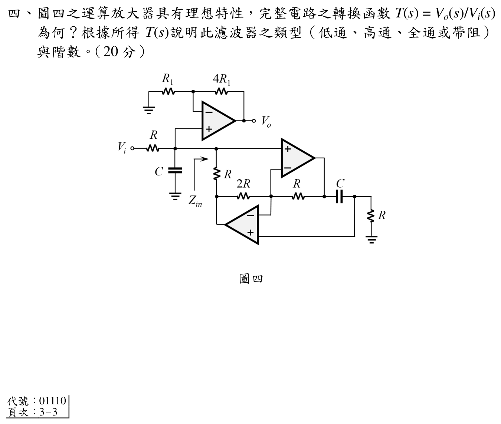

# 108 年電子學_含電力電子第 4 題

## 考場標準作答

GIC 將輸入端的阻抗轉為

\[
Z_{in}(s)=\frac{R\cdot2R\cdot R}{R\cdot(1/sC)}=2sR^2C=sL_{eq},
\qquad L_{eq}=2R^2C.
\]

因此節點對地為 $Z_p=(1/sC)\parallel(2sR^2C)$，再與輸入串聯電阻 $R$ 分壓。上方非反相級增益為 $1+4R_1/R_1=5$，故

\[
\boxed{T(s)=\frac{V_o}{V_i}=\frac{10sRC}{2s^2R^2C^2+2sRC+1}}.
\]

分母最高次為 $s^2$，且 $T(0)=T(\infty)=0$，所以是\(\boxed{\text{二階帶通濾波器}}\)。

## 得分點拆解

- 由 GIC 阻抗轉換式辨認 $Z_{in}=s(2R^2C)$，不能誤當成電容。
- 將此等效電感與圖中的電容並聯，再與輸入串聯 $R$ 做分壓。
- 寫出上方非反相級的 5 倍增益並乘入總轉移函數。
- 以低頻、高頻極限判斷帶通，以分母最高次判斷二階。

## 完整教學推導

### 1. GIC 等效電感

依官方圖中五個阻抗位置，$Z_1=R,Z_2=R,Z_3=2R,Z_4=1/(sC),Z_5=R$。理想運算放大器的虛短、虛斷條件給出

\[
Z_{in}=\frac{Z_1Z_3Z_5}{Z_2Z_4}
=\frac{R(2R)R}{R/(sC)}=2sR^2C.
\]

這是電感阻抗 $sL$，所以 $L_{eq}=2R^2C$。

### 2. 輸入節點分壓

輸入節點的並聯阻抗為

\[
Z_p=\frac{1}{sC}\parallel2sR^2C
=\frac{2sR^2C}{1+2s^2R^2C^2}.
\]

由串聯輸入電阻 $R$，

\[
\frac{V_+}{V_i}=\frac{Z_p}{R+Z_p}
=\frac{2sRC}{1+2sRC+2s^2R^2C^2}.
\]

上方理想非反相放大器的閉迴路增益是

\[
\frac{V_o}{V_+}=1+\frac{4R_1}{R_1}=5.
\]

相乘得到

\[
T(s)=5\frac{2sRC}{1+2sRC+2s^2R^2C^2}
=\frac{10sRC}{2s^2R^2C^2+2sRC+1}.
\]

### 3. 類型與階數

當 $s\to0$，分子與 $s$ 成正比，$T(s)\to0$；當 $s\to\infty$，分母為 $s^2$ 而分子為 $s$，仍有 $T(s)\to0$。中間頻率可有非零增益，故為帶通。分母為二次多項式，故為二階。

## 獨立驗算

- 量綱檢查：$sRC$ 無因次，$s^2R^2C^2$ 也無因次，故 $T(s)$ 為無因次增益。
- 低頻極限 $T(0)=0$，高頻極限 $\lim_{s\to\infty}T(s)=0$，與帶通定義相符。
- 若 $Z_{in}$ 改成 $1/(sC)$，低頻／高頻極限會與圖示不符；以 GIC 公式回代可確認目前為等效電感。
- `qid` 與官方 Q04 裁切圖的兩個理想運算放大器、$R$、$2R$、$C$ 配置一致。

## 常見失分

- GIC 分子分母位置顛倒，將 $sL$ 誤算成 $1/(sC)$。
- 忘記輸入端還有並聯的實體電容 $C$，只保留 GIC 等效電感。
- 把非反相增益寫成 $4$ 而不是 $1+4=5$。
- 看到二次分母就直接判定低通，未檢查 $s=0$ 與 $s\to\infty$ 的極限。
