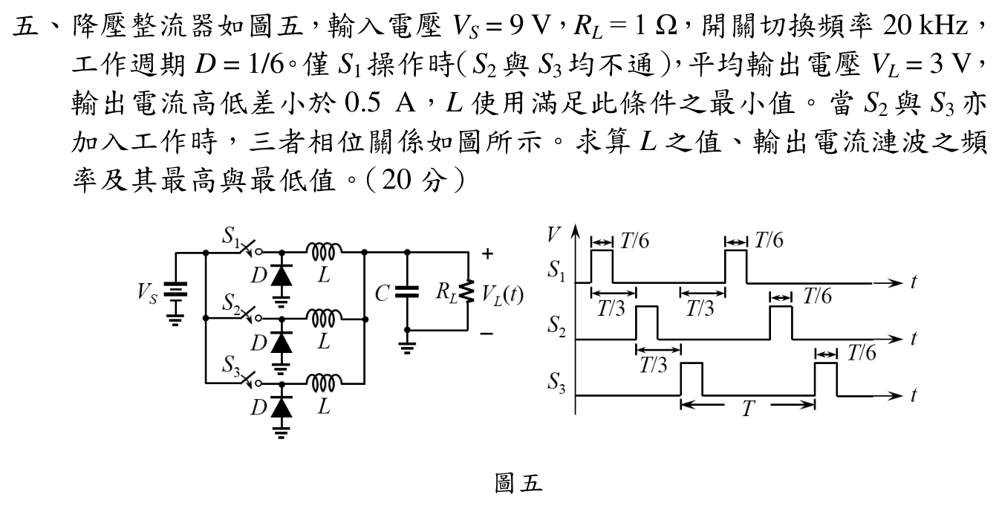

# 108 年電子學_含電力電子第 5 題

> 本題已依官方三相交錯脈波時序重建各電感電流斜率，並以總電流週期回代。

## 五、交錯並聯降壓轉換器電感、漣波頻率與極值計算（20 分）

### 📌 題目與已知條件

> **題目陳述**：
> 「降壓整流器如圖五，輸入電壓 $V_S = 9\text{ V}, R_L = 1\ \Omega$，開關切換頻率 $20\text{ kHz}$，工作週期 $D = 1/6$。僅 $S_1$ 操作時（$S_2$ 與 $S_3$ 均不通），平均輸出電壓 $V_L = 3\text{ V}$，輸出電流高低差小於 $0.5\text{ A}，L$ 使用滿足此條件之最小值。當 $S_2$ 與 $S_3$ 亦加入工作時，三者相位關係如圖所示。求算 $L$ 之值、輸出電流漣波之頻率及其最高與最低值。（20 分）」

---

### 💡 核心考點與破題關鍵
1. **單相操作電感設計**：
   $$\Delta i_L = \frac{(V_S - V_L) D T_s}{L} \le 0.5\text{ A} \implies L_{min} = \frac{(V_S - V_L) D}{f_s \Delta i_L}$$
2. **三相交錯並聯（3-Phase Interleaved）**：
   - 漣波頻率倍增： $f_{ripple} = 3 \times f_s = 60\text{ kHz}$。
   - 輸出平均電流 $I_{out} = \frac{V_L}{R_L} = 3\text{ A}$。

---

### ✏️ 步驟式詳細數學推導

#### 步驟 1：求解電感值 $L$
單相操作時，$V_S = 9\text{ V}, V_L = 3\text{ V}, D = 1/6, f_s = 20\text{ kHz} \implies T_s = 50\ \mu\text{s}$：
導通時間 $t_{on} = D T_s = \frac{50\ \mu\text{s}}{6} = \frac{25}{3}\ \mu\text{s}$。
由電感電流漣波條件 $\Delta i_L \le 0.5\text{ A}$：
$$
\Delta i_L = \frac{(V_S - V_L) t_{on}}{L} = \frac{(9 - 3)\text{ V} \times \frac{25}{3} \times 10^{-6}\text{ s}}{L} = \frac{50 \times 10^{-6}}{L} \le 0.5\text{ A}
$$
$$
\mathbf{L = \frac{50 \times 10^{-6}}{0.5} = \mathbf{100 \times 10^{-6}\text{ H} = 100\ \mu\text{H} = 0.1\text{ mH}}}
$$

---

#### 步驟 2：求三相交錯工作時之輸出電流漣波頻率
三相開關相位彼此錯開 $120^\circ$（時間延遲 $T_s/3$），輸出總電流為三相之和：
$$
\mathbf{f_{ripple} = 3 \times f_s = 3 \times 20\text{ kHz} = \mathbf{60\text{ kHz}}}
$$

---

#### 步驟 3：求輸出電流最高值與最低值
1. 輸出平均總電流：
   $$I_{out,avg} = \frac{V_L}{R_L} = \frac{3\text{ V}}{1\ \Omega} = \mathbf{3\text{ A}}$$
2. 因 $D = 1/6 < 1/3$，三相開關導通區間互不重疊。
   導通區間一相上升斜率為 \( (V_S-V_L)/L=6/L \)，其餘兩相下降斜率各為 \( -V_L/L=-3/L \)，故總斜率為零。三相全關斷的間隔為 \(T/6\)，總斜率為 \( -3V_L/L=-9/L \)，因此
   $$\Delta I_{out}=\frac{3V_L}{L}\frac{T}{6}=\frac{3}{6}\Delta i_L=\frac{3}{6}(0.5\text{ A})=\mathbf{0.75\text{ A}}$$
3. 輸出電流極值：

   $$\mathbf{I_{out,max} = I_{out,avg} + \frac{\Delta I_{out}}{2} = 3\text{ A} + \frac{0.75\text{ A}}{2} = \mathbf{3.375\text{ A}}}$$

   $$\mathbf{I_{out,min} = I_{out,avg} - \frac{\Delta I_{out}}{2} = 3\text{ A} - \frac{0.75\text{ A}}{2} = \mathbf{2.625\text{ A}}}$$

---

### 🎯 第五題 滿分關鍵與結論
* **電感值**： $\mathbf{L = 100\ \mu\text{H}}$
* **漣波頻率**： $\mathbf{f_{ripple} = 60\text{ kHz}}$
* **輸出電流極值**： $\mathbf{I_{out,max} = 3.375\text{ A}}, \quad \mathbf{I_{out,min} = 2.625\text{ A}}$
