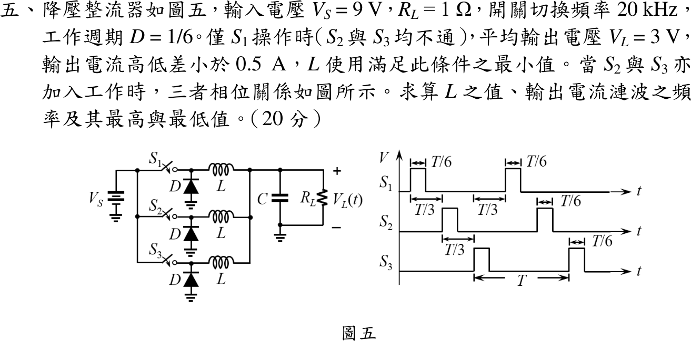

# 108 年電子學第 5 題｜三相交錯式降壓轉換器

## 已知與所求

$V_S=9\,\mathrm V$、$R_L=1\,\Omega$、$f_s=20\,\mathrm{kHz}$、$D=1/6$。僅 $S_1$ 工作時題給 $V_L=3\,\mathrm V$，單相電感電流高低差 $<0.5\,\mathrm A$，$L$ 取最小值。$S_1,S_2,S_3$ 脈寬皆為 $T/6$，彼此相差 $T/3$。求 $L$、輸出電流漣波頻率及其最高、最低值。

## 考場標準作答

\[
T_s=\frac1{20\,\mathrm{kHz}}=50\,\mu\mathrm s,\qquad t_{on}=DT_s=\frac{T_s}{6}
\]

### 電感

僅 $S_1$ 工作，導通期間電感跨壓 $V_S-V_L=6\,\mathrm V$：
\[
\Delta i_L=\frac{(V_S-V_L)DT_s}{L}=\frac{6\times(50/6)\,\mu\mathrm s}{L}=\frac{50\,\mu\mathrm s}{L}\le0.5\,\mathrm A
\]
\[
\boxed{L_{min}=100\ \mu\mathrm H}
\]

### 漣波頻率

三相脈波相差 $T_s/3$，輸出電流每 $T_s/3$ 重複一次：
\[
\boxed{f_{ripple}=3f_s=3\times20\text{ kHz}=\mathbf{60\text{ kHz}}}
\]

### 最高、最低值

脈寬 $T_s/6$、間隔 $T_s/3$，任一時刻至多一相導通。三相電感電流之和的斜率：

- 一相導通：$\dfrac{V_S-V_L}{L}-\dfrac{V_L}{L}-\dfrac{V_L}{L}=\dfrac{6-3-3}{L}=0$。
- 三相皆關斷：$-\dfrac{3V_L}{L}=-\dfrac9L$，歷時 $T_s/6$。

總電流高低差
\[
\Delta I_o=\frac9L\cdot\frac{T_s}{6}=\frac{9}{100\,\mu\mathrm H}\cdot\frac{50\,\mu\mathrm s}{6}=\mathbf{0.75\text{ A}}
\]
平均值 $I_{o,avg}=V_L/R_L=3\,\mathrm A$，以平均值為中心：
\[
\boxed{\mathbf{I_{o,max}=3.375\text{ A}}},\qquad
\boxed{\mathbf{I_{o,min}=2.625\text{ A}}}
\]

## 驗算

單相檢查：$6\,\mathrm V\times(50/6)\,\mu\mathrm s/100\,\mu\mathrm H=0.5\,\mathrm A$，剛好達上限；三相皆關斷與一相導通兩種狀態的斜率比 $-9/L:0$ 對應 $T_s/6$ 內總降幅 $0.75\,\mathrm A$，$3.375-2.625=0.75\,\mathrm A$，中點 $=3\,\mathrm A$。若不交錯，輸出漣波會是單相的 $0.5\,\mathrm A$ 且頻率只有 $20\,\mathrm{kHz}$。

## 失分點

- 漣波頻率寫成單相的 $20\,\mathrm{kHz}$，漏乘三相交錯的 3 倍。
- 導通時間用 $T_s/3$（相位間隔）而非脈寬 $T_s/6$。
- 把 $0.5\,\mathrm A$ 當成三相總電流漣波，極值寫成 $3.25$ 與 $2.75\,\mathrm A$。

## 條件與疑義

題給 $V_S=9\,\mathrm V$、$D=1/6$ 的理想降壓平均輸出為 $DV_S=1.5\,\mathrm V$，與題給 $V_L=3\,\mathrm V$ 不一致；且代入 $V_L=3\,\mathrm V$ 時，三相總電流只有降沒有升，無週期穩態。本解以題面明載的 $V_L=3\,\mathrm V$（$I_{o,avg}=3\,\mathrm A$）為準，採導通區間斜率；其他讀法的答案：

- 同樣 $V_L=3\,\mathrm V$、改用關斷區間 $\Delta i_L=V_L(1-D)T_s/L\le0.5\,\mathrm A$：$L_{min}=250\ \mu\mathrm H$。
- 以 $V_L=DV_S=1.5\,\mathrm V$ 一致求解：$L_{min}=125\ \mu\mathrm H$，一相導通總斜率 $+4.5/L$、全關 $-4.5/L$，$\Delta I_o=0.30\ \mathrm A$，$I_{o,max}=1.65\ \mathrm A$、$I_{o,min}=1.35\ \mathrm A$。

三種讀法的漣波頻率皆為 $60\,\mathrm{kHz}$。
