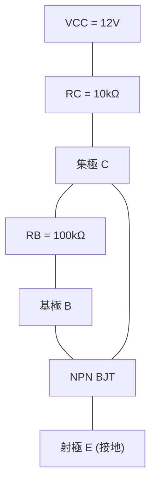

# 110 年電子學_含電力電子第 1 題

> ⚠️ 本檔由年度詳解分割產生；尚未完成獨立逐步重算，禁止視為已校驗答案。

## 一、BJT 集極回授偏壓電路與溫升工作點（Q 點）變化率分析（25 分）

### 📌 題目與已知條件
![[110年_電機工程技師_電子學（包括電力電子學）_p1.png|750]]
*圖：110年電子學第一題 BJT 集極回授偏壓電路*

> **題目陳述**：
> 「一電晶體集極回授偏壓電路，其中 $V_{CC} = 12\text{ V}, R_B = 100\text{ k}\Omega, R_C = 10\text{ k}\Omega$。
> $25^\circ\text{C}$ 時 $\beta_{dc} = 100, V_{BE} = 0.7\text{ V}；75^\circ\text{C}$ 時 $\beta_{dc} = 150, V_{BE} = 0.5\text{ V}$。
> 請繪出集極回授偏壓電路，並求由 $25^\circ\text{C}$ 升至 $75^\circ\text{C}$ 時之 $Q$ 點變化率。（25 分）」

---

### 💡 核心考點與破題關鍵
1. **集極回授偏壓方程式**：
   $$V_{CC} = (I_C + I_B) R_C + I_B R_B + V_{BE} = I_B [(\beta + 1) R_C + R_B] + V_{BE}$$
   $$I_B = \frac{V_{CC} - V_{BE}}{R_B + (\beta + 1) R_C}, \quad I_C = \beta I_B, \quad V_{CE} = I_B R_B + V_{BE}$$
2. **Q 點變化率定義**：
   $$\Delta I_C / I_{C1} \times 100\%, \quad \Delta V_{CE} / V_{CE1} \times 100\%$$

---

### ✏️ 步驟式詳細數學推導

![[110年_電子學_第1題_BJT集極回授偏壓小訊號等效電路圖.svg|850]]
*圖：110年第一題 BJT 集極回授偏壓小訊號等效電路分析圖*

#### 步驟 1：繪製集極回授偏壓電路

---

#### 步驟 2：計算 $25^\circ\text{C}$ 時之靜態工作點 $Q_1(I_{C1}, V_{CE1})$
代入 $\beta_1 = 100, V_{BE1} = 0.7\text{ V}$：
$$
I_{B1} = \frac{12\text{ V} - 0.7\text{ V}}{100\text{ k}\Omega + (100 + 1) \times 10\text{ k}\Omega} = \frac{11.3\text{ V}}{1110\text{ k}\Omega} \approx 0.01018\text{ mA} = 10.18\ \mu\text{A}
$$
$$
\mathbf{I_{C1} = \beta_1 I_{B1} = 100 \times 0.01018\text{ mA} = \mathbf{1.0180\text{ mA}}}
$$
$$
\mathbf{V_{CE1} = I_{B1} R_B + V_{BE1} = (0.01018\text{ mA} \times 100\text{ k}\Omega) + 0.7\text{ V} = 1.018\text{ V} + 0.7\text{ V} = \mathbf{1.7180\text{ V}}}
$$

---

#### 步驟 3：計算 $75^\circ\text{C}$ 時之靜態工作點 $Q_2(I_{C2}, V_{CE2})$
代入 $\beta_2 = 150, V_{BE2} = 0.5\text{ V}$：
$$
I_{B2} = \frac{12\text{ V} - 0.5\text{ V}}{100\text{ k}\Omega + (150 + 1) \times 10\text{ k}\Omega} = \frac{11.5\text{ V}}{1610\text{ k}\Omega} \approx 0.007143\text{ mA} = 7.143\ \mu\text{A}
$$
$$
\mathbf{I_{C2} = \beta_2 I_{B2} = 150 \times 0.007143\text{ mA} = \mathbf{1.0714\text{ mA}}}
$$
$$
\mathbf{V_{CE2} = I_{B2} R_B + V_{BE2} = (0.007143\text{ mA} \times 100\text{ k}\Omega) + 0.5\text{ V} = 0.7143\text{ V} + 0.5\text{ V} = \mathbf{1.2143\text{ V}}}
$$

---

#### 步驟 4：求 $Q$ 點各參數之變化率
1. **集極電流變化率**：

   $$\mathbf{\frac{\Delta I_C}{I_{C1}} = \frac{I_{C2} - I_{C1}}{I_{C1}} \times 100\% = \frac{1.0714 - 1.0180}{1.0180} \times 100\% \approx \mathbf{+5.25\%}}$$

2. **集-射極電壓變化率**：

   $$\mathbf{\frac{\Delta V_{CE}}{V_{CE1}} = \frac{V_{CE2} - V_{CE1}}{V_{CE1}} \times 100\% = \frac{1.2143 - 1.7180}{1.7180} \times 100\% \approx \mathbf{-29.32\%}}$$

---

### 🎯 第一題 滿分關鍵與結論
* **$25^\circ\text{C}$ 工作點**： $I_{C1} = 1.0180\text{ mA}, \ V_{CE1} = 1.7180\text{ V}$
* **$75^\circ\text{C}$ 工作點**： $I_{C2} = 1.0714\text{ mA}, \ V_{CE2} = 1.2143\text{ V}$
* **變化率**： $\Delta I_C / I_C = \mathbf{+5.25\%}, \quad \Delta V_{CE} / V_{CE} = \mathbf{-29.32\%}$

---
