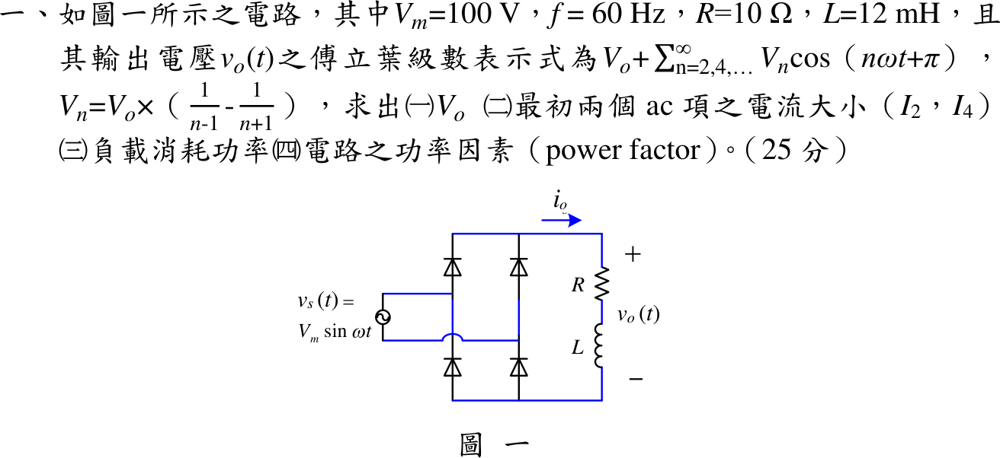

# 111 年電子學第 1 題｜橋式全波整流 RL 負載

## 已知與所求

理想二極體橋式整流，$v_s=V_m\sin\omega t$，$V_m=100\,\mathrm V$、$f=60\,\mathrm{Hz}$（$\omega=376.991\,\mathrm{rad/s}$），負載串聯 $R=10\,\Omega$、$L=12\,\mathrm{mH}$。題給 $v_o=V_o+\sum_{n=2,4,\ldots}V_n\cos(n\omega t+\pi)$，$V_n=V_o\left(\frac1{n-1}-\frac1{n+1}\right)=\frac{2V_o}{n^2-1}$。求（一）$V_o$；（二）$I_2,I_4$；（三）負載功率；（四）功率因數。

## 考場標準作答

### （一）直流輸出電壓

\[
\boxed{V_o=\frac{2V_m}{\pi}=63.662\ \mathrm V},\qquad I_0=\frac{V_o}{R}=6.3662\ \mathrm A
\]

### （二）最初兩個交流項電流（振幅）

\[
V_2=\tfrac23V_o=42.441\ \mathrm V,\quad |Z_2|=\sqrt{10^2+(2\omega L)^2}=\sqrt{10^2+9.0478^2}=13.486\ \Omega
\Rightarrow \boxed{I_2=3.147\ \mathrm A}
\]
\[
V_4=\tfrac2{15}V_o=8.4883\ \mathrm V,\quad |Z_4|=\sqrt{10^2+18.096^2}=20.675\ \Omega
\Rightarrow \boxed{I_4=0.4106\ \mathrm A}
\]

### （三）負載消耗功率

電感不耗實功，只算 $R$；各諧波正交：
\[
I_{rms}^2=I_0^2+\frac{I_2^2+I_4^2}{2}+\cdots=40.528+4.952+0.084+\cdots=45.575\ \mathrm{A^2}
\]
\[
\boxed{P=I_{rms}^2R=455.75\ \mathrm W}
\]
只取 $n=0,2,4$ 得 $455.65\,\mathrm W$，與完整級數差 0.02%，考場可用。

### （四）功率因數

橋式整流只改變電流方向，$I_{s,rms}=I_{rms}=6.7509\,\mathrm A$：
\[
\boxed{\mathrm{PF}=\frac{P}{V_{s,rms}I_{s,rms}}=\frac{455.75}{70.711\times6.7509}=0.9547}
\]

## 驗算

時域法：半週期內 $i(\theta)=\frac{V_m}{|Z_1|}\sin(\theta-\phi)+Ke^{-\theta R/(\omega L)}$，以週期條件 $i(0)=i(\pi)$ 定 $K$，得 $i(0)=i_{\min}>0$（連續導通，$v_o$ 確為全波正弦），積分 $\frac1\pi\int_0^\pi i^2d\theta=45.575\,\mathrm{A^2}$，與傅立葉功率和一致。另 $(10+j9.0478)\tilde I_2=-42.441$ 回到題給相位 $\pi$ 的諧波電壓。

## 失分點

- $I_2,I_4$ 是振幅，功率要再除以 2（或先換有效值）；直接 $I_0^2+I_2^2+I_4^2$ 會高估。
- 功率因數分母要用電源電流有效值 $6.751\,\mathrm A$，不是 $I_0=6.366\,\mathrm A$。
- 阻抗要用 $n\omega L$，誤用基頻 $\omega L=4.52\,\Omega$ 會使 $I_2$ 偏大。
