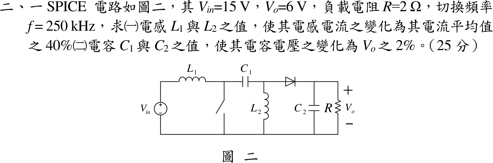

# 111 年電子學第 2 題｜SEPIC 轉換器元件設計

## 已知與所求

SEPIC：$V_{in}=15\,\mathrm V$、$V_o=6\,\mathrm V$、$R=2\,\Omega$、$f=250\,\mathrm{kHz}$（$T=4\,\mu\mathrm s$）。求（一）$L_1,L_2$ 使各自電感電流峰對峰變化為其平均值的 40%；（二）$C_1,C_2$ 使電容電壓變化為 $V_o$ 的 2%（$0.12\,\mathrm V$）。

## 考場標準作答

### 工作點

\[
\frac{V_o}{V_{in}}=\frac{D}{1-D}\Rightarrow D=\frac{6}{21}=\frac27,\qquad V_{C1}=V_{in}=15\ \mathrm V
\]
\[
I_o=\frac{V_o}{R}=3\ \mathrm A,\qquad I_{L1}=I_{in}=\frac{V_oI_o}{V_{in}}=1.2\ \mathrm A,\qquad I_{L2}=I_o=3\ \mathrm A
\]

### （一）電感

開關導通時 $L_1$ 承受 $V_{in}$、$L_2$ 承受 $V_{C1}=V_{in}$，$\Delta i_L=\frac{V_{in}DT}{L}$，$V_{in}DT=17.143\,\mu\mathrm{V\cdot s}$：
\[
\boxed{L_1=\frac{17.143\,\mu}{0.4\times1.2}=35.71\ \mu\mathrm H},\qquad
\boxed{L_2=\frac{17.143\,\mu}{0.4\times3}=14.29\ \mu\mathrm H}
\]

### （二）電容

導通期間 $C_1$ 放出 $I_{L2}$、$C_2$ 獨自供應 $I_o$，兩者都是 $3\,\mathrm A$ 持續 $DT$：
\[
C=\frac{I\,DT}{\Delta V_C}=\frac{3\times\frac27\times4\,\mu}{0.12}
\Rightarrow\boxed{C_1=28.57\ \mu\mathrm F},\qquad \boxed{C_2=28.57\ \mu\mathrm F}
\]

## 驗算

截止期間核對電荷平衡：$C_1$ 吸收 $I_{L1}(1-D)T=1.2\times\frac57\times4\,\mu=3.429\,\mu\mathrm C$，等於導通期間放出的 $I_{L2}DT=3\times\frac27\times4\,\mu=3.429\,\mu\mathrm C$，故 $\Delta V_{C1}=3.429\,\mu/28.57\,\mu=0.12\,\mathrm V$。功率守恆 $15\times1.2=6\times3=18\,\mathrm W$。

## 失分點

- $C_1$ 的轉移電荷用 $I_{L2}=3\,\mathrm A$（或截止期間的 $I_{L1}$ 配 $1-D$）；用 $I_{in}=1.2\,\mathrm A$ 配 $D$ 會得 $11.43\,\mu\mathrm F$。
- $L_2$ 的平均電流是 $I_o=3\,\mathrm A$，不是 $I_{in}$。
- SEPIC 增益為 $D/(1-D)$，誤用 Boost 的 $1/(1-D)$ 會得負的 $D$。
