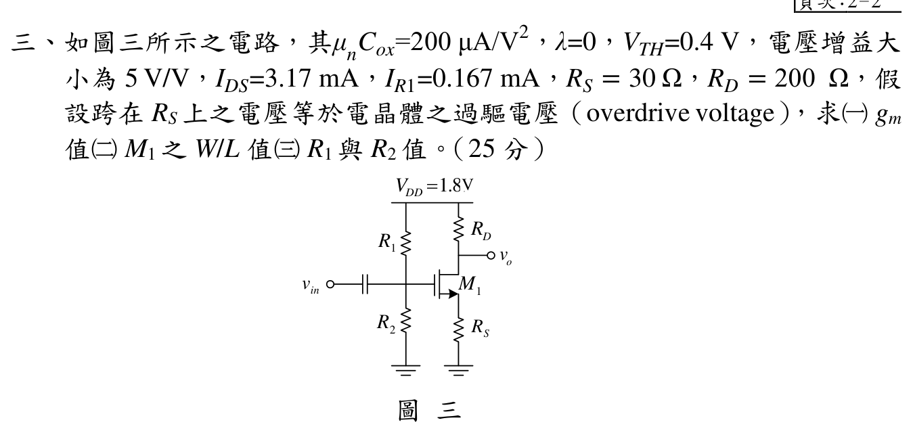

# 111 年電子學第 3 題：MOSFET 源極退化放大器

## 參考書影像核對（以參考書為主，並經獨立回代）

使用者提供的參考書照片將本題主解列為

\[
g_m=1\,\mathrm{mS},
\qquad
\frac WL=3522.2,
\qquad
R_2=3.3185\,\mathrm{k}\Omega,
\qquad
R_1=7.459\,\mathrm{k}\Omega.
\]

但把參考書自己的增益式直接代入 (g_m=1\,\mathrm{mS}) 時，

\[
\left|\frac{1}{1/g_m+30\,\Omega}(200\,\Omega)\right|
=\frac{200}{1030}=0.1942\ne 5.
\]

因此參考書的 (g_m=1\,\mathrm{mS}) 應視為排印或計算錯誤；若只依指定增益，應為 (g_m=0.1\,\mathrm{S}=100\,\mathrm{mS})。另一方面，題面給定 (I_D=3.17\,\mathrm{mA})、(R_S=30\,\Omega) 且 (V_{OV}=I_DR_S)，由平方律必得 (g_m=0.0666667\,\mathrm{S})，其增益為 (4.444444)，仍與題面 (5) 不同。參考書將 (V_{GS}=0.4951\,\mathrm{V}) 排印為 (0.4591\,\mathrm{V})，也會導致其 (R_1,R_2) 數值偏差。

本題以下保留參考書主解讀值與可回代的兩個條件分支，並將出題／排印矛盾寫入詳解；依使用者裁決，本題以 `reference_book_verified` 發布，但此狀態只代表參考書範圍內的雙分支整理，不代表官方唯一正解。

## 官方題目（逐題裁切）

如圖三所示，\(\mu_nC_{ox}=200\,\mu\mathrm{A/V^2}\)、\(\lambda=0\)、
\(V_{TH}=0.4\,\mathrm{V}\)，電壓增益大小為 \(5\,\mathrm{V/V}\)，
\(I_{DS}=3.17\,\mathrm{mA}\)、\(I_{R1}=0.167\,\mathrm{mA}\)、
\(R_S=30\,\Omega\)、\(R_D=200\,\Omega\)。假設跨在 \(R_S\) 上的電壓等於電晶體過驅電壓，求 \(g_m\)、\(M_1\) 的 \(W/L\)、以及 \(R_1,R_2\)。

官方題圖保留於 `source_crop`，本題只引用逐題裁切圖，未嵌入整頁試卷。

## 電路與基本條件

由圖確認 \(V_{DD}=1.8\,\mathrm{V}\)，\(R_1\)-\(R_2\) 為閘極分壓器，
\(R_D\) 接汲極、\(R_S\) 接源極，輸入電容隔離直流。令
\[
V_S=I_{DS}R_S,\qquad
V_{OV}=V_{GS}-V_{TH}.
\]
題目明確指定 \(V_S=V_{OV}\)，因此
\[
V_S=V_{OV}
=(3.17\times10^{-3})(30)
=0.0951\,\mathrm{V}.
\]

閘極直流電壓為
\[
V_G=V_{TH}+V_{OV}+V_S
=0.4+0.0951+0.0951
=0.5902\,\mathrm{V}.
\]

以題目給定的 \(I_{DS}\) 檢查飽和區假設：

\[
V_D=1.8-I_{DS}R_D=1.8-(3.17\,\mathrm{mA})(200\,\Omega)=1.166\,\mathrm{V},
\qquad
V_{DS}=V_D-V_S=1.0709\,\mathrm{V}>V_{OV}=0.0951\,\mathrm{V}.
\]

因此工作區假設本身一致，矛盾只出現在指定增益與平方律跨導之間。

## 由交流增益求 \(g_m\)

\(\lambda=0\) 表示 \(r_o=\infty\)。忽略外接負載時，未旁路源極電阻的共源極小訊號增益大小為
\[
\lvert A_v\rvert
=\frac{g_mR_D}{1+g_mR_S}=5.
\]
整理：
\[
g_mR_D=5(1+g_mR_S),
\]
\[
g_m(R_D-5R_S)=5,
\]
\[
\boxed{
g_m=\frac{5}{200-5(30)}
=0.100000\,\mathrm{S}
}.
\]

## 由跨導與過驅電壓求 \(W/L\)

若採用長通道平方律
\[
g_m=\mu_nC_{ox}\left(\frac WL\right)V_{OV},
\]
則由上面增益得到的 \(g_m\) 導出
\[
\frac WL
=\frac{0.100000}
{(200\times10^{-6})(0.0951)}
=\boxed{5257.624}.
\]

## 由閘極分壓電流求 \(R_1,R_2\)

理想 MOS 閘極直流電流為零，故
\[
I_{R1}=I_{R2}=0.167\,\mathrm{mA}.
\]
上方 \(R_1\) 的壓降為 \(1.8-0.5902=1.2098\,\mathrm{V}\)，下方 \(R_2\) 的壓降為 \(0.5902\,\mathrm{V}\)：
\[
\boxed{
R_1=\frac{1.8-0.5902}{0.167\,\mathrm{mA}}
=7.244311\,\mathrm{k}\Omega
},
\]
\[
\boxed{
R_2=\frac{0.5902}{0.167\,\mathrm{mA}}
=3.534132\,\mathrm{k}\Omega
}.
\]

## 一致性回代：目前資料互相矛盾

上述 \(g_m=0.1\,\mathrm{S}\) 是由題目給定的交流增益、\(R_D\)、\(R_S\) 唯一導出的結果；但若同時採用標準平方律，則
\[
g_m=\frac{2I_{DS}}{V_{OV}}
=\frac{2(3.17\,\mathrm{mA})}{0.0951\,\mathrm{V}}
=0.0666667\,\mathrm{S},
\]
與增益導出的 \(0.100000\,\mathrm{S}\) 不相等。

更強的檢查是把題目指定的 $V_{OV}=I_DR_S$ 直接代入平方律跨導：

\[
g_m=\frac{2I_D}{V_{OV}}
=\frac{2I_D}{I_DR_S}
=\frac{2}{R_S}.
\]

因此只要 $R_S=30\,\Omega$ 與 $V_{OV}=I_DR_S$ 同時成立，$g_m$ 必定為
$0.0666667\,\mathrm S$，不可能藉由更改 $I_D$ 變成 $0.1\,\mathrm S$。

兩種資料子集合各自回代如下：

- 只用增益條件：\(g_m=0.100000\,\mathrm{S}\)，\(W/L=5257.624\)，且
  \[
  \frac{g_mR_D}{1+g_mR_S}
  =\frac{(0.1)(200)}{1+(0.1)(30)}
  =5.
  \]
- 只用 \(I_{DS}\)、\(V_S=V_{OV}\) 與平方律：\(g_m=0.0666667\,\mathrm{S}\)，
  \(W/L=3505.082\)，但其增益為
  \[
  \frac{(0.0666667)(200)}
  {1+(0.0666667)(30)}
  =4.444444\neq5.
  \]

由於使用者已裁決採雙解呈現，本題不再把 \(g_m\) 與 \(W/L\) 壓成單一數值，而是並列參考書主解、指定增益分支與平方律分支；\(R_1,R_2\) 則在題圖 \(V_{DD}=1.8\,\mathrm{V}\)、理想閘極與題目指定 \(V_S=V_{OV}\) 下可獨立得到。

## 最小更正候選（出題／排印錯誤說明）

若保留題面 (I_{DS}=3.17\,\mathrm{mA})、(R_S=30\,\Omega) 與平方律，則

$$V_{OV}=0.0951\,\mathrm V,\qquad g_m=\frac{2I_D}{V_{OV}}=0.0666667\,\mathrm S,$$
$$|A_v|=\frac{g_mR_D}{1+g_mR_S}=4.444444.$$

也就是說，指定增益應約為 (4.44\,\mathrm{V/V})，而不是 5。

反過來若保留 $|A_v|=5$、$R_D=200\,\Omega$、$I_D=3.17\,\mathrm{mA}$、
$V_{OV}=I_DR_S$ 與平方律，則由 $g_m=2/R_S$ 得

$$
5=\frac{(2/R_S)R_D}{1+(2/R_S)R_S}
=\frac{2R_D}{3R_S},
$$

$$
R_S=\boxed{26.666667\,\Omega},\qquad
g_m=\frac{2}{R_S}=\boxed{0.075\,\mathrm S}.
$$

此時

$$
V_{OV}=I_DR_S=0.0845333\,\mathrm V,
$$

$$
\frac WL=\frac{g_m}{\mu_nC_{ox}V_{OV}}
=\boxed{4436.120}.
$$

再由 $V_G=V_{TH}+2V_{OV}$ 可得 $R_1=7.370858\,\mathrm{k}\Omega$、
$R_2=3.407585\,\mathrm{k}\Omega$。這兩個最小更正候選把可能的誤植位置具體化：
一是把增益改為 $4.444444$，二是把 $R_S$ 改為 $26.666667\,\Omega$；不能靠更改
$I_D$ 消除矛盾。

## 審查結論

本題官方圖面與偏壓數值足以求出 \(V_{OV}\)、\(V_G\)、\(R_1\)、\(R_2\)，也足以分別由增益或平方律求出候選 \(g_m,W/L\)；全部已知條件無法同時滿足標準 MOSFET 平方律與指定增益，且參考書另有 \(g_m\) 與 \(V_{GS}\) 排印／計算錯誤。依使用者裁決，本題保留雙分支與錯誤說明，狀態升級為 `audit_status: reference_book_verified`；參考書 evidence 仍不等同官方唯一答案。
