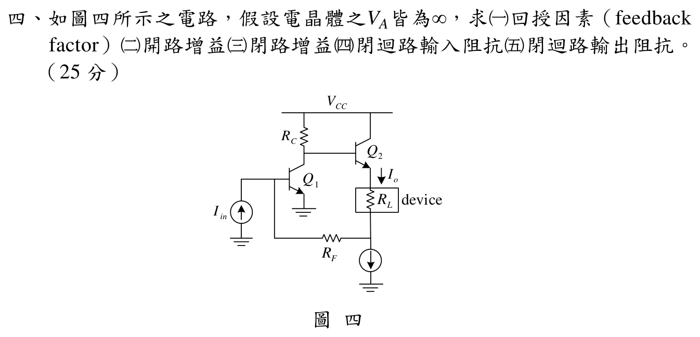

# 111 年電子學第 4 題：並聯—串聯電流回授放大器

## 📌 題目與已知條件

如圖四所示之電路，假設電晶體的 \(V_A\) 皆為 \(\infty\)，求：

1. 回授因素（feedback factor）
2. 開路增益
3. 閉路增益
4. 閉迴路輸入阻抗
5. 閉迴路輸出阻抗

官方圖面沒有給數值電阻或偏壓，因此本題的答案是依參考書建立的小訊號符號式。

## 💡 核心考點與破題關鍵

輸入端以電流並聯混合，輸出端以電流串聯取樣，所以本題屬於**並聯—串聯（Shunt-Series）／電流—電流（Current-Current Feedback）負回授**。也就是說，輸入端是電流並聯混合、輸出端是電流串聯取樣。令 \(I_o\) 為流過負載 \(R_L\) 的輸出電流，\(I_f\) 為經 \(R_F\) 回到輸入端的回授電流。

為避免與回授因素混淆，以下以 \(\beta_T\) 表示 Q2 的 BJT 電流增益，以 \(\beta_f\) 表示負回授因素。由 \(V_A=\infty\)，兩支 BJT 的 \(r_o\) 均視為無限大。

## ✏️ 步驟式詳細數學推導

### 步驟 1：求回授因素 \(\beta_f\)

在參考書的回授分解中，理想偏壓電流源於交流分析視為開路；下方串聯取樣支路的 KCL 給出回授電流與輸出電流大小相同：

\[
I_o=I_f
\]

因此

\[
\boxed{\beta_f=\frac{I_f}{I_o}=1}.
\]

這裡的 \(\beta_f\) 是回授網路的電流傳輸因子，不是 Q1 或 Q2 的 BJT \(\beta_T\)。

### 步驟 2：建立開路增益 \(A\)

先將回授系統拆成基本放大器 \(A\) 與回授網路。由 Q2 的基極看入負載側，等效輸入電阻為

\[
R_a=r_{\pi2}+(1+\beta_T)(R_L+R_F).
\]

輸入端的 Q1 小訊號電壓為

\[
v_{\pi1}=I_{in}(R_F\parallel r_{\pi1}).
\]

Q1 的共射極級使集極電壓反相，且集極端由 \(R_C\) 與 \(R_a\) 分壓；Q2 為共集極級，射極電流為基極電流的 \(1+\beta_T\) 倍。因此

\[
A=\frac{I_o}{I_{in}}
=-(R_F\parallel r_{\pi1})g_{m1}
\frac{R_C}{R_C+R_a}(1+\beta_T).
\]

\[
\boxed{
A=-(R_F\parallel r_{\pi1})g_{m1}
\frac{R_C}{R_C+r_{\pi2}+(1+\beta_T)(R_L+R_F)}(1+\beta_T)
}.
\]

參考書開路增益式漏掉由輸入電流轉成 \(v_{\pi1}\) 所需的 \(R_F\parallel r_{\pi1}\)。若直接寫成 \(\frac{R_F}{R_F+r_{\pi1}}\times g_{m1}\)，量綱也不是無因次電流增益；本解已補回此因子，並可由 \(v_{\pi1}=I_{in}(R_F\parallel r_{\pi1})\) 直接回代。

### 步驟 3：求基本放大器的輸入與輸出阻抗

基本放大器的輸入阻抗為 Q1 輸入端並聯的兩條支路：

\[
\boxed{R_{iA}=R_F\parallel r_{\pi1}}.
\]

由輸出端施加測試電壓，Q2 的射極反映至集極端的等效電阻為 \(\frac{R_C+r_{\pi2}}{1+\beta_T}\)，再加上輸出側的 \(R_L\) 與 \(R_F\)，故

\[
\boxed{
R_{oA}=R_L+R_F+\frac{R_C+r_{\pi2}}{1+\beta_T}
}.
\]

### 步驟 4：求閉迴路增益 \(A_f\)

負回授的誤差信號為 \(I_{in}-I_f\)，故標準閉迴路關係為

\[
I_o=A(I_{in}-\beta_f I_o).
\]

整理得

\[
I_o(1+A\beta_f)=AI_{in},
\]

\[
\boxed{A_f=\frac{I_o}{I_{in}}=\frac{A}{1+A\beta_f}}.
\]

### 步驟 5：求閉迴路輸入阻抗 \(R_{if}\)

並聯混合會使輸入阻抗降低 \(1+A\beta_f\) 倍：

\[
\boxed{R_{if}=\frac{R_{iA}}{1+A\beta_f}
=\frac{R_F\parallel r_{\pi1}}{1+A\beta_f}}.
\]

### 步驟 6：求閉迴路輸出阻抗 \(R_{of}\)

串聯取樣會使輸出阻抗提高 \(1+A\beta_f\) 倍：

\[
\boxed{R_{of}=R_{oA}(1+A\beta_f)}.
\]

## 🎯 滿分結論與作答要點

- 回授型態：並聯—串聯（Shunt-Series）／電流—電流負回授。
- 回授因素：
  \[
  \boxed{\beta_f=\frac{I_f}{I_o}=1}.
  \]
- 開路增益：
  \[
  \boxed{A=-(R_F\parallel r_{\pi1})g_{m1}\frac{R_C}{R_C+R_a}(1+\beta_T)},
  \quad
  R_a=r_{\pi2}+(1+\beta_T)(R_L+R_F).
  \]
- 閉路增益：
  \[
  \boxed{A_f=\frac{A}{1+A\beta_f}}.
  \]
- 閉迴路輸入阻抗：
  \[
  \boxed{R_{if}=\frac{R_F\parallel r_{\pi1}}{1+A\beta_f}}.
  \]
- 閉迴路輸出阻抗：
  \[
  \boxed{R_{of}=\left(R_L+R_F+\frac{R_C+r_{\pi2}}{1+\beta_T}\right)(1+A\beta_f)}.
  \]

以上為參考書主解的符號式，並已修正開路增益遺漏 \(R_F\parallel r_{\pi1}\) 的量綱問題；參考書 evidence 不等同官方公布答案。
