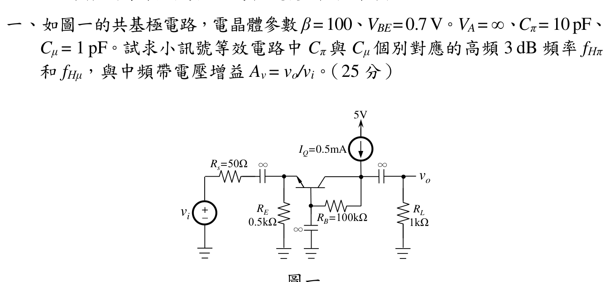

# 112 年電子學第 1 題：共基極放大器高頻響應

## 1. 題面與交流模型

官方裁切圖給定 $\beta=100$、$V_{BE}=0.7\,\mathrm{V}$、$V_A=\infty$、$C_\pi=10\,\mathrm{pF}$、$C_\mu=1\,\mathrm{pF}$、$I_Q=0.5\,\mathrm{mA}$，並有 $R_s=50\,\Omega$、$R_E=0.5\,\mathrm{k}\Omega$、$R_B=100\,\mathrm{k}\Omega$、$R_L=1\,\mathrm{k}\Omega$。兩個標示 $\infty$ 的耦合／旁路電容在中頻及本題分別計算的高頻小訊號模型中視為短路。

題圖沒有明示熱電壓 $V_T$；以下採教材最常用的 $V_T=25\,\mathrm{mV}$，並保留此假設，因此不能宣稱數值頻率對所有模型唯一成立。

\[
g_m=\frac{I_C}{V_T}=\frac{0.5\,\mathrm{mA}}{25\,\mathrm{mV}}=20\,\mathrm{mS},
\qquad
r_\pi=\frac{\beta}{g_m}=5\,\mathrm{k}\Omega.
\]

基極為交流接地，故 $C_\pi$ 直接跨接射極–地，$C_\mu$ 直接跨接集極–地，沒有共射極的 Miller 乘積放大。

## 2. $C_\pi$ 個別造成的高頻極點

令其他高頻電容開路、將理想信號源歸零。由基極交流接地，BJT 從射極看入的電阻為

\[
r_e=\frac{r_\pi}{\beta+1}=49.504950\,\Omega.
\]

因此 $C_\pi$ 兩端所見電阻為

\[
R_{C_\pi}=R_s\parallel R_E\parallel r_e
=50\parallel500\parallel49.504950
=23.696682\,\Omega.
\]

\[
\boxed{
f_{H\pi}=\frac{1}{2\pi R_{C_\pi}C_\pi}
=\frac{1}{2\pi(23.696682)(10\,\mathrm{pF})}
=671.634\,\mathrm{MHz}}
\]

若依常用 $r_e\approx1/g_m=50\,\Omega$ 近似，則 $R_{C_\pi}=23.809524\,\Omega$、$f_{H\pi}=668.451\,\mathrm{MHz}$；兩者差異來自是否保留有限 $\beta$ 修正。

## 3. $C_\mu$ 個別造成的高頻極點

令 $C_\pi$ 開路，$V_A=\infty$ 使 $r_o=\infty$，且集極端的理想偏流源在交流下開路。由於基極旁路為交流地，$R_B$ 也從集極接到地，因此

\[
R_{C_\mu}=R_L\parallel R_B\parallel r_o
=1000\parallel100000
=990.099010\,\Omega.
\]

\[
\boxed{
f_{H\mu}=\frac{1}{2\pi R_{C_\mu}C_\mu}
=\frac{1}{2\pi(990.099010)(1\,\mathrm{pF})}
=160.746\,\mathrm{MHz}}
\]

原年度解答忽略了圖中的 $R_B$，得到 $159.155\,\mathrm{MHz}$；只有在另行假設 $R_B\to\infty$ 時才可得到該近似值。

## 4. 中頻帶電壓增益

中頻時 $C_\pi,C_\mu$ 視為短路於其交流端點之外的模型，輸入端射極等效電阻為

\[
R_{in,e}=R_E\parallel r_e
=500\parallel49.504950
=45.045045\,\Omega.
\]

因此射極電壓相對於題目輸入端 $v_i$ 的分壓為

\[
\frac{v_e}{v_i}=\frac{R_{in,e}}{R_s+R_{in,e}}
=\frac{45.045045}{50+45.045045}=0.473684.
\]

集極的交流負載包含 $R_L\parallel R_B=990.099010\,\Omega$。共基極級不反相，故

\[
\frac{v_o}{v_e}=g_m(R_L\parallel R_B)=0.020(990.099010)=19.801980.
\]

合併得

\[
\boxed{
A_v=\frac{v_o}{v_i}
=g_m(R_L\parallel R_B)
\frac{R_E\parallel r_e}{R_s+R_E\parallel r_e}
=9.384825\ \mathrm{V/V}}
\]

若忽略 $R_B$ 對集極負載、並以 $r_e=1/g_m=50\,\Omega$ 近似，才得到年度解答的 $A_v=200/21=9.523810\,\mathrm{V/V}$。

## 校驗結論

- `qid` 與官方 `source_crop`、拓撲及元件參數已核對。
- 已補入官方圖中容易漏掉的 $R_B=100\,\mathrm{k}\Omega$ 對 $C_\mu$ 極點與中頻增益的影響。
- 題圖沒有指定 $V_T$，且教材可能採 $25$ 或 $26\,\mathrm{mV}$；以上以 $V_T=25\,\mathrm{mV}$ 給出可回代數值，但保留 `needs_manual_review`，待 Sol 確認採用模型後再升級。

### 逐項回代與模型界線

官方裁切圖已確認 $I_Q=0.5\,\mathrm{mA}$、$R_s=50\,\Omega$、$R_E=0.5\,\mathrm{k}\Omega$、$R_B=100\,\mathrm{k}\Omega$、$R_L=1\,\mathrm{k}\Omega$、$C_\pi=10\,\mathrm{pF}$、$C_\mu=1\,\mathrm{pF}$，以及基極旁路電容與輸入／輸出耦合電容均標示為 $\infty$。因此本解在高頻小訊號模型中將基極視為交流地，並以 $V_A=\infty$ 得 $r_o=\infty$。

採用教材常用 $V_T=25\,\mathrm{mV}$ 時：

\[
g_m=\frac{0.5\,\mathrm{mA}}{25\,\mathrm{mV}}=20\,\mathrm{mS},
\qquad
r_\pi=\frac{\beta}{g_m}=5.000\,\mathrm{k}\Omega,
\qquad
r_e=\frac{r_\pi}{\beta+1}=49.50495\,\Omega.
\]

\[
R_{\pi}=R_s\parallel R_E\parallel r_e=23.69668\,\Omega,
\qquad
f_{H\pi}=\frac{1}{2\pi R_\pi C_\pi}=671.634\,\mathrm{MHz},
\]

\[
R_{\mu}=R_L\parallel R_B=990.09901\,\Omega,
\qquad
f_{H\mu}=\frac{1}{2\pi R_\mu C_\mu}=160.746\,\mathrm{MHz}.
\]

中頻增益回代為

\[
R_{in,e}=R_E\parallel r_e=45.04505\,\Omega,
\qquad
\frac{v_e}{v_i}=\frac{45.04505}{50+45.04505}=0.473684,
\]

\[
A_v=g_m(R_L\parallel R_B)\frac{v_e}{v_i}
=0.020(990.09901)(0.473684)
=9.384825\ \mathrm{V/V}.
\]

若教材採 $V_T=26\,\mathrm{mV}$，則 $r_e=51.48515\,\Omega$、$f_{H\pi}=659.269\,\mathrm{MHz}$；這證明題圖未給 $V_T$ 時，$f_{H\pi}$ 與精確中頻增益不是唯一數值。故本檔維持人工複核狀態，但 $V_T=25\,\mathrm{mV}$ 主解及其模型假設已明確標示。

<!-- LEGACY_EXPLANATION_HIDDEN: replaced after independent verification

## 官方題目（逐題裁切）

如圖一的共基極電路，電晶體參數β =100、VBE=0.7V。VA=∞、Cπ =$10\text{ pF}$、
Cμ = $1\text{ pF}$。試求小訊號等效電路中Cπ 與Cμ 個別對應的高頻3 dB 頻率fHπ
和fHμ，與中頻帶電壓增益Av = vo/vi。（25 分）
圖一

## 校驗狀態

本段為歷史模板殘片，已由上方題號級獨立推導取代，不作為答案依據。
-->
