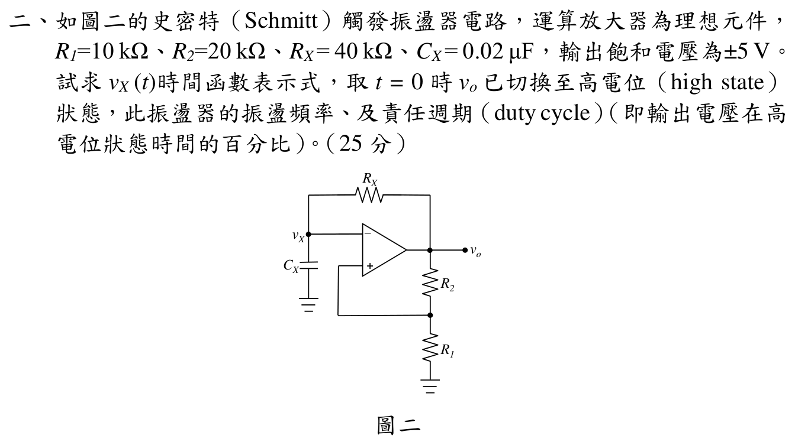

# 112 年電子學第 2 題：Schmitt 觸發鬆弛振盪器

## 1. 閾值與時間常數

官方圖為理想運算放大器正回授 Schmitt 觸發器，輸出飽和為 $v_o=\pm5\,\mathrm{V}$，且 $R_1=10\,\mathrm{k}\Omega$ 接地、$R_2=20\,\mathrm{k}\Omega$ 接輸出、$R_X=40\,\mathrm{k}\Omega$、$C_X=0.02\,\mu\mathrm{F}$。

非反相端分壓電壓為

\[
v_+=\frac{R_1}{R_1+R_2}v_o=\frac{1}{3}v_o,
\qquad
V_T=\pm\frac{5}{3}\,\mathrm{V}.
\]

反相端 $v_X$ 經 $R_X$ 由輸出充電，故

\[
\tau=R_XC_X=(40\,\mathrm{k}\Omega)(0.02\,\mu\mathrm{F})=0.8\,\mathrm{ms}.
\]

題目指定 $t=0$ 時輸出剛切換至高電位。切換瞬間電容電壓連續，因此切換前的低輸出狀態使

\[
v_X(0)= -\frac{5}{3}\,\mathrm{V},
\qquad
v_o(0^+)=+5\,\mathrm{V}.
\]

## 2. 高、低輸出狀態的 $v_X(t)$

固定輸出為 $V_o$ 時，$v_X$ 滿足

\[
\frac{dv_X}{dt}=\frac{V_o-v_X}{\tau},
\qquad
v_X(t)=V_o+[v_X(t_0)-V_o]e^{-(t-t_0)/\tau}.
\]

### 高電位半週期

當 $v_o=+5\,\mathrm{V}$，$v_X$ 從 $-5/3$ 上升至正閾值 $+5/3$：

\[
v_X(t)=5-\frac{20}{3}e^{-t/\tau},
\qquad 0\le t<t_H.
\]

令 $v_X(t_H)=5/3$：

\[
\frac{5}{3}=5-\frac{20}{3}e^{-t_H/\tau}
\quad\Longrightarrow\quad
e^{-t_H/\tau}=\frac12,
\qquad
t_H=\tau\ln2=0.554518\,\mathrm{ms}.
\]

此刻運算放大器切換至 $v_o=-5\,\mathrm{V}$。

### 低電位半週期

當 $v_o=-5\,\mathrm{V}$，$v_X$ 從 $+5/3$ 下降至 $-5/3$：

\[
v_X(t)=-5+\frac{20}{3}e^{-(t-t_H)/\tau},
\qquad t_H\le t<t_H+t_L.
\]

令 $v_X(t_H+t_L)=-5/3$：

\[
-\frac{5}{3}=-5+\frac{20}{3}e^{-t_L/\tau}
\quad\Longrightarrow\quad
e^{-t_L/\tau}=\frac12,
\qquad
t_L=\tau\ln2=0.554518\,\mathrm{ms}.
\]

因此 $t=0$ 起始的一個週期可寫為

\[
v_X(t)=
\begin{cases}
5-\dfrac{20}{3}e^{-t/\tau},&0\le t<t_H,\\[6pt]
-5+\dfrac{20}{3}e^{-(t-t_H)/\tau},&t_H\le t<T,
\end{cases}
\qquad v_X(t+T)=v_X(t).
\]

## 3. 頻率與責任週期

\[
T=t_H+t_L=2\tau\ln2
=1.109035\,\mathrm{ms},
\]

\[
\boxed{f=\frac1T=901.684\,\mathrm{Hz}},
\qquad
\boxed{D=\frac{t_H}{T}=\frac12=50\%}.
\]

## 校驗結論

- `qid` 與官方 `source_crop` 已核對，正回授分壓閾值為 $\pm5/3\,\mathrm{V}$。
- $\tau=0.8\,\mathrm{ms}$、$t_H=t_L=0.554518\,\mathrm{ms}$、$T=1.109035\,\mathrm{ms}$ 均由圖示元件回代。
- 正確振盪頻率為 $901.684\,\mathrm{Hz}$，責任週期為 $50\%$；條件完整，標記為 `verified`。

<!-- LEGACY_EXPLANATION_HIDDEN: replaced after independent verification

## 官方題目（逐題裁切）

如圖二的史密特（Schmitt）觸發振盪器電路，運算放大器為理想元件，
R1=$10\text{ k}\Omega$、R2=$20\text{ k}\Omega$、RX= $40\text{ k}\Omega$、CX= $0.02\ \mu\text{F}$，輸出飽和電壓為±5 V。
試求vX (t)時間函數表示式，取t = 0 時vo 已切換至高電位（high state）
狀態，此振盪器的振盪頻率、及責任週期（duty cycle）（即輸出電壓在高
電位狀態時間的百分比）。（25 分）
圖二
5V
∞
+_
vi
RE
$0.5\text{ k}\Omega$
$$RB = 100\text{ k}\Omega$$
$$Rs = 50\ \Omega$$
$1\text{ k}\Omega$
∞
∞
$$IQ = 0.5\text{ mA}$$
_
_
CX
vX
RX

## 校驗狀態

本題已由年度詳解拆分為獨立記錄；目前僅保留官方裁切題目，尚未將既有年度詳解視為可信答案。待依題目條件完成獨立推導、數值／符號代回與第二人驗算後，才可升級為 `verified`。
-->
