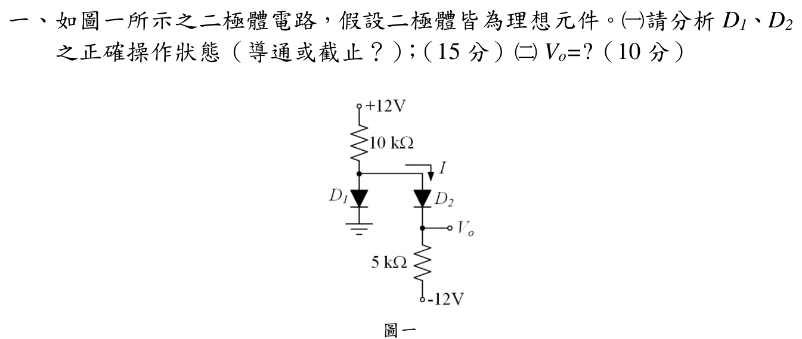

# 113 年電子學第 1 題：理想二極體操作狀態

## 1. 讀圖與理想二極體模型

令兩個二極體上端共同節點為 $x$。由官方符號，$D_1$ 的陽極接 $x$、陰極接地，$D_2$ 的陽極接 $x$、陰極接輸出 $V_o$；兩者皆只允許電流由上往下。理想二極體導通時壓降為 0 V，截止時電流為 0。

上方 $10\,\mathrm{k}\Omega$ 接 $+12\,\mathrm{V}$，下方 $5\,\mathrm{k}\Omega$ 接 $-12\,\mathrm{V}$。

## 2. 狀態假設與一致性檢查

### 候選一：$D_1$ 導通、$D_2$ 截止

若 $D_1$ 導通，則 $V_x=0$。此時 $D_2$ 截止且輸出端無電流，故 $V_o=-12\,\mathrm{V}$。然而

\[
V_x-V_o=0-(-12)=12\,\mathrm{V}>0,
\]

這會使 $D_2$ 正向偏壓，與「$D_2$ 截止」矛盾。因此此候選狀態不成立。

### 候選二：$D_1$ 截止、$D_2$ 導通

$D_2$ 導通時 $V_x=V_o$，電路成為 $+12$ V 與 $-12$ V 之間的串聯電阻：

\[
I=\frac{12-(-12)}{10\,\mathrm{k}\Omega+5\,\mathrm{k}\Omega}
=1.600\,\mathrm{mA}.
\]

由上方電阻壓降與下方電阻壓降分別求得

\[
V_x=12-I(10\,\mathrm{k}\Omega)=-4.000\,\mathrm{V},
\]

\[
V_o=-12+I(5\,\mathrm{k}\Omega)=-4.000\,\mathrm{V}.
\]

檢查二極體條件：

\[
V_{D_1}=V_x-0=-4.000\,\mathrm{V}<0,
\]

故 $D_1$ 確實截止；而 $D_2$ 兩端電壓為 $V_x-V_o=0$，且電流 $I=1.600\,\mathrm{mA}>0$ 由陽極流向陰極，故 $D_2$ 確實導通。

## 答案

\[
\boxed{D_1\ \text{截止}},
\qquad
\boxed{D_2\ \text{導通}},
\qquad
\boxed{V_o=-4.000\,\mathrm{V}}.
\]

## 校驗結論

- `qid` 與官方 `source_crop` 已核對，$D_1,D_2$ 的方向均為由共同上端節點向下。
- 已用兩組導通／截止假設逐一檢查理想二極體的電壓與電流條件，只有 $D_1$ 截止、$D_2$ 導通一致。
- 串聯電流與兩端電壓回代成立，故本題標記為 `verified`。

<!-- LEGACY_EXPLANATION_HIDDEN: replaced after independent verification

## 官方題目（逐題裁切）

如圖一所示之二極體電路，假設二極體皆為理想元件。(一)請分析D1、D2
之正確操作狀態（導通或截止？）；（15 分）(二)Vo=?（10 分）
圖一

## 校驗狀態

歷史草稿內容已由上方獨立校驗解答取代，僅供追溯。
-->
