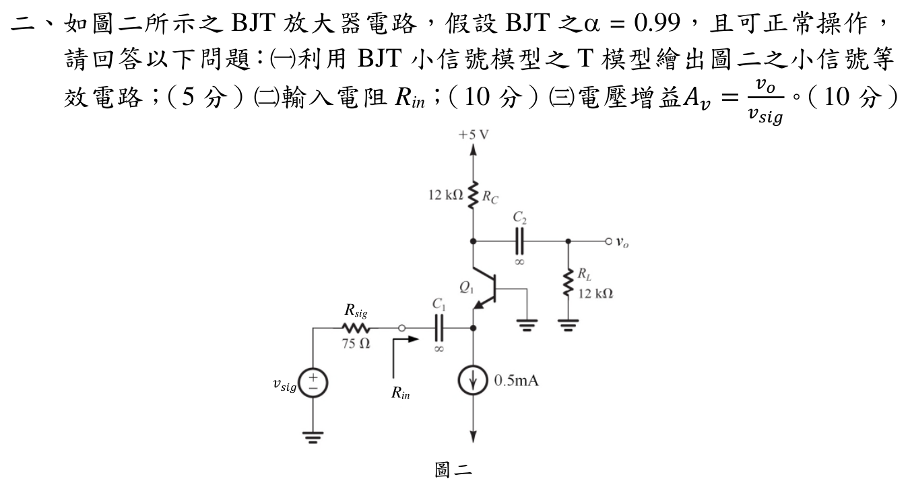

# 113 年電子學第 2 題：共基極 BJT T 模型與電壓增益

## 1. 題面與小訊號模型

### 條件式數值模型與升級判定

官方題面未明示接面溫度或 $V_T$，也沒有找到官方勘誤或完整官方解答補入此常數。以下先採教材常用 $V_T=25\,\mathrm{mV}$ 作主分支，並列出 $25.85$ 與 $26\,\mathrm{mV}$ 的敏感度；這是明示的教材假設，不是官方題面資料。輸入端的 $R_{sig}$ 分壓已納入 $v_e/v_{sig}$，所以不會把源端分壓遺漏，但仍不足以消除 $V_T$ 缺口；本題維持 `needs_manual_review`。

官方圖給定 $\alpha=0.99$、射極偏壓電流 $I_E=0.5\,\mathrm{mA}$，$R_{sig}=75\,\Omega$、$R_C=12\,\mathrm{k}\Omega$、$R_L=12\,\mathrm{k}\Omega$；基極交流接地，輸入由射極端經耦合電容接入，輸出由集極經耦合電容取出。題目未明示 $V_T$，以下先採教材常用 $V_T=25\,\mathrm{mV}$，並保留人工複核狀態。

因 $V_A=\infty$ 且理想偏流源在交流下開路，BJT T 模型包含射極–基極電阻

\[
r_e=\frac{V_T}{I_E},
\]

以及由射極電流控制的集極電流源 $\alpha i_e$；基極為交流地，集極負載為 $R_C\parallel R_L$。

## 2. 輸入電阻

在 $V_T=25\,\mathrm{mV}$ 假設下

\[
r_e=\frac{25\,\mathrm{mV}}{0.5\,\mathrm{mA}}=50\,\Omega.
\]

偏流源交流開路，故由射極看入的放大器輸入電阻為

\[
\boxed{R_{in}=r_e=50\,\Omega}.
\]

## 3. 電壓增益逐步計算

輸入源經 $R_{sig}$ 與 $R_{in}$ 分壓，故

\[
\frac{v_e}{v_{sig}}=\frac{R_{in}}{R_{sig}+R_{in}}
=\frac{50}{75+50}=0.4.
\]

集極的交流等效負載為

\[
R_C'=R_C\parallel R_L=12\,\mathrm{k}\Omega\parallel12\,\mathrm{k}\Omega=6\,\mathrm{k}\Omega.
\]

採 $i_e$ 定義為流入射極的 T 模型電流，$v_e=-i_er_e$；受控集極電流使輸出與射極電壓同相，因此

\[
v_o=-\alpha i_eR_C'
=\frac{\alpha R_C'}{r_e}v_e.
\]

所以

\[
\frac{v_o}{v_e}=\frac{0.99(6000)}{50}=118.8,
\]

\[
\boxed{
A_v=\frac{v_o}{v_{sig}}
=\frac{R_{in}}{R_{sig}+R_{in}}
\frac{\alpha(R_C\parallel R_L)}{r_e}
=0.4(118.8)=47.52\ \mathrm{V/V}}.
\]

此為正增益，符合共基極級的非反相特性。

## 4. 參數假設的影響與回代

若教材採 $V_T=26\,\mathrm{mV}$，則 $r_e=52\,\Omega$、$R_{in}=52\,\Omega$，且

\[
A_v=\frac{52}{75+52}\frac{0.99(6000)}{52}
=\frac{0.99(6000)}{127}=46.771654\ \mathrm{V/V}.
\]

因此題目未給 $V_T$ 時，$R_{in}$ 與 $A_v$ 不能在不同教材常數下宣稱唯一數值；在常用 $25\,\mathrm{mV}$ 約定下，回代為 $R_{in}=50\,\Omega$、$A_v=47.52\,\mathrm{V/V}$。

若以室溫物理常數近似 (V_T=25.85\,\mathrm{mV})，則

\[
r_e=51.70\,\Omega,
\qquad R_{in}=51.70\,\Omega,
\qquad A_v=\frac{0.99(6000)}{75+51.70}=46.882399\ \mathrm{V/V}.
\]

| 假設 | \(r_e=V_T/I_E\) | \(R_{in}\) | \(A_v\) |
|---|---:|---:|---:|
| \(V_T=25\,\mathrm{mV}\) | \(50.00\,\Omega\) | \(50.00\,\Omega\) | \(47.520000\) |
| \(V_T=25.85\,\mathrm{mV}\) | \(51.70\,\Omega\) | \(51.70\,\Omega\) | \(46.882399\) |
| \(V_T=26\,\mathrm{mV}\) | \(52.00\,\Omega\) | \(52.00\,\Omega\) | \(46.771654\) |

因此題目未給 (V_T) 或接面溫度時，(R_{in}) 與 (A_v) 不能宣稱唯一數值；各分支均已用同一 T 模型回代。

## 校驗結論

- `qid` 與官方 `source_crop` 已核對，拓撲為基極交流接地的共基極 BJT，且 $R_C=R_L=12\,\mathrm{k}\Omega$、$R_{sig}=75\,\Omega$、$I_E=0.5\,\mathrm{mA}$。
- T 模型、$R_C\parallel R_L$ 負載與正相位增益均已逐步回代。
- 由於官方題面沒有指定 $V_T$，保留 `needs_manual_review`；採 $V_T=25\,\mathrm{mV}$ 時關鍵結果為 $R_{in}=50\,\Omega$、$A_v=47.52\,\mathrm{V/V}$。

<!-- LEGACY_EXPLANATION_HIDDEN: replaced after independent verification

## 官方題目（逐題裁切）

如圖二所示之BJT 放大器電路，假設BJT 之α= 0.99，且可正常操作，
請回答以下問題：(一)利用BJT 小信號模型之T 模型繪出圖二之小信號等
效電路；（5 分）(二)輸入電阻Rin；（10 分）(三)電壓增益s3=
3z
3Lhg。（10 分）
圖二
Rsig
Rin
vs

## 校驗狀態

本段為歷史模板殘片，已由上方題號級獨立推導取代，不作為答案依據。
-->
