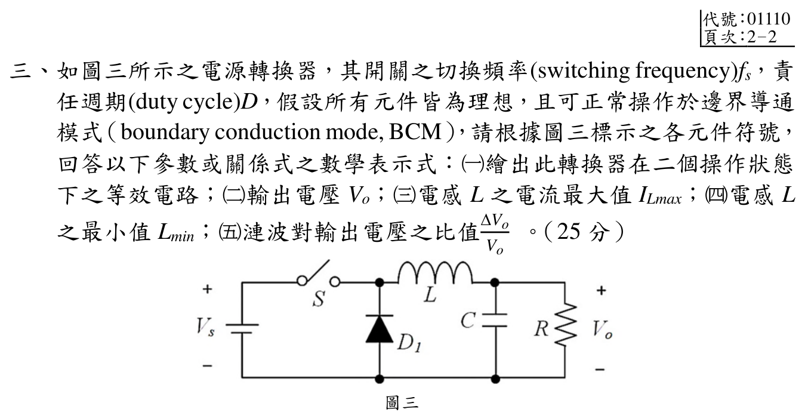

# 113 年電子學第 3 題｜Buck 降壓轉換器的 BCM

> 題圖中開關 \(S\) 串在 \(V_s\) 與電感 \(L\) 之間，二極體 \(D_1\) 由下方共地節點指向開關／電感節點；因此是 Buck，並非 Boost。舊解把此圖判成 Boost，公式不可沿用。

## 考場標準作答

令 \(T_s=1/f_s\)，\(0<D<1\)，\(\Delta V_o\) 為峰對峰漣波，且依題意採理想元件、BCM 與小輸出電壓漣波近似。

（一）兩個操作狀態：

![[113年_電子學_第3題_降壓型Buck轉換器二操作狀態等效電路圖.svg|850]]

- \(0\le t<DT_s\)：\(S\) 導通、\(D_1\) 截止；輸入 \(V_s\) 經 \(S,L\) 向 \(C\parallel R\) 供能，\(v_L=V_s-V_o\)，\(i_L\) 從 0 線性升至 \(I_{L\max}\)。
- \(DT_s\le t<T_s\)：\(S\) 截止、\(D_1\) 導通；電感經 \(C\parallel R\) 與 \(D_1\) 續流，\(v_L=-V_o\)，\(i_L\) 降回 0。輸入源不在續流迴路。

（二）伏秒平衡：
\[
(V_s-V_o)D+(-V_o)(1-D)=0
\quad\Longrightarrow\quad\boxed{V_o=DV_s}.
\]

（三）BCM 的峰值等於 ON 區電流上升量，且一周期的三角波平均值等於負載電流：
\[
\boxed{I_{L\max}=\frac{(V_s-V_o)D}{Lf_s}
=\frac{V_sD(1-D)}{Lf_s}=2I_o=\frac{2V_o}{R}=\frac{2DV_s}{R}}.
\]

（四）把峰值式與 \(I_{L\max}=2DV_s/R\) 聯立，得到在給定 \(D,R,f_s\) 下維持 CCM 的臨界（最小）電感：
\[
\boxed{L_{\min}=\frac{(1-D)R}{2f_s}}.
\]
本題恰在 BCM，故 \(L=L_{\min}\)；若 \(L<L_{\min}\)，則會進入 DCM。

（五）忽略 ESR，電容電流 \(i_C=i_L-I_o\)；BCM 三角波的峰值為 \(2I_o\)，正向半週的電荷面積為 \(\Delta Q=I_oT_s/4=I_{L\max}T_s/8\)，所以
\[
\boxed{\frac{\Delta V_o}{V_o}
=\frac{I_o}{4Cf_sV_o}
=\frac{1}{4RCf_s}}
\quad\left(=\frac{1-D}{8LCf_s^2}\text{，於 }L=L_{\min}\right).
\]

## 得分點拆解

- 先按官方圖辨識串聯開關與接地續流二極體，畫出 ON、OFF 兩條電流路徑；不可套用 Boost 圖。
- 寫 \(v_L=V_s-V_o\) 與 \(-V_o\)，由伏秒平衡得 \(V_o=DV_s\)。
- 用 BCM 的 \(I_{L\min}=0\) 和三角波平均 \(I_o=I_{L\max}/2\)，同時寫出峰值兩種等價形式。
- 由峰值式解 \(L_{\min}\)，且說明 \(L<L_{\min}\) 進入 DCM。
- 電容電流取 \(i_L-I_o\) 而非直接取 \(i_L\)；積分正向半週電荷求峰對峰漣波。

## 完整教學推導

官方題圖的輸入正端先經 \(S\) 到切換節點，再經 \(L\) 到輸出；\(D_1\) 陽極接下方共地、陰極接切換節點；\(C\) 與 \(R\) 並聯跨接輸出與共地。ON 時二極體反偏，電感左端電位為 \(V_s\)，右端約為 \(V_o\)。OFF 時電感電流不能瞬斷，續流路徑為共地 \(\to D_1\to L\to C\parallel R\to\) 共地，電感左端約為 0。這兩種狀態直接給出上列電感電壓，與 Boost 的 ON/OFF 極性不同。

BCM 電流從 0 升至峰值，再在 OFF 區降回 0；兩段斜率分別是 \((V_s-V_o)/L\)、\(-V_o/L\)。設週期穩態，電感伏秒平衡立即給 \(V_o=DV_s\)。由輸出端電容一周期淨電荷為 0，電感平均電流等於 \(I_o=V_o/R\)。整個三角波的平均為峰值一半，因此 \(I_{L\max}=2V_o/R\)。代入 ON 段上升量可解出 \(L_{\min}=(1-D)R/(2f_s)\)。

輸出漣波不能只積分開關 ON 時電容放電，因為 OFF 時電感電流從峰值降至零，其中一段仍高於負載電流。令 \(i_C=i_L-I_o\)。由於 \(I_{L\max}=2I_o\)，電容電流在 \(i_L=I_o\) 處換號；正向區是一個底寬 \(T_s/2\)、高度 \(I_o\) 的三角形，故 \(\Delta Q=I_oT_s/4\)。以 \(\Delta V_o=\Delta Q/C\) 與 \(I_o=V_o/R\) 得最後一式。

## 獨立驗算

取一組僅供驗算的占空比 \(D=0.4\)，以及 \(V_s=12\,\mathrm V\)、\(R=10\,\Omega\)、\(f_s=25\,\mathrm{kHz}\)：\(V_o=4.8\,\mathrm V\)、\(L_{\min}=120\,\mu\mathrm H\)、\(I_o=0.48\,\mathrm A\)、\(I_{L\max}=0.96\,\mathrm A\)。ON 區上升量 \((12-4.8)\times0.4/(120\,\mu\mathrm H\times25\,\mathrm{kHz})=0.96\,\mathrm A\)；OFF 區下降量 \(4.8\times0.6/(120\,\mu\mathrm H\times25\,\mathrm{kHz})=0.96\,\mathrm A\)，吻合 BCM。若另取 \(C=100\,\mu\mathrm F\)，漣波比 \(1/(4RCf_s)=0.01\)，即 \(\Delta V_o=0.048\,\mathrm V\)。這組數字只作公式回代，並非題目給值。

## 常見失分

- 把串聯輸入開關誤認為 Boost 的對地開關，導致 \(V_o=V_s/(1-D)\) 與錯誤的臨界電感。
- 把 BCM 峰值誤寫成平均值，漏掉三角波的因子 2。
- 把 \(\Delta I_L\) 峰峰值與半幅值混用。
- 漣波只算 ON 區放電量 \(I_oDT_s/C\)；對 BCM 的實際峰對峰漣波，還要計入 OFF 區電容電流換號後的充放電。
