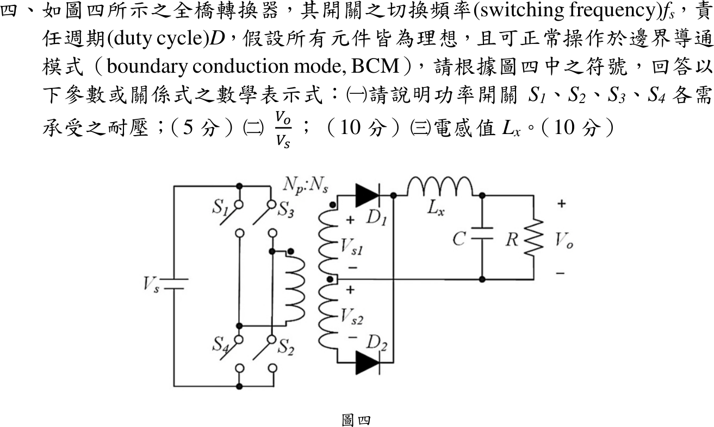

# 113 年電子學第 4 題｜全橋轉換器的 BCM

## 已知與所求

直流 $V_s$ 供全橋 $S_1\sim S_4$（左臂 $S_1/S_4$、右臂 $S_3/S_2$，對角組 $S_1S_2$、$S_3S_4$），變壓器 $N_p:N_s$，中心抽頭次級 $V_{s1},V_{s2}$ 經 $D_1,D_2$ 全波整流，再經 $L_x$ 到 $C\parallel R$。切換頻率 $f_s$、責任週期 $D$，理想、BCM。求（一）各開關耐壓；（二）$V_o/V_s$；（三）$L_x$。

本解約定：每組對角開關在一個 $T_s$ 內導通 $DT_s$（$0<D<0.5$），兩組交替；$n_h$ 為每個半繞組對一次側的匝比。

## 考場標準作答

### （一）開關耐壓

$S_1S_2$ 導通時，同臂的 $S_4$、$S_3$ 各直接跨在母線上；反之亦然：
\[
\boxed{V_{S1,\max}=V_{S2,\max}=V_{S3,\max}=V_{S4,\max}=V_s}
\]
（理想值，不含漏感尖峰與裕度。）

### （二）電壓轉換比

導通區（每半週 $DT_s$）$v_{L_x}=n_hV_s-V_o$；續流區（每半週 $T_s/2-DT_s$）兩二極體同時導通、整流輸出為 0，$v_{L_x}=-V_o$。一週期伏秒平衡：
\[
2(n_hV_s-V_o)DT_s-V_o(1-2D)T_s=0\ \Rightarrow\ \boxed{\frac{V_o}{V_s}=2Dn_h}
\]
依圖四符號、$N_s$ 取每個半繞組（中心抽頭教科書慣例），$n_h=N_s/N_p$，即 $V_o/V_s=2DN_s/N_p$。

### （三）BCM 電感

電感電流每半週由 0 升至峰值再降回 0（等效頻率 $2f_s$），平均值等於 $V_o/R$：
\[
\Delta i_L=\frac{V_o(1/2-D)}{L_xf_s},\qquad \frac{\Delta i_L}{2}=\frac{V_o}{R}\ \Rightarrow\ \boxed{L_x=\frac{(1-2D)R}{4f_s}}
\]
此式與匝比口徑無關。

## 驗算

- 上升段 $(n_hV_s-V_o)DT_s/L_x=n_hV_sD(1-2D)T_s/L_x$，下降段 $V_o(1/2-D)T_s/L_x=n_hV_sD(1-2D)T_s/L_x$，兩者相等，BCM 自洽。
- 示例 $D=0.2$、$R=10\,\Omega$、$f_s=20\,\mathrm{kHz}$：$L_x=0.6\times10/80000=75\,\mu\mathrm H$；$D\to0.5$ 時續流區消失，$L_x\to0$。

## 失分點

- 把全橋當單脈波：一週期有兩個整流脈波，漏掉因子 2 得 $V_o/V_s=Dn_h$。
- 套 Buck 的 $L_{\min}=(1-D)R/(2f_s)$；電感看到的頻率是 $2f_s$、續流時間是 $(1/2-D)T_s$。

## 條件與疑義

官方圖只標 $N_p:N_s$，未指明 $N_s$ 為半繞組或端對端總匝數。若 $N_s$ 指端對端總匝數，$n_h=N_s/(2N_p)$，$V_o/V_s=DN_s/N_p$，與上式差一倍；$L_x$ 不受影響。題幹以 $D$ 為開關責任週期，同臂開關不可同時導通，故 $0<D<0.5$。
