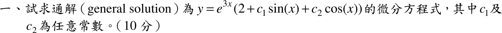
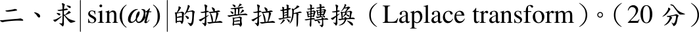
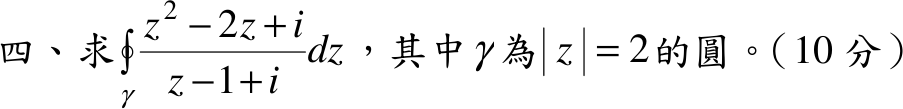
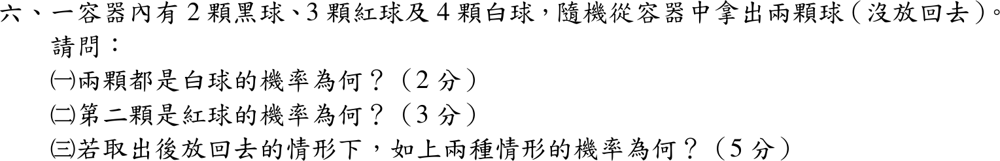
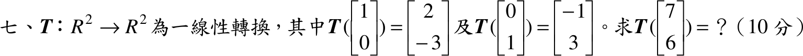
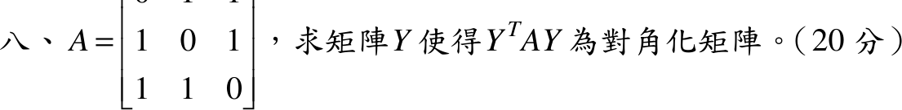

# 📝 105 年電機工程技師｜工程數學逐題詳解

> 本頁由題級 canonical 筆記組合；每題保留 QID、官方裁切、校驗狀態與完整得分型解答。

## 題目導覽
- [[#105 年第 1 題｜由通解反推微分方程|第 1 題：由通解反推微分方程]]
- [[#105 年第 2 題｜全波整流正弦的拉普拉斯轉換|第 2 題：全波整流正弦的拉普拉斯轉換]]
- [[#105 年第 3 題｜複變線積分|第 3 題：複變線積分]]
- [[#105 年第 4 題｜圓周複變積分|第 4 題：圓周複變積分]]
- [[#105 年第 5 題｜由 CDF 求區間機率|第 5 題：由 CDF 求區間機率]]
- [[#105 年第 6 題｜球的抽樣（不放回與放回）|第 6 題：球的抽樣（不放回與放回）]]
- [[#105 年第 7 題｜線性轉換的計算|第 7 題：線性轉換的計算]]
- [[#105 年第 8 題｜實對稱矩陣的對角化|第 8 題：實對稱矩陣的對角化]]

---

## 105 年第 1 題｜由通解反推微分方程

> 題級識別：`EE-105-03-1`
> canonical 來源：`canonical/EE-105-03-1.md`
> 題級校驗狀態：`verified`

![[依考科分類/03_工程數學/images/questions/PE_105年_工程數學_Q01.png]]

> 官方裁切來源：`依考科分類/03_工程數學/images/questions/PE_105年_工程數學_Q01.png`

### 考場標準作答

通解 \(y=e^{3x}\bigl(2+c_1\sin x+c_2\cos x\bigr)\) 含兩個任意常數，所以是二階線性 ODE：齊次部分 \(e^{3x}(c_1\sin x+c_2\cos x)\) 對應特徵根 \(r=3\pm i\)，常數項 \(2e^{3x}\) 是特解。

\[
(r-3)^2+1=r^2-6r+10\ \Rightarrow\ y''-6y'+10y=g(x)
\]
以特解 \(y_p=2e^{3x}\) 決定右側：
\[
g(x)=2(9-18+10)e^{3x}=2e^{3x}
\]
\[
\boxed{y''-6y'+10y=2e^{3x}}
\]

### 驗算

不同方法：拆 \(y=2e^{3x}+u\)，\(u=e^{3x}(c_1\sin x+c_2\cos x)\) 為齊次解，故 \(u''-6u'+10u=0\)。\(\bigl(2e^{3x}\bigr)''-6\bigl(2e^{3x}\bigr)'+10\bigl(2e^{3x}\bigr)=(18-36+20)e^{3x}=2e^{3x}\)，與 \(c_1,c_2\) 無關，整個通解滿足所求 ODE。

### 失分點

- 常數項 \(2\) 不屬於齊次解，不能漏掉右側 \(2e^{3x}\)，否則得 \(y''-6y'+10y=0\)。
- 虛部是 \(1\)（\(\sin x,\cos x\)），特徵式末項為 \(10=3^2+1^2\)，不是 \(13\)。

---

## 105 年第 2 題｜全波整流正弦的拉普拉斯轉換

> 題級識別：`EE-105-03-2`
> canonical 來源：`canonical/EE-105-03-2.md`
> 題級校驗狀態：`verified`

![[依考科分類/03_工程數學/images/questions/PE_105年_工程數學_Q02.png]]

> 官方裁切來源：`依考科分類/03_工程數學/images/questions/PE_105年_工程數學_Q02.png`

### 已知與所求

\(f(t)=|\sin\omega t|\)（取 \(\omega>0\)，\(t\ge0\)），求 \(\mathcal L\{f\}\)（20 分）。\(f\) 是週期 \(T=\pi/\omega\) 的週期函數，且在 \(0\le t<T\) 內 \(f=\sin\omega t\)。

### 考場標準作答

週期函數公式：
\[
F(s)=\frac{1}{1-e^{-sT}}\int_0^{T}e^{-st}\sin\omega t\,dt
\]
用 \(\int e^{-st}\sin\omega t\,dt=-\dfrac{e^{-st}(s\sin\omega t+\omega\cos\omega t)}{s^2+\omega^2}\)，在 \(0\) 到 \(\pi/\omega\)：
\[
\int_0^{\pi/\omega}e^{-st}\sin\omega t\,dt=\frac{\omega\left(1+e^{-\pi s/\omega}\right)}{s^2+\omega^2}
\]
\[
F(s)=\frac{\omega}{s^2+\omega^2}\cdot\frac{1+e^{-\pi s/\omega}}{1-e^{-\pi s/\omega}}
\]
\[
\boxed{\mathcal L\{|\sin\omega t|\}=\frac{\omega}{s^2+\omega^2}\coth\!\left(\frac{\pi s}{2\omega}\right),\quad \operatorname{Re}s>0}
\]

### 驗算

不同方法：極限檢查。\(s\to\infty\) 時 \(f\approx\omega t\)（\(t\) 小），\(F\to\omega/s^2\)，公式中 \(\coth\to1\) 吻合。\(s\to0^+\) 時 \(sF(s)\to\) 平均值：\(\coth(x)\approx1/x\)，\(sF\to \dfrac{\omega}{\omega^2}\cdot\dfrac{2\omega}{\pi}=\dfrac2\pi\)，正是 \(|\sin|\) 的平均值 \(\dfrac1\pi\int_0^\pi\sin\theta\,d\theta=\dfrac2\pi\)。

### 失分點

- 本題是 \(|\sin\omega t|\)，不是 \(\sin\omega t\)；直接寫 \(\omega/(s^2+\omega^2)\) 會整題失分。
- 週期是 \(\pi/\omega\)（不是 \(2\pi/\omega\)），分母才是 \(1-e^{-\pi s/\omega}\)。
- 一個週期的積分用 \(0\) 到 \(\pi/\omega\) 的 \(\sin\)，不須分段處理絕對值。

---

## 105 年第 3 題｜複變線積分

> 題級識別：`EE-105-03-3`
> canonical 來源：`canonical/EE-105-03-3.md`
> 題級校驗狀態：`verified`

![[依考科分類/03_工程數學/images/questions/PE_105年_工程數學_Q03.png]]

> 官方裁切來源：`依考科分類/03_工程數學/images/questions/PE_105年_工程數學_Q03.png`

### 考場標準作答

路徑 \(z(t)=t^3+it\)，\(0\le t\le1\)，故 \(\operatorname{Im}z=t\)，\(dz=(3t^2+i)\,dt\)：
\[
\int_C\operatorname{Im}(z)\,dz=\int_0^1t(3t^2+i)\,dt=\left[\frac34t^4+\frac i2t^2\right]_0^1
\]
\[
\boxed{\int_C\operatorname{Im}(z)\,dz=\frac34+\frac i2}
\]

### 驗算

\(\operatorname{Im}z\) 不解析，不能用原函數；改拆實虛部：\(\int_0^1 3t^3dt=\tfrac34\)、\(\int_0^1t\,dt=\tfrac12\)，與上式一致。

### 失分點

- \(\operatorname{Im}(z)=t\) 是實數，不是 \(it\)；否則虛部多乘 \(i\) 而符號錯。
- \(dz\) 要用 \(z'(t)dt=(3t^2+i)dt\)，不可只寫 \(dt\)。

---

## 105 年第 4 題｜圓周複變積分

> 題級識別：`EE-105-03-4`
> canonical 來源：`canonical/EE-105-03-4.md`
> 題級校驗狀態：`verified`

![[依考科分類/03_工程數學/images/questions/PE_105年_工程數學_Q04.png]]

> 官方裁切來源：`依考科分類/03_工程數學/images/questions/PE_105年_工程數學_Q04.png`

### 考場標準作答

\(\displaystyle I=\oint_{|z|=2}\frac{z^2-2z+i}{z-(1-i)}\,dz\)，唯一極點 \(z_0=1-i\)，\(|z_0|=\sqrt2<2\) 在圓內，為一階極點（分子在 \(z_0\) 不為零時）。分子即 \(f(z)=z^2-2z+i\)，在圓內解析，由柯西積分公式：
\[
f(1-i)=(1-i)^2-2(1-i)+i=-2i-2+2i+i=-2+i
\]
\[
\boxed{I=2\pi i\,f(1-i)=2\pi i(-2+i)=-2\pi-4\pi i}
\]

### 驗算

不同方法：以 \(z=2e^{i\theta}\) 對 \(0\le\theta\le2\pi\) 做數值圍線積分，結果為 \(-6.2832-12.5664i\)，等於 \(-2\pi-4\pi i\)。

### 失分點

- 分母 \(z-1+i=z-(1-i)\)，極點是 \(1-i\)，不是 \(1+i\)；需先確認 \(|1-i|=\sqrt2<2\) 在圓內才可用留數／柯西公式。
- \(2\pi i\cdot i=-2\pi\)，實部符號易錯。

---

## 105 年第 5 題｜由 CDF 求區間機率

> 題級識別：`EE-105-03-5`
> canonical 來源：`canonical/EE-105-03-5.md`
> 題級校驗狀態：`verified`

![[依考科分類/03_工程數學/images/questions/PE_105年_工程數學_Q05.png]]

> 官方裁切來源：`依考科分類/03_工程數學/images/questions/PE_105年_工程數學_Q05.png`

### 已知與所求

\(F(x)=0\ (x<0)\)；\(x/3\ (0\le x<1)\)；\(x/2\ (1\le x<2)\)；\(1\ (x\ge2)\)。求（一）\(P(1/2\le X\le3/2)\)（5 分）；（二）\(P(X>3/2)\)（5 分）。

### 考場標準作答

\(F\) 在 \(x=1\) 由 \(F(1^-)=\tfrac13\) 跳到 \(F(1)=\tfrac12\)，所以 \(P(X=1)=\tfrac16\)；在 \(x=1/2\) 與 \(x=2\) 連續，無質量點。

#### （一）

\[
P\left(\tfrac12\le X\le\tfrac32\right)=F\left(\tfrac32\right)-F\left(\tfrac12^-\right)=\frac34-\frac16=\boxed{\frac7{12}}
\]

#### （二）

\[
P\left(X>\tfrac32\right)=1-F\left(\tfrac32\right)=\boxed{\frac14}
\]

### 驗算

不同方法：拆成連續部分加質量點。\(\left(\tfrac12,1\right)\) 密度 \(\tfrac13\)：\(\tfrac16\)；\(X=1\)：\(\tfrac16\)；\(\left(1,\tfrac32\right)\) 密度 \(\tfrac12\)：\(\tfrac14\)；合計 \(\tfrac16+\tfrac16+\tfrac14=\tfrac7{12}\)。總質量 \(\tfrac13+\tfrac16+\tfrac12=1\)。

### 失分點

- 區間含端點 \(1\)，要把 \(x=1\) 的跳躍 \(1/6\) 算進去；若各段單獨用密度積分而漏掉質量點，會得 \(\tfrac5{12}\) 而非 \(\tfrac7{12}\)。
- 用 \(F(3/2)\) 時取 \(x/2\)（\(1\le x<2\)）\(=3/4\)，不是 \(x/3\)。

---

## 105 年第 6 題｜球的抽樣（不放回與放回）

> 題級識別：`EE-105-03-6`
> canonical 來源：`canonical/EE-105-03-6.md`
> 題級校驗狀態：`verified`

![[依考科分類/03_工程數學/images/questions/PE_105年_工程數學_Q06.png]]

> 官方裁切來源：`依考科分類/03_工程數學/images/questions/PE_105年_工程數學_Q06.png`

### 已知與所求

2 黑、3 紅、4 白共 9 球，取兩顆。求（一）兩顆都是白球（2 分）；（二）第二顆是紅球（3 分）；（三）放回情形下的上述兩種機率（5 分）。

### 考場標準作答

#### （一）不放回，兩顆白球

\[
P=\frac{\binom42}{\binom92}=\frac{6}{36}=\boxed{\frac16}
\]

#### （二）不放回，第二顆紅球

依第一顆顏色分情形（全機率）：
\[
P(R_2)=\frac39\cdot\frac28+\frac69\cdot\frac38=\frac1{12}+\frac14=\boxed{\frac13}
\]
（第一顆為紅 \(\tfrac39\)，之後剩 2 紅／8 球；第一顆非紅 \(\tfrac69\)，之後剩 3 紅／8 球。）

#### （三）放回

兩次抽取獨立且分布相同：
\[
P(\text{兩白})=\left(\frac49\right)^2=\boxed{\frac{16}{81}},\qquad \boxed{P(R_2)=\frac39}\ (=\tfrac13，與不放回相同)
\]

### 驗算

對稱性：不放回時每顆球出現在第二位的機會均等，故 \(P(R_2)=3/9=1/3\)，與全機率結果相同；兩顆白球亦可由 \(\tfrac49\cdot\tfrac38=\tfrac16\) 核對。

### 失分點

- 不放回第二次的分母是 \(8\) 球，白球剩 \(3\) 顆。
- 第二顆為紅球時，不可把第一顆的所有情形（黑、白、紅）漏掉任何一類。

---

## 105 年第 7 題｜線性轉換的計算

> 題級識別：`EE-105-03-7`
> canonical 來源：`canonical/EE-105-03-7.md`
> 題級校驗狀態：`verified`

![[依考科分類/03_工程數學/images/questions/PE_105年_工程數學_Q07.png]]

> 官方裁切來源：`依考科分類/03_工程數學/images/questions/PE_105年_工程數學_Q07.png`

### 考場標準作答

\(\begin{bmatrix}7\\6\end{bmatrix}=7\begin{bmatrix}1\\0\end{bmatrix}+6\begin{bmatrix}0\\1\end{bmatrix}\)，由線性性：
\[
T\begin{bmatrix}7\\6\end{bmatrix}=7\begin{bmatrix}2\\-3\end{bmatrix}+6\begin{bmatrix}-1\\3\end{bmatrix}=\begin{bmatrix}14-6\\-21+18\end{bmatrix}=\boxed{\begin{bmatrix}8\\-3\end{bmatrix}}
\]

### 驗算

標準矩陣 \([T]=\begin{bmatrix}2&-1\\-3&3\end{bmatrix}\)（兩個基底像為欄），\([T]\begin{bmatrix}7\\6\end{bmatrix}=\begin{bmatrix}14-6\\-21+18\end{bmatrix}=\begin{bmatrix}8\\-3\end{bmatrix}\)。

---

## 105 年第 8 題｜實對稱矩陣的對角化

> 題級識別：`EE-105-03-8`
> canonical 來源：`canonical/EE-105-03-8.md`
> 題級校驗狀態：`verified`

![[依考科分類/03_工程數學/images/questions/PE_105年_工程數學_Q08.png]]

> 官方裁切來源：`依考科分類/03_工程數學/images/questions/PE_105年_工程數學_Q08.png`

### 已知與所求

\(A=\begin{bmatrix}0&1&1\\1&0&1\\1&1&0\end{bmatrix}\)，求 \(Y\) 使 \(Y^TAY\) 為對角矩陣（20 分）。取 \(Y\) 為正交矩陣（\(Y^T=Y^{-1}\)），則 \(Y^TAY\) 即相似對角化。

### 考場標準作答

\(A=J-I\)（\(J\) 為全 1 矩陣）。特徵多項式 \(\det(A-\lambda I)=-(\lambda-2)(\lambda+1)^2\)，故 \(\lambda=2\)（單根）、\(\lambda=-1\)（二重）。

- \(\lambda=2\)：\((A-2I)v=0\Rightarrow v=(1,1,1)^T\)。
- \(\lambda=-1\)：\((A+I)v=0\Rightarrow v_1+v_2+v_3=0\)，取 \((1,-1,0)^T\)，再取與其正交者 \((1,1,-2)^T\)。

三向量互相正交（實對稱矩陣的相異特徵值特徵向量必正交，二重根的空間內自行取正交），單位化：
\[
Y=\begin{bmatrix}\tfrac1{\sqrt3}&\tfrac1{\sqrt2}&\tfrac1{\sqrt6}\\\tfrac1{\sqrt3}&-\tfrac1{\sqrt2}&\tfrac1{\sqrt6}\\\tfrac1{\sqrt3}&0&-\tfrac2{\sqrt6}\end{bmatrix},\qquad
\boxed{Y^TAY=\begin{bmatrix}2&0&0\\0&-1&0\\0&0&-1\end{bmatrix}}
\]
\(Y\) 不唯一：二重特徵空間可取任意正交基底，欄的順序也可更換（對角元順序隨之改變）。

### 驗算

\(\operatorname{tr}A=0=2-1-1\)，\(\det A=2=2\cdot(-1)(-1)\)；數值 \(\texttt{eigh}\) 得特徵值 \(-1,-1,2\)，且 \(Y^TY=I\)。

### 失分點

- 二重根 \(\lambda=-1\) 的兩個特徵向量需彼此正交；\((1,-1,0)\) 與 \((1,0,-1)\) 不正交，須再正交化。
- 單位化漏掉 \(\sqrt6\)（\((1,1,-2)\) 長度為 \(\sqrt6\)）會使 \(Y^TY\ne I\)。
