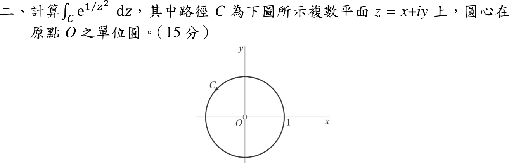
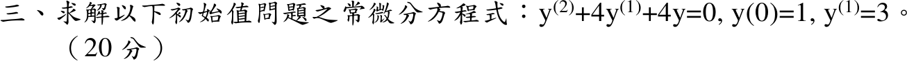
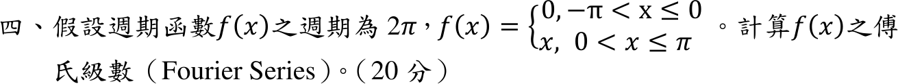
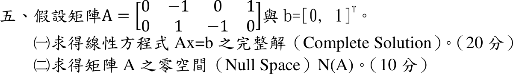

# 📝 114 年電機工程技師｜工程數學逐題詳解

> 本頁由題級 canonical 筆記組合；每題保留 QID、官方裁切、校驗狀態與完整得分型解答。

## 題目導覽
- [[#114 年第 1 題｜垃圾郵件的機率|第 1 題：垃圾郵件的機率]]
- [[#114 年第 2 題｜本性奇點的閉路積分|第 2 題：本性奇點的閉路積分]]
- [[#114 年第 3 題｜重根二階線性 ODE|第 3 題：重根二階線性 ODE]]
- [[#114 年第 4 題｜分段週期函數傅立葉級數|第 4 題：分段週期函數傅立葉級數]]
- [[#114 年第 5 題｜完整解與零空間|第 5 題：完整解與零空間]]

---

## 114 年第 1 題｜垃圾郵件的機率

> 題級識別：`EE-114-03-1`
> canonical 來源：`canonical/EE-114-03-1.md`
> 題級校驗狀態：`verified`

![[依考科分類/03_工程數學/images/questions/PE_114年_工程數學_Q01.png]]

> 官方裁切來源：`依考科分類/03_工程數學/images/questions/PE_114年_工程數學_Q01.png`

### 考場標準作答

令 \(A_i\) 為郵件進入帳戶 \(i\)、\(S\) 為垃圾郵件。三帳戶互斥且涵蓋所有郵件，由全機率公式
\[
\begin{aligned}
P(S)&=\sum_{i=1}^{3}P(S\mid A_i)P(A_i)=(0.01)(0.70)+(0.02)(0.20)+(0.05)(0.10)\\
&=0.007+0.004+0.005=\boxed{0.016=1.6\%}
\end{aligned}
\]

### 驗算

每 1000 封郵件：帳戶 1 有 700 封含 7 封垃圾、帳戶 2 有 200 封含 4 封、帳戶 3 有 100 封含 5 封，共 16 封，即 \(16/1000\)；且 \(1.6\%\) 落在條件率 \(1\%\)–\(5\%\) 之間，符合加權平均。

### 失分點

- 三個條件率直接平均得 \((1+2+5)/3=2.67\%\)，漏乘帳戶比例 \(0.7,0.2,0.1\)。

---

## 114 年第 2 題｜本性奇點的閉路積分

> 題級識別：`EE-114-03-2`
> canonical 來源：`canonical/EE-114-03-2.md`
> 題級校驗狀態：`verified`

![[依考科分類/03_工程數學/images/questions/PE_114年_工程數學_Q02.png]]

> 官方裁切來源：`依考科分類/03_工程數學/images/questions/PE_114年_工程數學_Q02.png`

### 考場標準作答

單位圓內唯一奇點為 \(z=0\)（本性奇點）。Laurent 展開
\[
e^{1/z^2}=\sum_{k=0}^{\infty}\frac{z^{-2k}}{k!}=1+\frac1{z^2}+\frac1{2!\,z^4}+\cdots
\]
只含偶次負冪，沒有 \(z^{-1}\) 項，故 \(\operatorname{Res}_{z=0}=0\)。由留數定理
\[
\oint_Ce^{1/z^2}\,dz=2\pi i\cdot0=\boxed{0}
\]

### 驗算

以 \(z=e^{i\theta}\) 逐項積分：\(\oint_C z^{-2k}dz=i\int_0^{2\pi}e^{i(1-2k)\theta}d\theta\)，僅 \(1-2k=0\) 時非零，而整數 \(k\) 無解，故每項皆為 0，與留數法一致（結果與繞行方向無關）。

### 失分點

- 把常數項或 \(z^{-2}\) 係數 1 當成留數，得出 \(2\pi i\)。

---

## 114 年第 3 題｜重根二階線性 ODE

> 題級識別：`EE-114-03-3`
> canonical 來源：`canonical/EE-114-03-3.md`
> 題級校驗狀態：`verified`

![[依考科分類/03_工程數學/images/questions/PE_114年_工程數學_Q03.png]]

> 官方裁切來源：`依考科分類/03_工程數學/images/questions/PE_114年_工程數學_Q03.png`

### 考場標準作答

題面第二個初值寫作 \(y^{(1)}=3\)，依初始值問題讀為 \(y'(0)=3\)。

特徵方程 \(r^2+4r+4=(r+2)^2=0\)，重根 \(r=-2\)，故 \(y=(C_1+C_2t)e^{-2t}\)，
\(y'=(C_2-2C_1-2C_2t)e^{-2t}\)。代入 \(y(0)=1\Rightarrow C_1=1\)；\(y'(0)=C_2-2C_1=3\Rightarrow C_2=5\)：
\[
\boxed{y(t)=(1+5t)e^{-2t}}
\]

### 驗算

拉氏轉換：\((s^2+4s+4)Y=s\,y(0)+y'(0)+4y(0)=s+7\)，
\[
Y=\frac{s+7}{(s+2)^2}=\frac{1}{s+2}+\frac{5}{(s+2)^2}\ \Rightarrow\ y=e^{-2t}+5te^{-2t},
\]
與主解相同。

### 失分點

- 重根只寫 \(C_1e^{-2t}+C_2e^{-2t}\)（兩項相依）；或把 \(y'(0)=3\) 直接當 \(C_2=3\)，漏掉 \(-2C_1\)。

---

## 114 年第 4 題｜分段週期函數傅立葉級數

> 題級識別：`EE-114-03-4`
> canonical 來源：`canonical/EE-114-03-4.md`
> 題級校驗狀態：`verified`

![[依考科分類/03_工程數學/images/questions/PE_114年_工程數學_Q04.png]]

> 官方裁切來源：`依考科分類/03_工程數學/images/questions/PE_114年_工程數學_Q04.png`

### 已知與所求

週期 \(2\pi\)，\(f(x)=0\)（\(-\pi<x\le0\)）、\(f(x)=x\)（\(0<x\le\pi\)）。求傅立葉級數。

### 考場標準作答

取 \(f(x)\sim a_0/2+\sum_{n=1}^\infty(a_n\cos nx+b_n\sin nx)\)；負半週期 \(f=0\)，積分只剩 \([0,\pi]\)：
\[
a_0=\frac1\pi\int_0^\pi x\,dx=\frac\pi2,
\]
\[
a_n=\frac1\pi\int_0^\pi x\cos(nx)\,dx=\frac1\pi\left[\frac{x\sin nx}{n}+\frac{\cos nx}{n^2}\right]_0^\pi=\frac{(-1)^n-1}{\pi n^2},
\]
\[
b_n=\frac1\pi\int_0^\pi x\sin(nx)\,dx=\frac1\pi\left[-\frac{x\cos nx}{n}+\frac{\sin nx}{n^2}\right]_0^\pi=\frac{(-1)^{n+1}}{n}.
\]
所以
\[
\boxed{f(x)\sim\frac\pi4+\sum_{n=1}^{\infty}
\left[\frac{(-1)^n-1}{\pi n^2}\cos(nx)
+\frac{(-1)^{n+1}}{n}\sin(nx)\right]}
\]
即奇數 \(n\) 時 \(a_n=-2/(\pi n^2)\)、偶數時 \(a_n=0\)。這裡的 \(\sim\) 表示：在連續點收斂至 \(f(x)\)；在週期接點 \(x=(2m+1)\pi\)，題面給 \(f(\pi)=\pi\)，但級數收斂至左右極限平均 \(\pi/2\)，不能寫成逐點處處相等。

### 驗算

- \(x=0\)（連續點）：\(\frac\pi4-\frac2\pi\sum_{n\text{ odd}}\frac1{n^2}=\frac\pi4-\frac2\pi\cdot\frac{\pi^2}{8}=0=f(0)\)。
- 上式及 \(x=\pi\) 處所有 \(\sin(n\pi)=0\)，**不能**驗證 \(b_n\)。改取 \(x=\pi/2\)：偶數項 \(a_n=0\)、奇數項 \(\cos(n\pi/2)=0\)，
\[
S\!\left(\tfrac\pi2\right)=\frac\pi4+\sum_{k=0}^{\infty}\frac{(-1)^k}{2k+1}=\frac\pi4+\frac\pi4=\frac\pi2=f\!\left(\tfrac\pi2\right),
\]
確認 \(b_n\) 的尺度；若多除一個 \(\pi\) 則不成立。

### 失分點

- 把 \(a_0=\pi/2\) 直接當常數項，正確常數項是 \(a_0/2=\pi/4\)。
- \(b_n\) 誤寫成 \((-1)^{n+1}/(\pi n)\)。
- 在 \(x=\pi\) 直接寫級數值等於 \(f(\pi)=\pi\)，忽略跳躍點收斂到平均值。

---

## 114 年第 5 題｜完整解與零空間

> 題級識別：`EE-114-03-5`
> canonical 來源：`canonical/EE-114-03-5.md`
> 題級校驗狀態：`verified`

![[依考科分類/03_工程數學/images/questions/PE_114年_工程數學_Q05.png]]

> 官方裁切來源：`依考科分類/03_工程數學/images/questions/PE_114年_工程數學_Q05.png`

### 已知與所求

\(A=\begin{bmatrix}0&-1&0&1\\0&1&-1&0\end{bmatrix}\)、\(b=[0,\ 1]^T\)。求（一）\(Ax=b\) 的完整解；（二）\(N(A)\)。

### 考場標準作答

#### （一）完整解

\(Ax=b\) 即 \(-x_2+x_4=0\)、\(x_2-x_3=1\)。主元在第 2、3 欄，令自由變數 \(x_1=c_1,\ x_2=c_2\)，得 \(x_4=c_2,\ x_3=c_2-1\)：
\[
\boxed{x=\begin{bmatrix}0\\0\\-1\\0\end{bmatrix}
+c_1\begin{bmatrix}1\\0\\0\\0\end{bmatrix}
+c_2\begin{bmatrix}0\\1\\1\\1\end{bmatrix},\quad c_1,c_2\in\mathbb R}
\]
即特解 \(x_p\) 加上零空間的任意組合。

#### （二）零空間

令右端為 0：\(x_4=x_2,\ x_3=x_2\)，\(x_1\) 任意：
\[
\boxed{N(A)=\operatorname{span}\left\{
\begin{bmatrix}1\\0\\0\\0\end{bmatrix},
\begin{bmatrix}0\\1\\1\\1\end{bmatrix}\right\}}
\]

### 驗算

\(Ax_p=(0,\ 0+1)^T=(0,1)^T=b\)；\(A(1,0,0,0)^T=0\)、\(A(0,1,1,1)^T=(-1+1,\ 1-1)^T=0\)。\(\operatorname{rank}A=2\)，秩－零度定理 \(\dim N(A)=4-2=2\)，與兩個基底向量數一致。

### 失分點

- \(A\) 的第 1 欄全為 0，\(x_1\) 是自由變數；漏掉 \((1,0,0,0)^T\) 會使 \(\dim N(A)\) 只剩 1。
- 由 \(x_2-x_3=1\) 移項誤得 \(x_3=1-x_2\)，特解應為 \(x_3=-1\)（\(x_2=0\)）。
- 只給特解或只給零空間，未寫成「特解＋零空間」的完整解。
