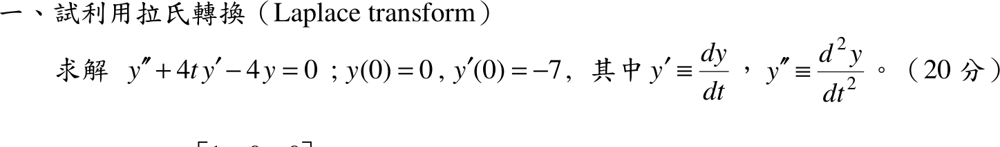

# 104 年第 1 題｜以拉氏轉換解變係數 ODE

## 已知與所求

\(y''+4t\,y'-4y=0\)，\(y(0)=0\)，\(y'(0)=-7\)（20 分），以拉氏轉換求 \(y(t)\)。係數 \(4t\) 含 \(t\)，不是常係數。

## 考場標準作答

令 \(Y(s)=\mathcal L\{y\}\)。
\[
\mathcal L\{y''\}=s^2Y-sy(0)-y'(0)=s^2Y+7,\qquad
\mathcal L\{t\,y'\}=-\frac{d}{ds}\bigl(sY-y(0)\bigr)=-Y-sY'
\]
代入：
\[
s^2Y+7+4(-Y-sY')-4Y=0\ \Rightarrow\ Y'-\left(\frac s4-\frac2s\right)Y=\frac7{4s}
\]
齊次解 \(Y_h=C\,\dfrac{e^{s^2/8}}{s^2}\)；觀察得特解 \(Y_p=-\dfrac7{s^2}\)（代入：\(\tfrac{14}{s^3}-\left(\tfrac s4-\tfrac2s\right)\left(-\tfrac7{s^2}\right)=\tfrac7{4s}\)）。
拉氏轉換須在 \(s\to\infty\) 趨於 \(0\)，而 \(e^{s^2/8}\) 發散，故 \(C=0\)：
\[
Y(s)=-\frac7{s^2}\ \Rightarrow\ \boxed{y(t)=-7t}
\]

## 驗算

回代：\(y''=0\)，\(4t\,y'=-28t\)，\(-4y=28t\)，三項和為 \(0\)；\(y(0)=0\)、\(y'(0)=-7\)。數值積分該 IVP 得 \(y(2)=-14\)，吻合。

## 失分點

- \(\mathcal L\{t\,y'\}=-\dfrac{d}{ds}\bigl(sY-y(0)\bigr)\)，是對 \(sY\) 整體微分，且帶負號；漏掉 \(-Y\) 項會得錯的 \(Y'\) 方程。
- 轉換後是 \(Y\) 的一階 ODE，通解含 \(Ce^{s^2/8}/s^2\)，必須以 \(s\to\infty\) 趨零（轉換條件）捨去。
