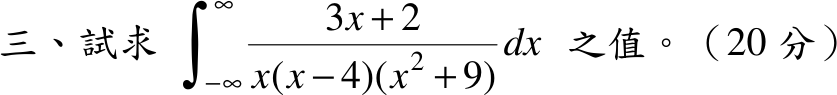

# 104 年第 3 題｜實軸極點的廣義積分（主值）

## 已知與所求

\[
I=\int_{-\infty}^{\infty}\frac{3x+2}{x(x-4)(x^2+9)}\,dx\quad(20\text{ 分})
\]

被積函數在 \(x=0\) 與 \(x=4\) 有實軸一階極點。

## 考場標準作答

先判斷收斂性：在 \(x=0\) 附近 \(f\approx-\dfrac1{18x}\)，在 \(x=4\) 附近 \(f\approx\dfrac7{50(x-4)}\)，皆非可積，故普通廣義積分不存在（發散）。若依工程數學留數題慣例取 Cauchy 主值（題目未標示 PV，見「條件與疑義」），則：

部分分式：
\[
\frac{3x+2}{x(x-4)(x^2+9)}=-\frac1{18x}+\frac7{50(x-4)}-\frac{19x+126}{225(x^2+9)}
\]
對稱主值下 \(\operatorname{PV}\!\int\dfrac{dx}{x}=0\)、\(\operatorname{PV}\!\int\dfrac{dx}{x-4}=0\)（上下限 \(\pm R\) 時為 \(\ln\frac{R-4}{R+4}\to0\)），\(\dfrac{x}{x^2+9}\) 為奇函數，只剩
\[
-\frac{126}{225}\int_{-\infty}^{\infty}\frac{dx}{x^2+9}=-\frac{14}{25}\cdot\frac\pi3
\]
\[
\boxed{\operatorname{PV}I=-\frac{14\pi}{75}\approx-0.5864}
\]

## 驗算

留數法：\(\operatorname{PV}I=\pi i\bigl(\operatorname{Res}_0+\operatorname{Res}_4\bigr)+2\pi i\operatorname{Res}_{3i}\)，\(\operatorname{Res}_0=-\tfrac1{18}\)，\(\operatorname{Res}_4=\tfrac7{50}\)，\(\operatorname{Res}_{3i}=\dfrac{3(3i)+2}{3i(3i-4)(6i)}\)。計算得 \(\operatorname{PV}I=-\dfrac{14\pi}{75}\)；另以數值積分（在 \(0\)、\(4\) 兩側各挖去 \(10^{-9}\) 對稱小區間）得 \(-0.586431\)，與 \(-14\pi/75=-0.586431\) 吻合。

## 失分點

- \(\displaystyle\int_{-\infty}^{\infty}\frac{dx}{x^2+9}=\frac\pi3\)，係數 \(-\tfrac{126}{225}\) 約分為 \(-\tfrac{14}{25}\)，乘 \(\tfrac\pi3\) 得分母 \(75\)，不是 \(225\)。
- 實軸極點在上半圓繞行時各貢獻 \(\pi i\operatorname{Res}\)（半留數），不是 \(2\pi i\operatorname{Res}\)。

## 條件與疑義

官方題幹未標示 Cauchy 主值（PV）。若按普通廣義積分，因 \(x=0,4\) 的單極點，積分發散；上列 \(-14\pi/75\) 僅為採對稱主值的條件答案，作答時宜先寫「普通廣義積分不存在」再給主值。
