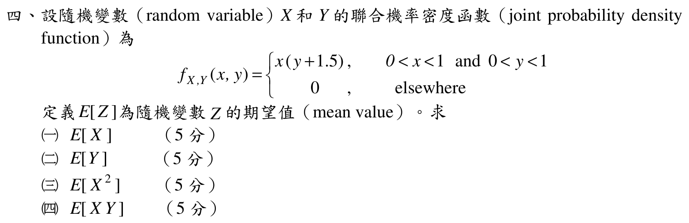

# 104 年第 4 題｜二維聯合機率密度的期望值

## 考場標準作答

因

\[
f_{X,Y}(x,y)=x\left(y+\frac32\right),\qquad 0<x<1,\ 0<y<1,
\]

先求邊際密度：

\[
f_X(x)=\int_0^1x\left(y+\frac32\right)dy=2x,\qquad
f_Y(y)=\int_0^1x\left(y+\frac32\right)dx
=\frac12\left(y+\frac32\right).
\]

以上分別適用於 \(0<x<1\)、\(0<y<1\)，區間外為零。因在原支持集上 \(f_{X,Y}=f_Xf_Y\)，故 \(X,Y\) 獨立。四小題可用一維積分與乘積迅速完成：

\[
\boxed{E[X]=\int_0^1 2x^2\,dx=\frac23},
\]

\[
\boxed{E[Y]=\int_0^1\frac y2\left(y+\frac32\right)dy=\frac{13}{24}},
\]

\[
\boxed{E[X^2]=\int_0^1 2x^3\,dx=\frac12},
\qquad
\boxed{E[XY]=E[X]E[Y]=\frac{13}{36}}.
\]

## 得分點拆解

- 四個小題各 5 分；先在 \(0<x,y<1\) 求兩個邊際密度，再以一維積分作答，較不易重複抄四次雙重積分。
- 寫明 \(f_{X,Y}=f_Xf_Y\) 才能用獨立性求 \(E[XY]\)。
- \(E[X^2]\) 的被積式是 \(x^2f_{X,Y}\)，不是把 \(E[X]\) 平方。
- \(E[XY]\) 的被積式是 \(xyf_{X,Y}\)，最後答案為 \(13/36\)。
- 可先驗證密度積分為 1，作為後續積分上下限與常數的防錯檢查。

## 完整教學推導

官方 crop 給出
\[
f_{X,Y}(x,y)=
\begin{cases}
x\left(y+\frac32\right),&0<x<1,\ 0<y<1,\\
0,&\text{其他區域}.
\end{cases}
\]
先驗證正規化：
\[
\int_0^1\int_0^1x\left(y+\frac32\right)\,dy\,dx
=\left(\int_0^1x\,dx\right)\left(\int_0^1y+\frac32\,dy\right)=1.
\]

由定義逐項計算：
\[
\begin{aligned}
E[X]
&=\int_0^1\int_0^1x^2\left(y+\frac32\right)\,dy\,dx
=\boxed{\frac23},\\
E[Y]
&=\int_0^1\int_0^1xy\left(y+\frac32\right)\,dy\,dx
=\boxed{\frac{13}{24}}.
\end{aligned}
\]

二階動差：
\[
\begin{aligned}
E[X^2]
&=\int_0^1\int_0^1x^3\left(y+\frac32\right)\,dy\,dx
=\boxed{\frac12},\\
E[XY]
&=\int_0^1\int_0^1x^2y\left(y+\frac32\right)\,dy\,dx
=\boxed{\frac{13}{36}}.
\end{aligned}
\]

## 獨立驗算

不用獨立性，直接由原聯合密度核對交叉動差：
\[
E[XY]=\int_0^1\int_0^1x^2y\left(y+\frac32\right)\,dy\,dx
=\frac13\left(\frac13+\frac34\right)=\frac{13}{36}.
\]

另有 \(\operatorname{Var}(X)=E[X^2]-E[X]^2=1/2-4/9=1/18>0\)。兩項檢查分別防止誤用獨立性與把二階動差當作平均值平方。

## 常見失分

- 看見密度可分離就直接宣稱獨立，卻沒有確認兩個邊際密度的正規化常數。
- 把 \(E[X^2]\) 寫成 \((E[X])^2=4/9\)。
- \(E[XY]\) 少乘一個 \(x\) 或 \(y\)，或混入其他題目的被積函數。
- 忘記密度在單位正方形以外為 0。
