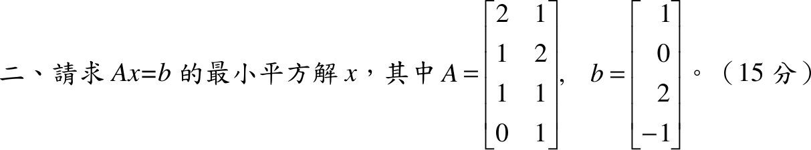

# 106 年第 2 題｜線性系統的最小平方解

## 已知與所求

\(A=\begin{bmatrix}2&1\\1&2\\1&1\\0&1\end{bmatrix}\)、\(b=(1,0,2,-1)^T\)（15 分），求 \(Ax=b\) 的最小平方解 \(x\)。

## 考場標準作答

\(A\) 兩行線性獨立，解正規方程 \(A^TAx=A^Tb\)：
\[
A^TA=\begin{bmatrix}6&5\\5&7\end{bmatrix},\quad A^Tb=\begin{bmatrix}4\\2\end{bmatrix},\quad
x=\frac1{17}\begin{bmatrix}7&-5\\-5&6\end{bmatrix}\begin{bmatrix}4\\2\end{bmatrix}
\]
\[
\boxed{x=\begin{bmatrix}18/17\\-8/17\end{bmatrix}}
\]

## 驗算

殘差 \(r=b-Ax=\tfrac1{17}(-11,\,-2,\,24,\,-9)^T\)，\(A^Tr=\tfrac1{17}(-22-2+24,\ -11-4+24-9)^T=\mathbf 0\)，殘差與 \(A\) 的行空間正交，確為最小平方解。

## 失分點

- \(A^Tb\) 第 2 分量是 \(1+0+2-1=2\)，不是 \(1\)；漏掉 \(-1\) 項會得 \(x=(23/17,\,-14/17)\)。
