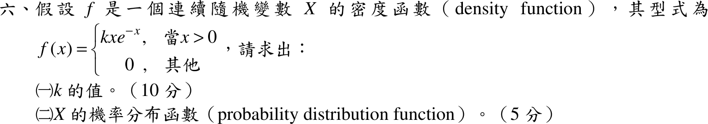

# 106 年第 6 題｜密度常數與 CDF

## 考場標準作答

### （一）常數 \(k\)

機率密度總面積為 \(1\)：\(\displaystyle\int_0^\infty kxe^{-x}dx=k\,\Gamma(2)=k\)，故 \(\boxed{k=1}\)。

### （二）機率分布函數

\(x\le0\) 時 \(F(x)=0\)；\(x>0\) 時 \(F(x)=\int_0^xue^{-u}du=\bigl[-(u+1)e^{-u}\bigr]_0^x=1-(x+1)e^{-x}\)：
\[
\boxed{F(x)=\begin{cases}0,&x\le0\\[2pt]1-(x+1)e^{-x},&x>0\end{cases}}
\]

## 驗算

\(F'(x)=(x+1)e^{-x}-e^{-x}=xe^{-x}=f(x)\)；\(F(0)=0\)，\(F(\infty)=1\)，且 \(F\) 遞增，符合分布函數性質。

## 失分點

- 分部積分 \(\int ue^{-u}du=-(u+1)e^{-u}\)，代入下限 \(0\) 時別漏掉 \(+1\)。
- \(F(x)\) 要分段寫出 \(x\le0\) 的 \(0\)。
