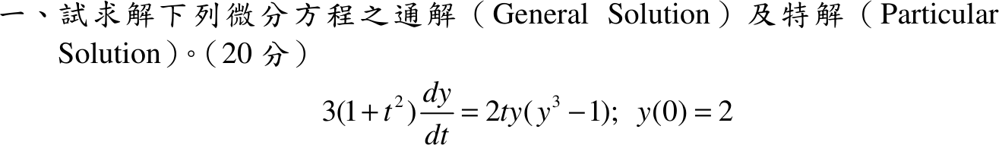

# 107 年第 1 題｜Bernoulli ODE

## 已知與所求

\(3(1+t^2)\dfrac{dy}{dt}=2ty(y^3-1)\)，\(y(0)=2\)（20 分）。求通解與滿足初值的特解。

## 考場標準作答

### （一）通解

可分離變數：
\[
\frac{dy}{y(y^3-1)}=\frac{2t\,dt}{3(1+t^2)},\qquad
\frac1{y(y^3-1)}=\frac{y^2}{y^3-1}-\frac1y
\]
積分：\(\tfrac13\ln|y^3-1|-\ln|y|=\tfrac13\ln(1+t^2)+c\)，兩邊乘 \(3\)：\(\ln\dfrac{|y^3-1|}{|y|^3}=\ln(1+t^2)+3c\)，即
\[
\boxed{1-\frac1{y^3}=C(1+t^2)}\quad\Bigl(\text{亦即 }y^3=\frac1{1-C(1+t^2)}\Bigr)
\]
另有常數解 \(y\equiv0\)（不在上式族內）；\(y\equiv1\) 對應 \(C=0\)。

### （二）特解

\(y(0)=2\)：\(1-\tfrac18=C\Rightarrow C=\tfrac78\)，\(y^3=\dfrac{8}{1-7t^2}\)：
\[
\boxed{y(t)=\frac{2}{(1-7t^2)^{1/3}}},\qquad |t|<\frac1{\sqrt7}
\]

## 驗算

令 \(w=y^{-3}\)（Bernoulli 代換），則 \(w'=-3y^{-4}y'=-\dfrac{2t}{1+t^2}(1-w)\)，為線性式 \(w'-\dfrac{2t}{1+t^2}w=-\dfrac{2t}{1+t^2}\)，積分因子 \(\dfrac1{1+t^2}\)，解 \(w=1+C(1+t^2)\)，與 \(1-y^{-3}=C'(1+t^2)\) 同族（\(C'=-C\)）。

回代特解：\(y^3-1=\dfrac{7(1+t^2)}{1-7t^2}\)，右側 \(\dfrac{2ty(y^3-1)}{3(1+t^2)}=\dfrac{14t\,y}{3(1-7t^2)}\)；左側 \(y'=\dfrac{28t}{3}(1-7t^2)^{-4/3}=\dfrac{14t}{3(1-7t^2)}\cdot2(1-7t^2)^{-1/3}\)，兩側相等。

## 失分點

- \(\dfrac1{y(y^3-1)}\) 的部分分式是 \(\dfrac{y^2}{y^3-1}-\dfrac1y\)，不是 \(\tfrac13\) 倍。
- 解在 \(1-7t^2\to0\) 處發散，特解僅在 \(|t|<1/\sqrt7\) 成立。
- 分離變數時除以 \(y(y^3-1)\)，會漏掉常數解 \(y\equiv0\)。
