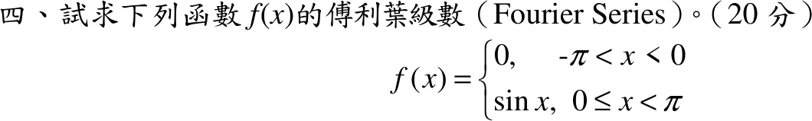

# 107 年第 4 題｜分段函數傅立葉級數

## 已知與所求

\(f(x)=0\)（\(-\pi<x<0\)）、\(f(x)=\sin x\)（\(0\le x<\pi\)），週期 \(2\pi\)（20 分）。求傅立葉級數。

## 考場標準作答

\(f=\dfrac{a_0}{2}+\sum(a_n\cos nx+b_n\sin nx)\)，只需對 \([0,\pi]\) 積分：

\[
a_0=\frac1\pi\int_0^\pi\sin x\,dx=\frac2\pi
\]

\(a_n=\dfrac1\pi\int_0^\pi\sin x\cos nx\,dx=\dfrac1{2\pi}\int_0^\pi[\sin(n+1)x-\sin(n-1)x]\,dx\)：

- \(n=1\)：\(\dfrac1{2\pi}\int_0^\pi\sin2x\,dx=0\)；
- \(n\ge2\) 為奇數：\(n\pm1\) 皆為偶數，\(\int_0^\pi\sin mx\,dx=0\)，故 \(a_n=0\)；
- \(n\) 為偶數：\(\int_0^\pi\sin mx\,dx=\dfrac2m\)（\(m\) 奇），\(a_n=\dfrac1{2\pi}\Bigl(\dfrac2{n+1}-\dfrac2{n-1}\Bigr)=\dfrac{-2}{\pi(n^2-1)}\)。

\(b_n=\dfrac1\pi\int_0^\pi\sin x\sin nx\,dx\)：\(b_1=\dfrac1\pi\cdot\dfrac\pi2=\dfrac12\)，\(n\ge2\) 時由正交性 \(b_n=0\)。令 \(n=2k\)：

\[
\boxed{f(x)\sim\frac1\pi+\frac12\sin x-\frac2\pi\sum_{k=1}^{\infty}\frac{\cos2kx}{4k^2-1}}
\]

## 驗算

取 \(x=0\)（\(f\) 在此連續，\(f(0)=0\)）：\(\sum_{k\ge1}\dfrac1{4k^2-1}=\tfrac12\sum\Bigl(\dfrac1{2k-1}-\dfrac1{2k+1}\Bigr)=\tfrac12\)（伸縮和），級數值 \(\dfrac1\pi-\dfrac2\pi\cdot\dfrac12=0\)，吻合。

Parseval：\(\dfrac1\pi\int_{-\pi}^{\pi}f^2dx=\dfrac12\)，而 \(\dfrac{a_0^2}{2}+b_1^2+\sum a_{2k}^2=\dfrac2{\pi^2}+\dfrac14+\dfrac4{\pi^2}\cdot\dfrac{\pi^2-8}{16}=\dfrac12\)。

## 失分點

- \(\int_{-\pi}^{0}\)（\(f=0\)）不必計算；積分範圍只剩 \([0,\pi]\)，常數項是 \(a_0/2=1/\pi\)，不是 \(a_0\)。
- \(n=1\) 要單獨處理：通式 \(a_n=-\dfrac{2}{\pi(n^2-1)}\) 在 \(n=1\) 分母為 \(0\)，須另算 \(a_1=0\)、\(b_1=\tfrac12\)。
- 奇數 \(n\ge3\) 的 \(a_n=0\)，級數只含偶數倍頻 \(\cos2kx\)。
