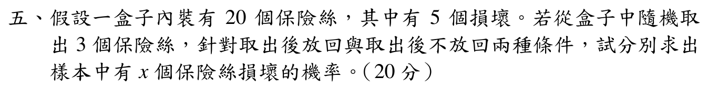

# 107 年第 5 題｜抽取損壞保險絲

## 考場標準作答

損壞率為

\[
p=\frac5{20}=\frac14.
\]

### 取出後放回

三次抽取相互獨立，故 \(X\sim\operatorname{Binomial}(3,1/4)\)：

\[
\boxed{P(X=x)=\binom3x\left(\frac14\right)^x
\left(\frac34\right)^{3-x}},\qquad x=0,1,2,3,
\]

### 取出後不放回

此時為超幾何分布：

\[
\boxed{P(X=x)=\frac{\binom5x\binom{15}{3-x}}{\binom{20}{3}}},
\qquad x=0,1,2,3,
\]

兩種抽法的機率函數在 \(x\notin\{0,1,2,3\}\) 時均為 \(0\)；上列支持集是題目「恰有 \(x\) 個損壞」的完整範圍。

## 得分點拆解

- 先寫出損壞機率 \(p=1/4\)，並辨認「放回」代表獨立的二項分布。
- 二項分布公式需同時包含組合數、損壞與正常兩項機率及支持集。
- 「不放回」使用超幾何分布；分子要同時選出損壞與正常保險絲，分母是全部 20 個取 3 個。
- 題目要求任意 \(x\) 的機率，交出兩個完整分布及 \(x=0,1,2,3\) 的支持集；不必額外求指定 \(x\) 的數值。

## 完整教學推導

放回時每次抽到損壞品的機率固定為 \(1/4\)，三次試驗彼此獨立，因此

\[
P(X=x)=\binom3x p^x(1-p)^{3-x}.
\]

不放回時總樣本數為 \(\binom{20}{3}\)。若恰有 \(x\) 個損壞品，就要由 5 個損壞品選 \(x\) 個，並由 15 個正常品選 \(3-x\) 個，因此得到超幾何公式。

## 獨立驗算

- 二項分布由二項式定理得 \(\sum_{x=0}^3P(X=x)=(1/4+3/4)^3=1\)。
- 超幾何分布由 Vandermonde 恆等式得 \(\sum_{x=0}^3\binom5x\binom{15}{3-x}=\binom{20}{3}\)。
- 另取 \(x=1\) 抽查：放回得 \(\binom31(1/4)(3/4)^2=27/64\)；不放回得 \(\binom51\binom{15}{2}/\binom{20}{3}=35/76\)。這只是驗算示例，不是題目另問的小題。
- 兩種抽法的期望損壞數均為 \(np=3(1/4)=0.75\)，與分布的中心位置一致；不放回只改變相依性與變異數。

## 常見失分

- 「不放回」仍套二項分布，忽略每抽一次母體比例會改變。
- 超幾何分子只寫 \(\binom5x\)，漏掉正常品的 \(\binom{15}{3-x}\)。
- 把符號 \(x\) 擅自固定為 1，或把「恰有 \(x\) 個」誤解成「至少 \(x\) 個」。
- 沒有寫支持集，導致組合數在不合法的 \(x\) 值上失去意義。
