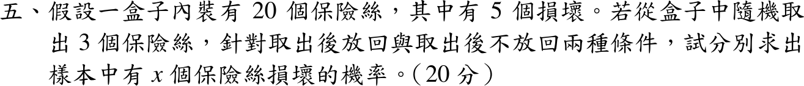

# 107 年第 5 題｜抽取損壞保險絲

## 已知與所求

20 個保險絲中有 5 個損壞，隨機取 3 個（20 分）。分別就取出後放回、不放回，求樣本中恰有 \(x\) 個損壞的機率。題目要求任意 \(x\) 的機率函數，不必額外求指定 \(x\) 的數值。

## 考場標準作答

損壞率 \(p=\dfrac5{20}=\dfrac14\)。

### 取出後放回

三次抽取獨立、\(p\) 不變，\(X\sim\operatorname{Binomial}(3,\tfrac14)\)：
\[
\boxed{P(X=x)=\binom3x\left(\frac14\right)^x\left(\frac34\right)^{3-x}},\qquad x=0,1,2,3
\]

### 取出後不放回

從 5 個損壞品取 \(x\) 個、15 個正常品取 \(3-x\) 個，樣本空間 \(\binom{20}{3}\)，為超幾何分布：
\[
\boxed{P(X=x)=\frac{\binom5x\binom{15}{3-x}}{\binom{20}{3}}},\qquad x=0,1,2,3
\]

兩種抽法的機率函數在 \(x\notin\{0,1,2,3\}\) 時均為 \(0\)。

## 驗算

總和：二項式定理 \((\tfrac14+\tfrac34)^3=1\)；Vandermonde 恆等式 \(\sum_x\binom5x\binom{15}{3-x}=\binom{20}{3}=1140\)。

逐一列出 \(x=0,1,2,3\) 只是驗算示例，不是題目另問的小題：

| \(x\) | 0 | 1 | 2 | 3 |
| --- | --- | --- | --- | --- |
| 放回 | \(27/64\) | \(27/64\) | \(9/64\) | \(1/64\) |
| 不放回 | \(91/228\) | \(35/76\) | \(5/38\) | \(1/114\) |

兩列各自總和為 \(1\)，期望損壞數皆為 \(3\cdot\tfrac14=0.75\)。

## 失分點

- 「不放回」仍套二項分布，忽略每抽一次母體比例會改變。
- 超幾何分子只寫 \(\binom5x\)，漏掉正常品的 \(\binom{15}{3-x}\)。
- 把「恰有 \(x\) 個損壞」誤解成「至少 \(x\) 個」，或擅自把 \(x\) 固定成某個值。
