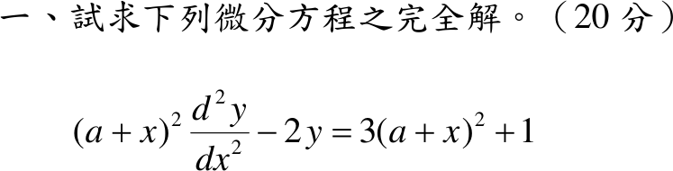

# 108 年第 1 題｜Euler 型方程

## 已知與所求

\((a+x)^2y''-2y=3(a+x)^2+1\)（20 分），\(a\) 為常數，求完全解（通解）。

## 考場標準作答

令 \(u=a+x\)（\(dx=du\)，導數不變），方程化為 Euler 型
\[
u^2y''-2y=3u^2+1,\qquad u\ne0 .
\]

**齊次解**：試 \(y=u^m\)，\(m(m-1)-2=0\Rightarrow m=2,\,-1\)，故 \(y_h=C_1u^2+C_2u^{-1}\)。

**特解**（逐項處理右側）：

- 右側 \(1\)：設 \(y=B\)，\(-2B=1\Rightarrow B=-\tfrac12\)。
- 右側 \(3u^2\)：\(u^2\) 是齊次解（共振），改設 \(y=Au^2\ln u\)，\(y''=A(2\ln u+3)\)，\(u^2y''-2y=3Au^2\Rightarrow A=1\)。

\[
\boxed{y=C_1(a+x)^2+\frac{C_2}{a+x}+(a+x)^2\ln|a+x|-\frac12},\qquad x\ne-a
\]

## 驗算

改用變數變易法：\(y_1=u^2,\ y_2=u^{-1}\)，\(W=y_1y_2'-y_2y_1'=-3\)；標準式 \(y''-\tfrac{2}{u^2}y=g\)，\(g=3+u^{-2}\)。
\[
y_p=-y_1\!\int\!\frac{y_2g}{W}du+y_2\!\int\!\frac{y_1g}{W}du
=\frac{u^2}{3}\Bigl(3\ln u-\frac1{2u^2}\Bigr)-\frac{u^3+u}{3u}
=u^2\ln u-\frac{u^2}{3}-\frac12 ,
\]
多出的 \(-u^2/3\) 併入 \(C_1u^2\)，與上式一致。

## 失分點

- 右側 \(3u^2\) 與齊次解 \(u^2\) 共振，直接設 \(y=Au^2\) 會得 \(0=3u^2\) 而無解，必須乘 \(\ln u\)。
- 右側 \(1\) 的特解是 \(-\tfrac12\)（\(-2B=1\)），常漏負號。
- 沒換成 \(u=a+x\) 就試 \(x^m\) 會失敗；結果要用 \(\ln|a+x|\)，標明 \(x\ne-a\)。
