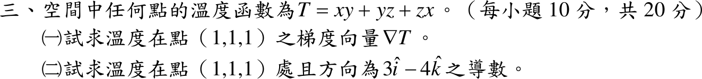

# 108 年第 3 題｜梯度與方向導數

## 已知與所求

\(T=xy+yz+zx\)（每小題 10 分）。求（一）\((1,1,1)\) 處的梯度 \(\nabla T\)；（二）該點沿 \(3\hat i-4\hat k\) 方向的方向導數。

## 考場標準作答

### （一）梯度

\(T=xy+yz+zx\)：\(\nabla T=(y+z,\ x+z,\ x+y)\)，在 \((1,1,1)\)：
\[
\boxed{\nabla T(1,1,1)=(2,2,2)=2\hat i+2\hat j+2\hat k}
\]

### （二）方向導數

方向 \(3\hat i-4\hat k\) 的單位向量為 \(\hat u=\tfrac15(3,0,-4)\)：
\[
D_{\hat u}T=\nabla T\cdot\hat u=\frac{2\cdot3+2\cdot0+2\cdot(-4)}{5}=\boxed{-\frac25}
\]
（沿該方向溫度遞減。）

## 驗算

沿直線 \((x,y,z)=(1+\tfrac35s,\ 1,\ 1-\tfrac45s)\) 以鏈鎖律直接微分：\(T=x+z+xz\)，
\(\dfrac{dT}{ds}\Big|_{0}=\tfrac35-\tfrac45+\tfrac35\cdot1+1\cdot\bigl(-\tfrac45\bigr)=-\tfrac25\)。

## 失分點

- 方向 \(3\hat i-4\hat k\) 的長度是 \(5\)，未化為單位向量會得 \(-2\)。
- 方向中沒有 \(\hat j\) 分量，\(\hat u\) 的 \(y\) 分量是 \(0\)，不要把 \(-4\hat k\) 當成 \(-4\hat j\)。
