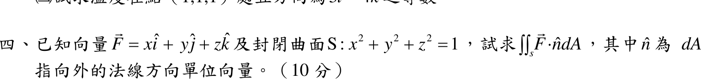

# 108 年第 4 題｜球面通量

## 考場標準作答

\(\vec F=(x,y,z)\)，\(\nabla\cdot\vec F=1+1+1=3\)；\(S\) 為單位球面（封閉，外法向），散度定理：
\[
\iint_S\vec F\cdot\hat n\,dA=\iiint_V3\,dV=3\cdot\frac43\pi(1)^3=\boxed{4\pi}
\]

## 驗算

直接做面積分：單位球面上外法向 \(\hat n=(x,y,z)\)，\(\vec F\cdot\hat n=x^2+y^2+z^2=1\)，故通量 \(=1\times S\text{ 的面積}=4\pi(1)^2=4\pi\)。
