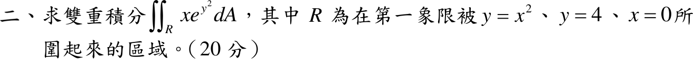

# 109 年第 2 題

## 考場標準作答

\(R\)：\(0\le x\le2,\ x^2\le y\le4\)。\(e^{y^2}\) 對 \(y\) 無初等反導函數，改為 \(0\le y\le4,\ 0\le x\le\sqrt y\)：
\[
\iint_R xe^{y^2}\,dA=\int_0^4\int_0^{\sqrt y}xe^{y^2}\,dx\,dy=\int_0^4\frac y2e^{y^2}\,dy
=\left[\frac14e^{y^2}\right]_0^4
=\boxed{\frac{e^{16}-1}{4}\approx2.22\times10^6}
\]

## 驗算

保留原次序，令 \(G(x)=\int_{x^2}^4e^{y^2}dy\)（\(G(2)=0\)，\(G'(x)=-2xe^{x^4}\)），分部積分：
\[
\int_0^2xG(x)\,dx=\left[\frac{x^2}{2}G\right]_0^2+\int_0^2x^3e^{x^4}dx=0+\left[\frac{e^{x^4}}{4}\right]_0^2=\frac{e^{16}-1}{4}
\]

## 失分點

- 區域是拋物線 \(y=x^2\) 上方、\(y=4\) 下方；畫成拋物線下方會得不可積的式子。
