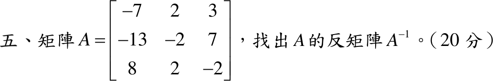

# 109 年第 5 題｜矩陣反矩陣

## 已知與所求

\(A=\begin{bmatrix}-7&2&3\\-13&-2&7\\8&2&-2\end{bmatrix}\)，求 \(A^{-1}\)（20 分）。

## 考場標準作答

沿第一列展開：
\[
\det A=-7(4-14)-2(26-56)+3(-26+16)=70+60-30=100
\]
餘因子 \(C_{ij}=(-1)^{i+j}M_{ij}\)：
\[
C=\begin{bmatrix}-10&30&-10\\10&-10&30\\20&10&40\end{bmatrix},\qquad
\operatorname{adj}A=C^T=\begin{bmatrix}-10&10&20\\30&-10&10\\-10&30&40\end{bmatrix}
\]
\[
\boxed{A^{-1}=\frac{\operatorname{adj}A}{\det A}=\frac1{10}\begin{bmatrix}-1&1&2\\3&-1&1\\-1&3&4\end{bmatrix}}
\]

## 驗算

逐列乘 \(10A^{-1}\) 的三欄：\((-7,2,3)\to(10,0,0)\)、\((-13,-2,7)\to(0,10,0)\)、\((8,2,-2)\to(0,0,10)\)，故 \(AA^{-1}=I\)。

## 失分點

- 伴隨矩陣是餘因子矩陣的轉置；漏轉置會得 \(C/100\)。
- \(C_{12},C_{21},C_{23},C_{32}\) 帶負號，最容易漏。
