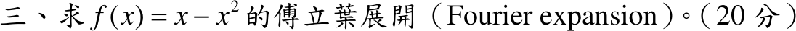

# 110 年第 3 題｜\(f(x)=x-x^2\) 的傅立葉展開

## 已知與所求

求 \(f(x)=x-x^2\) 的傅立葉展開（20 分）。題目未給區間，依慣例取 \(-\pi<x<\pi\) 並作 \(2\pi\) 週期延拓（見條件與疑義）。

## 考場標準作答

\(f\sim\frac{a_0}{2}+\sum_{n\ge1}(a_n\cos nx+b_n\sin nx)\)。\(x\) 為奇函數、\(-x^2\) 為偶函數，分開計算：
\[
a_0=\frac1\pi\int_{-\pi}^{\pi}(-x^2)\,dx=-\frac{2\pi^2}{3},\qquad
a_n=\frac2\pi\int_0^{\pi}(-x^2)\cos nx\,dx=-\frac{4(-1)^n}{n^2},
\]
\[
b_n=\frac2\pi\int_0^{\pi}x\sin nx\,dx=\frac{2(-1)^{n+1}}{n}.
\]
\[
\boxed{x-x^2=-\frac{\pi^2}{3}+\sum_{n=1}^{\infty}\left[-\frac{4(-1)^n}{n^2}\cos nx+\frac{2(-1)^{n+1}}{n}\sin nx\right],\quad -\pi<x<\pi}
\]

## 驗算

用 \(\sum\frac1{n^2}=\frac{\pi^2}{6}\)、\(\sum\frac{(-1)^n}{n^2}=-\frac{\pi^2}{12}\) 檢查兩點：
- \(x=0\)：\(-\frac{\pi^2}{3}-4\left(-\frac{\pi^2}{12}\right)=0=f(0)\)。
- \(x=\pi\)（跳躍點）：\(-\frac{\pi^2}{3}-4\cdot\frac{\pi^2}{6}=-\pi^2\)，等於 \(\frac{f(\pi^-)+f(-\pi^+)}{2}=\frac{(\pi-\pi^2)+(-\pi-\pi^2)}{2}\)。

## 失分點

- 常數項是 \(\frac{a_0}{2}=-\frac{\pi^2}{3}\)，誤寫 \(a_0\) 會差一倍。
- \(x\) 項只貢獻 \(b_n\)、\(-x^2\) 項只貢獻 \(a_n\)；混算時常把 \(\int x\cos nx\) 誤當非零。

## 條件與疑義

官方題幹只給 \(f(x)=x-x^2\)，未指定展開區間與週期，上式採最常見的 \((-\pi,\pi)\)。若改取 \((-L,L)\)、週期 \(2L\)，同法得
\[
\frac{a_0}{2}=-\frac{L^2}{3},\qquad a_n=-\frac{4L^2(-1)^n}{n^2\pi^2},\qquad b_n=\frac{2L(-1)^{n+1}}{n\pi},
\]
展開於 \(\cos\frac{n\pi x}{L}\)、\(\sin\frac{n\pi x}{L}\)；\(L=\pi\) 時即回到主解。
