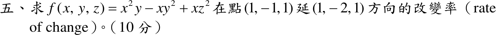

# 110 年第 5 題｜多變數函數的方向導數

## 考場標準作答

\[
\nabla f=(2xy-y^2+z^2,\ x^2-2xy,\ 2xz)\;\Rightarrow\;\nabla f(1,-1,1)=(-2,\ 3,\ 2)
\]
\[
\mathbf u=\frac{(1,-2,1)}{\sqrt6},\qquad
D_{\mathbf u}f=\frac{-2-6+2}{\sqrt6}=\boxed{-\sqrt6}
\]

## 驗算

沿 \(\mathbf r(h)=(1+h,\,-1-2h,\,1+h)\) 一階展開：\(x^2y\approx-1-4h\)、\(-xy^2\approx-1-5h\)、\(xz^2\approx1+3h\)，合計 \(f\approx-1-6h\)；每單位 \(h\) 走 \(\sqrt6\) 長，故變化率 \(-6/\sqrt6=-\sqrt6\)。

## 失分點

- 未把方向 \((1,-2,1)\) 單位化，會得 \(-6\)。
