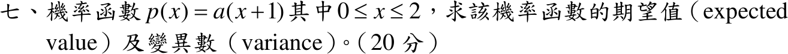

# 110 年第 7 題｜線性機率密度的期望值與變異數

## 已知與所求

\(p(x)=a(x+1)\)，\(0\le x\le2\)。求期望值與變異數（20 分）。

## 考場標準作答

### 正規化

\[
\int_0^2a(x+1)\,dx=a(2+2)=1\;\Longrightarrow\;\boxed{a=\frac14}
\]

### 期望值

\[
E[X]=\frac14\int_0^2(x^2+x)\,dx=\frac14\left(\frac83+2\right)=\boxed{E[X]=\frac76}
\]

### 變異數

\[
E[X^2]=\frac14\int_0^2(x^3+x^2)\,dx=\frac14\left(4+\frac83\right)=\frac53
\]
\[
\boxed{\operatorname{Var}(X)=\frac53-\left(\frac76\right)^2=\frac{60-49}{36}=\frac{11}{36}}
\]

## 驗算

用 CDF \(F(x)=\frac{x^2+2x}{8}\) 與尾端公式（\(X\ge0\)）：
\[
E[X]=\int_0^2(1-F)\,dx=2-\frac{1}{8}\left(\frac83+4\right)=\frac76,\qquad
E[X^2]=\int_0^2 2x(1-F)\,dx=4-\frac14\left(4+\frac{16}{3}\right)=\frac53.
\]

## 失分點

- 未先由正規化求 \(a\)，直接以 \(x+1\) 當密度，\(E[X]\) 會得 \(14/3\)，變異數 \(20/3-(14/3)^2\) 甚至為負。
- 把 \(E[X^2]=\frac53\) 當成變異數。
