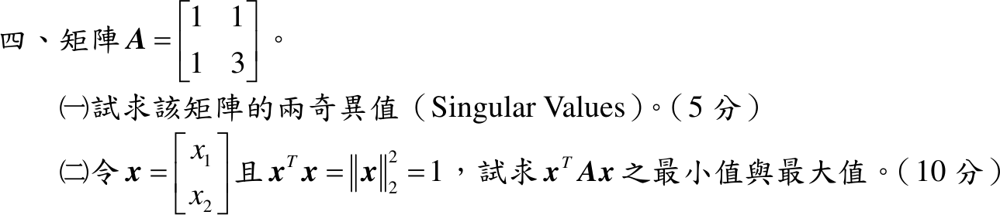

# 111 年第 4 題｜奇異值與二次型極值

## 已知與所求

\(A=\begin{bmatrix}1&1\\1&3\end{bmatrix}\)。（一）求兩奇異值（5 分）；（二）\(x=[x_1\ x_2]^T\)、\(x^Tx=1\)，求 \(x^TAx\) 的最小值與最大值（10 分）。

## 考場標準作答

### （一）奇異值

奇異值為 \(A^TA\) 特徵值的平方根：
\[
A^TA=\begin{bmatrix}2&4\\4&10\end{bmatrix},\qquad
\mu^2-12\mu+4=0\Rightarrow\mu=6\pm4\sqrt2=(2\pm\sqrt2)^2
\]
\[
\boxed{\sigma_1=2+\sqrt2\approx3.414,\quad \sigma_2=2-\sqrt2\approx0.586}
\]
（\(A\) 對稱且特徵值 \(2\pm\sqrt2\) 皆正，故奇異值即特徵值。）

### （二）Rayleigh 商極值

\(A\) 對稱，\(x^TAx\) 在單位圓上的極值為 \(A\) 的最小、最大特徵值：
\[
\det(A-\lambda I)=\lambda^2-4\lambda+2=0\Rightarrow\lambda=2\pm\sqrt2
\]
\[
\boxed{\min x^TAx=2-\sqrt2},\qquad \boxed{\max x^TAx=2+\sqrt2}
\]
分別發生在 \(x\parallel(1,\,1-\sqrt2)^T\) 與 \(x\parallel(1,\,1+\sqrt2)^T\)（取單位長）。

## 驗算

- （一）\(\sigma_1\sigma_2=(2+\sqrt2)(2-\sqrt2)=2=|\det A|\)；\(\sigma_1^2+\sigma_2^2=12=\lVert A\rVert_F^2=1+1+1+9\)。
- （二）令 \(x=(\cos\theta,\sin\theta)\)：\(x^TAx=\cos^2\theta+2\sin\theta\cos\theta+3\sin^2\theta=2+\sqrt2\sin(2\theta-\tfrac\pi4)\)，範圍正是 \([2-\sqrt2,\ 2+\sqrt2]\)。

## 失分點

- 把奇異值寫成 \(\sqrt{2\pm\sqrt2}\)（對 \(A\) 的特徵值再開根號）；應是 \(A^TA\) 特徵值的平方根。
- （二）只寫特徵值而未說明 \(A\) 對稱、約束為單位向量，極值論據不完整。
