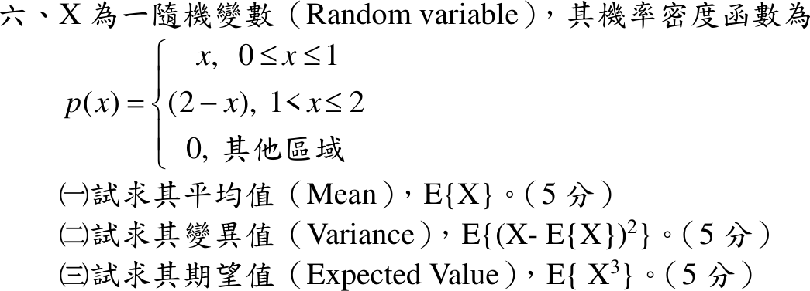

# 111 年第 6 題｜三角形機率密度的動差

## 已知與所求

\(p(x)=x\)（\(0\le x\le1\)）、\(2-x\)（\(1<x\le2\)）、其他為 0。求（一）\(E\{X\}\)；（二）\(E\{(X-E\{X\})^2\}\)；（三）\(E\{X^3\}\)，各 5 分。

## 考場標準作答

### （一）平均值

\[
E[X]=\int_0^1x^2\,dx+\int_1^2x(2-x)\,dx=\frac13+\left[x^2-\frac{x^3}{3}\right]_1^2=\frac13+\frac23=\boxed{E[X]=1}
\]

### （二）變異數

\[
E[X^2]=\int_0^1x^3\,dx+\int_1^2x^2(2-x)\,dx=\frac14+\left[\frac{2x^3}{3}-\frac{x^4}{4}\right]_1^2=\frac14+\frac{11}{12}=\frac76
\]
\[
\boxed{\operatorname{Var}(X)=\frac76-1^2=\frac16}
\]

### （三）三階動差

\[
E[X^3]=\int_0^1x^4\,dx+\int_1^2x^3(2-x)\,dx=\frac15+\left[\frac{x^4}{2}-\frac{x^5}{5}\right]_1^2=\frac15+\frac{13}{10}=\boxed{\frac32}
\]

## 驗算

此密度即兩個獨立 \(U(0,1)\) 之和 \(X=U_1+U_2\)：\(E[X]=\frac12+\frac12=1\)，\(\operatorname{Var}(X)=\frac1{12}+\frac1{12}=\frac16\)。又 \(p(2-x)=p(x)\) 對稱於 1，\(E[(X-1)^3]=0\Rightarrow E[X^3]=3E[X^2]-3E[X]+1=\frac72-3+1=\frac32\)。

## 失分點

- \(\int_1^2x^2(2-x)dx\) 代上下限出錯（應為 \(\frac{16}{3}-4-\frac23+\frac14=\frac{11}{12}\)）。
- 把 \(E[X^2]=\frac76\) 直接當成變異數。
